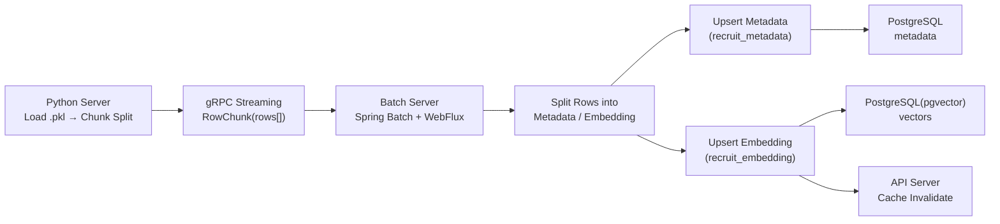
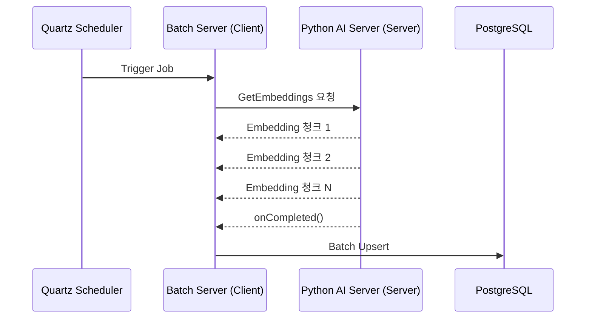
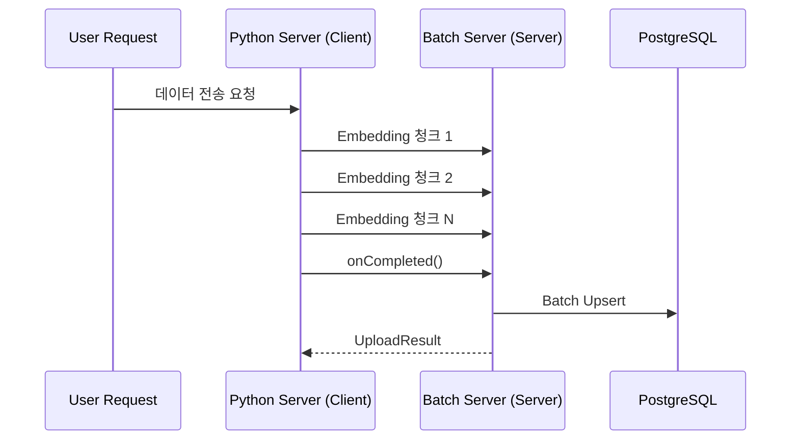
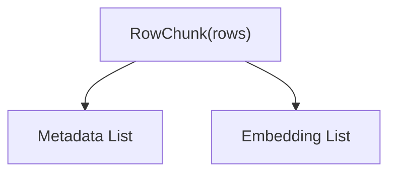

# 📘 AI Embedding Streaming Batch 인프라 설계서

*Headhunter-Recruit Matching System — Batch + Python gRPC Streaming*

> 본 문서는 Python 기반 AI 서버에서 생성되는 Recruit Embedding 및 Metadata를
>
>
> **대용량 gRPC Streaming + Batch Upsert + pgvector** 구조로 안정적으로 저장하기 위한 Batch 서버 아키텍처 설계서입니다.
>
> Spring Boot 4.0 + Java 21 + Spring Batch + WebFlux + gRPC Client 조합을 기반으로 합니다.
>

**최종 업데이트:** 2025-12-11
**구현 상태:** ✅ gRPC Client 구현 및 통신 검증 완료 (141,897 rows)

---

# 1. **목적(Purpose)**

```
Python AI Server → gRPC Streaming → Batch Server → PostgreSQL(pgvector)
                                           │
                                           └→ API Server gRPC (Cache Invalidation)
```

본 배치 서버는 Python 기반 AI Backend로부터 **대용량 Embedding 및 Metadata를 gRPC Streaming** 으로 전달받고,

이를 PostgreSQL(pgvector) 기반 저장소에 **두 개의 테이블(recruit_metadata / recruit_embedding)**로 분리 저장하는 역할을 수행한다.

---

# 2. 주요 요구사항

### ✔ 데이터 전달

> Python 서버는 `.pkl` 파일 내용을 **전체 로딩 후 chunk 단위로 스트리밍**한다.
> 
> 
> gRPC Streaming을 통해 **메모리 효율 + 대규모 처리** 가능.
> 

### ✔ Batch 처리

> Reactive(수신) + Blocking(저장) 구조의 안전한 조합
> 
> 
> Spring Batch는 streaming 데이터를 받아 chunk 단위로 저장한다.(Batch Upsert 전략)
> 
> **수신한 데이터(Row Chunk)를 분리하여 2개 테이블에 저장**
> 
> - recruit_metadata
> - recruit_embedding(pgvector)
> 
> chunk 기반 batch upsert 처리로 DB 성능 극대화
> 
> checkpoint 기반 재시작 안정성 확보
> 
> DLQ 로직을 통한 실패 row 비손실 처리
> 
> 저장 시 PostgreSQL(pgvector)을 사용.
> 
> 저장 후 API 서버에 캐시 초기화 이벤트 전달.
> 

### ✔ 안정성

> 재시작 가능성 고려: **idempotent 전략** 필요
> 
> 
> (예: 동일 사용자 embedding 갱신 시 upsert 사용)
> 

---

# 3. 전체 처리 흐름 구조

## 3.1 아키텍처 흐름도

1. Reactive gRPC 수신
2. Chunk 단위 batch upsert(JDBC)
3. metadata / embedding 분리 저장
4. DLQ 기록(실패 row)
5. checkpoint(last_processed_uuid) 갱신
6. API Server gRPC Cache Invalidate



---

# 4. 입력 데이터 구조(pkl → gRPC 전송 스키마)

## 4.1 통합 Row 구조

Python에서 읽는 `.pkl` 파일의 구조는 다음과 같다.

| 필드 | 타입 | 설명 |
| --- | --- | --- |
| id | UUID | PK |
| Company Name | string | 회사명 |
| Exp Years | int | 경력 |
| English Level | string | 영어 레벨 |
| Primary Keyword | string | 주요 키워드 |
| job_post_vectors | list<float> | Embedding Vector |

Batch 서버에서는 아래처럼 **메타데이터 / 벡터로 분리**해 저장한다.

## 4.2 **recruit_metadata (메타데이터)**

```sql
CREATE TABLE recruit_metadata (
    id UUID PRIMARY KEY,  -- UUID v7/ULID 권장 (시간순 정렬)
    company_name TEXT,
    exp_years INT,
    english_level TEXT,
    primary_keyword TEXT,
    updated_at TIMESTAMP DEFAULT NOW()
);
```

### UUID 기반 PK 전략 (NEW)

**AutoIncrement 대신 UUID를 PK로 사용하는 이유:**
- **대규모 병렬 Insert 경합 제거**: 시퀀스/identity 락 경쟁 없음
- **분산 시스템 친화적**: 클러스터 환경에서도 충돌 없음
- **Python 서버와의 일관성**: Python에서 생성한 UUID를 그대로 사용

**UUID v7 / ULID 사용 권장:**
- 시간순 정렬 가능 (timestamp 기반)
- 인덱스 성능 향상 (순차 삽입과 유사)
- 일반 UUID v4 대비 인덱스 fragmentation 감소

```java
// UUID v7 생성 예시 (Java)
import com.github.f4b6a3.uuid.UuidCreator;

UUID uuidV7 = UuidCreator.getTimeOrderedEpoch();
```

## 4.3 recruit_embedding (벡터 데이터)

```sql
CREATE TABLE recruit_embedding (
    id UUID PRIMARY KEY REFERENCES recruit_metadata(id) ON DELETE CASCADE,
    vector VECTOR(384),
    updated_at TIMESTAMP DEFAULT NOW()
);

CREATE INDEX recruit_embedding_ivfflat
ON recruit_embedding USING ivfflat (vector vector_l2_ops)
WITH (lists = 100);
```

### 🔧 Vector Dimension 관리 전략

- 기본값: 384
- 추후 모델 변경 가능성 대비 → application.yml에 dimension 값 저장
- 변경 시 자동 Schema Validation 수행 가능

## 4.4 Dead Letter Queue (DLQ) 테이블

```sql
CREATE TABLE recruit_embedding_dlq (
    id UUID,
    error_message TEXT,
    payload JSONB,
    created_at TIMESTAMP DEFAULT NOW()
);
```

---

# 5. 스트리밍 처리 전략

## ✔ 수신(ingest) → **Reactive WebFlux(gRPC Streaming Client)**

- backpressure 지원
- chunk 단위 스트리밍 처리
- Non-blocking 네트워크 IO

## ✔ 청크 재분할 및 병렬 구독 전략 (NEW)

Python 서버에서 받은 청크를 그대로 DB에 전달하지 않고, **Reactive 파이프라인에서 더 작은 단위로 세분화**하여 병렬 처리합니다.

### 청크 재분할 전략
```java
// Python에서 받은 큰 청크(예: 300 rows)를 더 작은 배치로 분할
Flux<RowChunk> largeChunks = grpcClient.streamEmbeddings(null, 300);

largeChunks
    .flatMap(chunk -> Flux.fromIterable(chunk.getRowsList())
        .buffer(50)  // 50개씩 재분할
        .map(rows -> RowChunk.newBuilder().addAllRows(rows).build())
    )
    .parallel(4)  // 4개 병렬 스트림
    .runOn(Schedulers.boundedElastic())  // 병렬 I/O 스레드 분배
    .flatMap(this::processChunk)
    .sequential()
    .subscribe();
```

### 병렬 구독의 이점
- **DB 커넥션 풀 활용 극대화**: 여러 스레드가 동시에 DB에 접근
- **처리량 증가**: I/O 대기 시간 동안 다른 청크 처리
- **메모리 압박 감소**: 큰 청크를 작은 단위로 분산 처리

### 주의사항
- 너무 작은 단위 → 컨텍스트 스위칭 비용 증가
- 너무 큰 단위 → 메모리 압박, 병렬성 저하
- **권장 배치 사이즈**: 50~100 rows per sub-chunk
- **병렬도**: CPU 코어 수 또는 DB 커넥션 풀 크기의 1/2 수준

## ✔ 저장(DB write) → **JPA + pgvector (Blocking)**

- 저장은 CPU IO bound이므로 JPA 사용이 유리
- pgvector의 indexing / ANN 최적화는 JPA 기반이 안정적
- Blockhound 예외 → Virtual Thread로 격리 수행

---

# 6. Batch 서버 내부 구조

## 6.1 폴더 구조

```
src/main/java/com.alpha.batch
 ├ config
 │    ├ GrpcClientConfig.java            ✅ 구현 완료
 │    ├ ExecutorConfig.java              ✅ 구현 완료 (VirtualThreadScheduler)
 │    └ BatchProperties.java             ✅ 구현 완료
 │
 ├ grpc
 │    ├ EmbeddingGrpcClient.java         ✅ 구현 완료 (통신 검증 완료)
 │    └ CacheInvalidateGrpcClient.java   ✅ 구현 완료
 │
 ├ domain
 │    ├ metadata
 │    │     ├ MetadataEntity.java        ✅ 구현 완료
 │    │     └ MetadataRepository.java    ✅ 구현 완료
 │    └ embedding
 │          ├ EmbeddingEntity.java       ✅ 구현 완료
 │          └ EmbeddingRepository.java   ✅ 구현 완료
 │
 ├ application
 │    ├ GrpcStreamTestService.java      ✅ 구현 완료 (2025-12-11)
 │    ├ StreamingService.java           ⏳ 예정 (gRPC Reactive 소비)
 │    ├ ChunkProcessor.java             ⏳ 예정
 │    └ CacheSyncService.java           ⏳ 예정
 │
 ├ runner
 │    └ GrpcTestRunner.java             ✅ 구현 완료 (2025-12-11)
 │
 ├ batch
 │    ├ job                              ⏳ 예정
 │    ├ step                             ⏳ 예정
 │    └ listener                         ⏳ 예정
 │
 ├ infrastructure
 │    └ CheckpointRepository.java       ✅ 구현 완료
 │
 └ scheduler
       └ BatchScheduler.java             ⏳ 예정

```

### 구현 상태 범례
- ✅ 구현 완료 및 검증 완료
- ⏳ 예정 (미구현)

---

# 7. Batch 처리 흐름 상세

## 전체흐름도

```arduino
Python AI Server 
   │
   └─ gRPC(StreamEmbedding)
           ↓
    Batch Server (WebFlux Reactive 수신)
           │
           ├─ chunk 단위 처리 (default = 300 rows)
           │
           ├─ metadata 저장 (JPA)
           ├─ embedding 저장 (JPA)
           │
           ├─ last_processed_uuid 갱신
           └─ gRPC 캐시 무효화(API Server)
```

## 7.1 Step 1 — gRPC Streaming 소비

### 서버 스트리밍 vs 클라이언트 스트리밍 병행 적용 (NEW)

본 프로젝트는 **두 가지 스트리밍 패턴을 모두 지원**하여 유연한 데이터 처리가 가능합니다.

#### 1) 서버 스트리밍 (Server Streaming) - Quartz 기반 자동 배치

**사용 시나리오**: Quartz 스케줄러가 주기적으로 Batch 서버를 트리거



**Proto 정의**:
```protobuf
service EmbeddingStreamService {
  rpc GetEmbeddings(StreamEmbeddingRequest)
      returns (stream RowChunk);  // 서버가 다중 응답
}

message StreamEmbeddingRequest {
  string last_processed_uuid = 1;
  int32 chunk_size = 2;   // default = 300
}
```

**클라이언트 구현 (Batch 서버)**:
```java
public Flux<RowChunk> streamEmbeddings(UUID lastProcessedUuid, int chunkSize) {
    Sinks.Many<RowChunk> sink = Sinks.many().unicast().onBackpressureBuffer();

    asyncStub.getEmbeddings(request, new StreamObserver<>() {
        @Override
        public void onNext(RowChunk chunk) {
            sink.tryEmitNext(chunk);  // 청크 수신
        }

        @Override
        public void onCompleted() {
            sink.tryEmitComplete();
        }
    });

    return sink.asFlux();
}
```

#### 2) 클라이언트 스트리밍 (Client Streaming) - 사용자 요청 기반

**사용 시나리오**: 사용자가 직접 Python 서버에 "Batch 서버로 데이터 전송" 요청



**Proto 정의**:
```protobuf
service EmbeddingStreamService {
  rpc UploadEmbeddings(stream RowChunk)
      returns (UploadResult);  // 클라이언트가 다중 요청, 서버가 단일 응답
}

message UploadResult {
  bool success = 1;
  int32 total_rows = 2;
  string message = 3;
}
```

**서버 구현 (Batch 서버)**:
```java
@Override
public StreamObserver<RowChunk> uploadEmbeddings(
        StreamObserver<UploadResult> responseObserver) {

    return new StreamObserver<>() {
        private int totalRows = 0;

        @Override
        public void onNext(RowChunk chunk) {
            // 청크 처리
            chunkProcessor.processChunk(chunk);
            totalRows += chunk.getRowsCount();
        }

        @Override
        public void onCompleted() {
            UploadResult result = UploadResult.newBuilder()
                    .setSuccess(true)
                    .setTotalRows(totalRows)
                    .setMessage("Successfully processed all chunks")
                    .build();

            responseObserver.onNext(result);
            responseObserver.onCompleted();
        }
    };
}
```

#### 병행 적용의 이점

| 패턴 | 장점 | 사용 사례 |
|-----|------|---------|
| **서버 스트리밍** | Batch 서버가 능동적으로 제어 가능<br>Checkpoint 기반 재시작 용이 | 정기 배치 작업<br>대량 초기 데이터 로딩 |
| **클라이언트 스트리밍** | Python 서버가 준비된 데이터를 즉시 전송<br>사용자 요청에 즉각 반응 | 실시간 데이터 갱신<br>수동 트리거 작업 |

### 기존 Proto 정의 (서버 스트리밍)

Python이 chunk(수천 rows)를 스트리밍으로 보내면 Batch 서버는 이를 Flux<RowChunk> 형태로 수신한다.

```protobuf
message RowChunk {
  repeated RecruitRow rows = 1;
}

message RecruitRow {
  string id = 1;
  string company_name = 2;
  int32 exp_years = 3;
  string english_level = 4;
  string primary_keyword = 5;
  repeated float vector = 6;
}
```

---

## 7.2 Step 2 — 2개 테이블로 분리



Batch 서버는 각 Row를 다음 두 가지 객체로 변환:

### Metadata Model

```java
record Metadata(
    UUID id,
    String companyName,
    int expYears,
    String englishLevel,
    String primaryKeyword
) {}
```

### Embedding Model

```java
record Embedding(
    UUID id,
    float[] vector
) {}
```

---

## 7.3 Step 3 — Chunk 처리 및 Metadata → Embedding 순서로 저장 (Upsert)

> ✔ Chunk Size 초기값: 300
> 
> 
> 추후 부하 테스트 후 300 → 500 → 2000 등 조절 가능.
> 
> metadata → embedding 순서로 저장해야 FK 오류 안 남
> 

### Batch Upsert 전략(PreparedStatement.addBatch)

```java
jdbcTemplate.batchUpdate(
  "INSERT INTO recruit_metadata (...) VALUES (...) " +
  "ON CONFLICT (id) DO UPDATE SET ...",
  batchPreparedStatementSetter
);
```

### 장점:

- 네트워크 왕복 횟수 감소
- PostgreSQL insert/upsert 처리량 대폭 증가

### 주의:

- 너무 큰 batch는 테이블 락 경쟁 유발
- chunk size = batch size 와 동일하게 유지하는 것을 권장

### DLQ 정책

chunk 내 개별 row 실패 시:

1. 실패 row → DLQ 테이블 insert
2. 나머지 row → 정상 commit
3. checkpoint는 chunk 끝에서 갱신
4. DLQ는 스케줄러 또는 별도 batch로 재처리

---

## 7.4 Step 4 — 캐시 무효화 gRPC (Batch → API Server)

모든 chunk 저장 후 API 서버에 다음 gRPC 호출 수행

```
InvalidateCache("recruit")
```

API 서버는 다음을 수행:

- Redis/Caffeine cached key 삭제
- 관련 GraphQL query 캐시 재빌드
- GraphQL Resolver 캐싱 키 무효화

```protobuf
message CacheInvalidateRequest {
  string target = 1; // ex) "recruit"
}

message CacheInvalidateResponse {
  bool success = 1;
}

service CacheService {
  rpc InvalidateCache(CacheInvalidateRequest)
      returns (CacheInvalidateResponse);
}
```

---

# 8. 체크포인트 관리

## 8.1 체크포인트 저장 방식

Batch 서버는 마지막으로 성공적으로 처리한 id를 기록한다.

```sql
CREATE TABLE embedding_batch_checkpoint (
    id SERIAL PRIMARY KEY,
    last_processed_uuid UUID,
    updated_at TIMESTAMP DEFAULT NOW()
);
```

Checkpoint는 **chunk 단위로 기록**한다.

각 chunk의 마지막 row의 uuid를 head uuid라 하며:

```java
last_processed_uuid = chunk.last().id
```

### Checkpoint 저장 규칙

- chunk 저장 성공 시 갱신
- chunk 내부 일부 실패 시에도 갱신 (실패 row는 DLQ로 저장)
- Python 재시작 시 last_processed_uuid 이후 row만 보내야 함

gRPC stream 재시작 시 Python 서버에 다음과 같이 요청한다:

```java
StreamEmbeddingChunk(last_processed_id)
```

---

# 9. Reactive + Blocking 혼합 구조

> Reactive 이벤트 루프에서 JPA를 호출하면 전체 스트림이 정지
> 
> 
> I/O heavy 작업은 반드시 별도 전용 스레드에서 수행해야 함
> 

### ✔ 수신은 Reactive(WebFlux)

- gRPC Streaming에서 backpressure 지원
- 이벤트 루프 기반 처리

### ✔ 저장은 Blocking(JPA + Virtual Threads + JDBC Batch)

- pgvector 최적 저장 방식
- 안정성 높음
- JPA EntityManager는 thread-safe가 아니므로 항상 per-thread 생성 보장

```java
// VirtualThreadExecutor 사용 - JPA는 반드시 Virtual Thread 전용 Executor에서 처리
executor = Executors.newVirtualThreadPerTaskExecutor();

// Reactive Stream → Blocking JPA 변환 시 .publishOn(jpaScheduler)
stream
  .publishOn(jpaScheduler)  
  .flatMap(chunk -> saveChunk(chunk))
  ....
```

### Virtual Thread 고려사항

<aside>

**Virtual Thread 사용 가이드**

- DB 작업은 반드시 **적당한 concurrency 제한** 필요
    
    (`Semaphore`, `Parallelism`, `boundedElastic`)
    
- 캐시 무효화·gRPC 호출 등 I/O 작업은 Virtual Thread OK
- batch chunk 병렬 처리 시 thread-safe 유틸리티만 사용 가능
1. **Reactor + boundedElastic pool 활용**
    
    DB I/O 쓰레드를 blocking pool에 분리
    
2. **pgvector 인덱스 튜닝**
    - lists, probes 파라미터 조정
</aside>

| 문제 | 설명 |
| --- | --- |
| DB connection pool 고갈 | Virtual Thread는 많지만 커넥션은 제한적 |
| Deadlock 확률 증가 | 공유자원(lock) 처리 시 Virtual Thread도 blocking |
| pgvector upsert는 대량 I/O → 실제 OS 스레드 점유 |  |

---

# 10. Race Condition 대응 전략

## 10.1 캐시 무효화 중복 호출 방지

```java
private final AtomicBoolean invalidating = new AtomicBoolean(false);

public void invalidateSafely() {
    if (invalidating.compareAndSet(false, true)) {
        try {
            cacheInvalidateGrpcClient.invalidate("recruit");
        } finally {
            invalidating.set(false);
        }
    }
}
```

## 10.2 gRPC Cache invalidate retry/backoff - 재시도 정책

```java
Cache Invalidate gRPC 호출 실패 시 3회 retry(backoff) 후,
스케줄러를 통해 재시도한다.
Invalidate는 idempotent하므로 중복 실행해도 문제가 없다.
```

## 10.3 Python Stream 비정상 종료 대응

```java
Python 스트림 종료 시 Batch 서버는
마지막 체크포인트(last_processed_uuid) 이후 데이터를
다시 요청하여 스트림을 안전하게 재개한다.
```

## 10.4 동일 id 중복 처리 시

```java
업데이트 충돌 발생 시 updated_at 기준 최신 row가 우선한다.
```

### 10.5 멀티스레딩 + Race Condition 실험 포인트

이 프로젝트의 중요한 의도 중 하나이므로 명시적으로 설명.

<aside>

**Race Condition 발생 지점 후보**

---

1. **캐시 무효화 요청이 여러 번 동시에 호출되는 경우**
2. **같은 청크에서 동일 id가 중복될 때 순서 보장 실패**
3. **vector upsert와 metadata upsert가 비동기 상태에서 경쟁**
4. **Python stream이 비정상 종료될 때 checkpoint 갱신 경쟁**
</aside>

<aside>

**해결 방법**

---

- Monitor Lock / AtomicBoolean 사용
- synchronized block으로 캐시 초기화 단일화
- Upsert 순서 → metadata → embedding 강제
- Chunk 처리 단위의 immutable 데이터 구조 사용
</aside>

---

# 11. 요약

| 항목 | 내용 |
| --- | --- |
| 데이터 저장 구조 | metadata / vector 분리 저장 |
| 통신 방식 | Python → Batch (gRPC Stream), Batch → API(gRPC Unary) |
| 핵심 처리 | Chunk 수신 → 분리 → upsert → cache invalidate |
| 성능 이슈 | WebFlux + JPA 조합, Virtual Thread 병행 시 blocking 주의 |
| 동시성 학습 포인트 | upsert 경쟁, 캐시 invalidation race, checkpoint race |

| 시나리오 | 대응 |
| --- | --- |
| gRPC 스트림 끊김 | last_processed_id  기준 재요청 |
| DB upsert 실패 | 해당 row DLQ 테이블 저장 |
| vector dimension mismatch | DLQ 테이블로 저장 후 Python 개발자에게 오류 보고 |
| 캐시 초기화 실패 | 배치 종료되지만 재시도 스케줄러가 별도로 실행 |
| Python 서버 지연 | gRPC timeout 조절 |

# 12. Python Streaming Server 구조

```
python_server/
 ├ load_pkl.py
 ├ stream_server.py
 ├ to_row_converter.py
 ├ chunker.py
 └ proto/
```

### 핵심 단계

1. pkl 로딩
2. row 변환
3. chunk 단위 생성
4. gRPC 스트리밍 전송