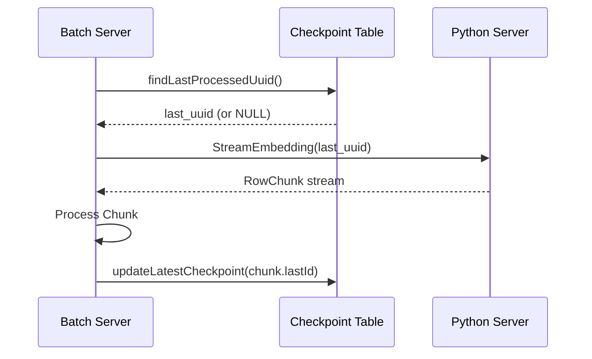

# 🗄️ Database 스키마

**작성일:** 2025-12-10
**업데이트:** 2025-12-12
**DBMS:** PostgreSQL 14+ with pgvector extension

---

## 🚨 중요 안내

이 문서는 **기본 스키마 개요**입니다. 상세 정보는 다음 문서를 참조하세요:

- **전체 DB 스키마 가이드**: `/Backend/docs/DB_스키마_가이드.md`
- **Flyway 마이그레이션 정책**: `/Backend/docs/Flyway_마이그레이션_가이드.md`
- **ERD 다이어그램**: `/Backend/docs/ERD_다이어그램.md`
- **도메인 확장 가이드**: `/Backend/Batch-Server/docs/도메인_확장_가이드.md`

---

## 전체 ERD

```
┌─────────────────────────┐
│  recruit_metadata       │
│─────────────────────────│
│ id (PK)          UUID   │
│ company_name     TEXT   │
│ exp_years        INT    │
│ english_level    TEXT   │
│ primary_keyword  TEXT   │
│ updated_at    TIMESTAMP │
└──────────┬──────────────┘
           │ 1
           │
           │ 1
┌──────────▼──────────────┐
│  recruit_embedding      │
│─────────────────────────│
│ id (PK,FK)       UUID   │
│ vector      VECTOR(384)│
│ updated_at    TIMESTAMP │
└─────────────────────────┘

┌─────────────────────────┐
│ recruit_embedding_dlq   │
│─────────────────────────│
│ id (PK)        SERIAL   │
│ recruit_id       UUID   │
│ error_message    TEXT   │
│ payload          JSONB  │
│ created_at   TIMESTAMP  │
└─────────────────────────┘

┌──────────────────────────────┐
│ embedding_batch_checkpoint   │
│──────────────────────────────│
│ id (PK)              SERIAL  │
│ last_processed_uuid   UUID   │
│ updated_at        TIMESTAMP  │
└──────────────────────────────┘
```

---

## 1. recruit_metadata (채용 메타데이터)

### 테이블 정의
```sql
CREATE TABLE recruit_metadata (
    id UUID PRIMARY KEY,  -- UUID v7/ULID 권장 (시간순 정렬)
    company_name TEXT NOT NULL,
    exp_years INT NOT NULL,
    english_level TEXT,
    primary_keyword TEXT,
    updated_at TIMESTAMP DEFAULT NOW()
);

CREATE INDEX idx_metadata_updated_at ON recruit_metadata(updated_at);
```

### UUID 기반 PK 전략 (NEW)

#### AutoIncrement 대신 UUID를 사용하는 이유

**1. 대규모 병렬 Insert 경합 제거**
```java
// Bad: AutoIncrement (시퀀스 락 경쟁)
INSERT INTO recruit_metadata (company_name, ...) VALUES (...);
// Thread 1, 2, 3이 동시에 시퀀스 획득 대기 → 병목

// Good: UUID (사전 생성, 경합 없음)
UUID id = UuidCreator.getTimeOrderedEpoch();
INSERT INTO recruit_metadata (id, company_name, ...) VALUES (?, ...);
// 각 스레드가 독립적으로 UUID 생성 → 병렬 처리
```

**2. 분산 시스템 친화적**
- 여러 Batch 서버 인스턴스가 동시에 데이터 삽입 가능
- 클러스터 환경에서도 ID 충돌 없음

**3. Python 서버와의 일관성**
- Python에서 생성한 UUID를 Batch 서버가 그대로 사용
- 데이터 추적 및 디버깅 용이

#### UUID v7 / ULID 사용 권장

**일반 UUID v4의 문제점:**
- 완전 랜덤 → 인덱스 fragmentation 심각
- B-Tree 인덱스 성능 저하 (비순차 삽입)

**UUID v7 / ULID의 이점:**
- **시간순 정렬 가능**: 첫 48bit가 timestamp
- **인덱스 성능 향상**: 순차 삽입과 유사한 효과
- **Fragmentation 감소**: B-Tree 분할 최소화

```java
// UUID v7 생성 (Java)
import com.github.f4b6a3.uuid.UuidCreator;

UUID uuidV7 = UuidCreator.getTimeOrderedEpoch();
// 예: 018c-1234-5678-9abc-def012345678
//     ^^^^       ^
//     타임스탬프   랜덤

// ULID 생성 (대안)
import de.huxhorn.sulky.ulid.ULID;

ULID.Value ulid = new ULID().nextValue();
// 예: 01ARZ3NDEKTSV4RRFFQ69G5FAV
```

#### 성능 비교

| PK 타입 | Insert 성능 | 인덱스 크기 | 병렬 처리 |
|---------|-----------|----------|----------|
| AutoIncrement | ⭐⭐⭐ (시퀀스 경합) | ⭐⭐⭐⭐⭐ | ❌ (락 경쟁) |
| UUID v4 | ⭐⭐⭐⭐ | ⭐⭐ (fragmentation) | ✅ |
| UUID v7 | ⭐⭐⭐⭐⭐ | ⭐⭐⭐⭐ | ✅ |
| ULID | ⭐⭐⭐⭐⭐ | ⭐⭐⭐⭐⭐ | ✅ |

### 컬럼 설명

| 컬럼 | 타입 | 제약 | 설명 |
|-----|------|------|------|
| id | UUID | PK | 채용 공고 고유 ID (UUID v7/ULID 권장) |
| company_name | TEXT | NOT NULL | 회사명 |
| exp_years | INT | NOT NULL | 요구 경력 (년) |
| english_level | TEXT | - | 영어 레벨 (Beginner, Intermediate, Advanced, Native) |
| primary_keyword | TEXT | - | 주요 키워드 (Backend, Frontend 등) |
| updated_at | TIMESTAMP | DEFAULT NOW() | 마지막 업데이트 시간 |

### Entity 매핑
```java
@Entity
@Table(name = "recruit_metadata")
public class MetadataEntity {
    @Id
    @Column(name = "id", columnDefinition = "UUID")
    private UUID id;

    @Column(name = "company_name", nullable = false)
    private String companyName;

    // ...
}
```

### Upsert 쿼리
```java
@Query(value = """
    INSERT INTO recruit_metadata (id, company_name, exp_years, english_level, primary_keyword, updated_at)
    VALUES (:#{#entity.id}, :#{#entity.companyName}, :#{#entity.expYears},
            :#{#entity.englishLevel}, :#{#entity.primaryKeyword}, NOW())
    ON CONFLICT (id)
    DO UPDATE SET
        company_name = EXCLUDED.company_name,
        exp_years = EXCLUDED.exp_years,
        english_level = EXCLUDED.english_level,
        primary_keyword = EXCLUDED.primary_keyword,
        updated_at = NOW()
    """, nativeQuery = true)
void upsert(@Param("entity") MetadataEntity entity);
```

---

## 2. recruit_embedding (벡터 데이터)

### 테이블 정의
```sql
CREATE TABLE recruit_embedding (
    id UUID PRIMARY KEY REFERENCES recruit_metadata(id) ON DELETE CASCADE,
    vector VECTOR(384) NOT NULL,
    updated_at TIMESTAMP DEFAULT NOW()
);

-- IVFFlat 인덱스 (유사도 검색 최적화)
CREATE INDEX recruit_embedding_ivfflat
ON recruit_embedding USING ivfflat (vector vector_l2_ops)
WITH (lists = 100);

CREATE INDEX idx_embedding_updated_at ON recruit_embedding(updated_at);
```

### 컬럼 설명

| 컬럼 | 타입 | 제약 | 설명 |
|-----|------|------|------|
| id | UUID | PK, FK | recruit_metadata.id 참조 |
| vector | VECTOR(384) | NOT NULL | Embedding Vector (OpenAI 기준 1536차원) |
| updated_at | TIMESTAMP | DEFAULT NOW() | 마지막 업데이트 시간 |

### pgvector 특징

#### Vector 타입
- PostgreSQL 확장으로 제공
- 고정 차원 배열 (본 프로젝트: 384)
- 다양한 거리 함수 지원:
  - `<->`: L2 distance (Euclidean)
  - `<#>`: Negative inner product
  - `<=>`: Cosine distance

#### IVFFlat 인덱스
- **lists:** 클러스터 개수 (100~1000 권장)
- **probes:** 검색 시 확인할 클러스터 수
- **Trade-off:** lists ↑ → 정확도 ↑, 속도 ↓

### Entity 매핑
```java
@Entity
@Table(name = "recruit_embedding")
public class EmbeddingEntity {
    @Id
    @Column(name = "id", columnDefinition = "UUID")
    private UUID id;

    @Column(name = "vector", nullable = false, columnDefinition = "vector(384)")
    private PGvector vector;

    // Helper methods
    public static EmbeddingEntity fromFloatArray(UUID id, float[] vectorArray) {
        return EmbeddingEntity.builder()
                .id(id)
                .vector(new PGvector(vectorArray))
                .build();
    }

    public float[] toFloatArray() {
        return this.vector.toArray();
    }
}
```

### Upsert 쿼리
```java
@Query(value = """
    INSERT INTO recruit_embedding (id, vector, updated_at)
    VALUES (:#{#entity.id}, CAST(:#{#entity.vector} AS vector), NOW())
    ON CONFLICT (id)
    DO UPDATE SET
        vector = CAST(EXCLUDED.vector AS vector),
        updated_at = NOW()
    """, nativeQuery = true)
void upsert(@Param("entity") EmbeddingEntity entity);
```

### 유사도 검색 쿼리
```java
@Query(value = """
    SELECT * FROM recruit_embedding
    ORDER BY vector <-> CAST(:queryVector AS vector)
    LIMIT :limit
    """, nativeQuery = true)
List<EmbeddingEntity> findSimilarVectors(
    @Param("queryVector") String queryVector,
    @Param("limit") int limit
);
```

---

## 3. recruit_embedding_dlq (Dead Letter Queue)

### 테이블 정의
```sql
CREATE TABLE recruit_embedding_dlq (
    id SERIAL PRIMARY KEY,
    recruit_id UUID,
    error_message TEXT NOT NULL,
    payload JSONB,
    created_at TIMESTAMP DEFAULT NOW()
);

CREATE INDEX idx_dlq_created_at ON recruit_embedding_dlq(created_at);
```

### 컬럼 설명

| 컬럼 | 타입 | 제약 | 설명 |
|-----|------|------|------|
| id | SERIAL | PK | 자동 증가 ID |
| recruit_id | UUID | - | 실패한 레코드의 ID |
| error_message | TEXT | NOT NULL | 에러 메시지 |
| payload | JSONB | - | 원본 데이터 (JSON 형식) |
| created_at | TIMESTAMP | DEFAULT NOW() | 실패 시각 |

### 사용 시나리오

1. **Vector Dimension Mismatch**
   ```sql
   INSERT INTO recruit_embedding_dlq (recruit_id, error_message, payload)
   VALUES ('uuid', 'Vector dimension mismatch: expected 384, got 768', '{"data": ...}');
   ```

2. **Validation Error**
   ```sql
   INSERT INTO recruit_embedding_dlq (recruit_id, error_message, payload)
   VALUES ('uuid', 'Invalid company_name: NULL', '{"data": ...}');
   ```

3. **DB Constraint Violation**
   ```sql
   INSERT INTO recruit_embedding_dlq (recruit_id, error_message, payload)
   VALUES ('uuid', 'FK constraint violation: metadata not found', '{"data": ...}');
   ```

### Entity 매핑
```java
@Entity
@Table(name = "recruit_embedding_dlq")
public class DlqEntity {
    @Id
    @GeneratedValue(strategy = GenerationType.IDENTITY)
    private Long id;

    @Column(name = "recruit_id")
    private UUID recruitId;

    @Column(name = "error_message", nullable = false)
    private String errorMessage;

    @Column(name = "payload", columnDefinition = "JSONB")
    private String payload;

    @CreationTimestamp
    @Column(name = "created_at")
    private LocalDateTime createdAt;
}
```

---

## 4. embedding_batch_checkpoint (체크포인트)

### 테이블 정의
```sql
CREATE TABLE embedding_batch_checkpoint (
    id SERIAL PRIMARY KEY,
    last_processed_uuid UUID,
    updated_at TIMESTAMP DEFAULT NOW()
);

-- 초기 레코드 삽입
INSERT INTO embedding_batch_checkpoint (last_processed_uuid, updated_at)
VALUES (NULL, NOW());
```

### 컬럼 설명

| 컬럼 | 타입 | 제약 | 설명 |
|-----|------|------|------|
| id | SERIAL | PK | 자동 증가 ID |
| last_processed_uuid | UUID | - | 마지막 처리된 레코드 ID |
| updated_at | TIMESTAMP | DEFAULT NOW() | 마지막 업데이트 시간 |

### 사용 방법

#### 1. Checkpoint 조회
```java
Optional<UUID> lastUuid = checkpointRepository.findLastProcessedUuid();
```

#### 2. Checkpoint 업데이트
```java
checkpointRepository.updateLatestCheckpoint(lastProcessedUuid);
```

#### 3. Checkpoint 기반 재시작
```java
// Python 서버에 요청 시
StreamEmbeddingRequest request = StreamEmbeddingRequest.newBuilder()
    .setLastProcessedUuid(lastUuid.toString())
    .setChunkSize(300)
    .build();
```

### 동작 흐름



---

## 5. Flyway Migration

### V1__init_schema.sql

전체 스키마를 한 번에 생성:
```sql
-- Enable pgvector
CREATE EXTENSION IF NOT EXISTS vector;

-- 테이블 생성 (위 DDL 참조)
-- ...

-- 인덱스 생성
-- ...

-- 초기 데이터
INSERT INTO embedding_batch_checkpoint (last_processed_uuid, updated_at)
VALUES (NULL, NOW());
```

### Migration 실행
```yaml
# application.yml
spring:
  flyway:
    enabled: true
    baseline-on-migrate: true
    locations: classpath:db/migration
```

---

## 성능 최적화

### 1. 인덱스 전략
- `updated_at`: 최근 업데이트 레코드 조회 최적화
- IVFFlat: Vector Similarity Search 최적화

### 2. Upsert 성능
- Batch Upsert (300 rows per chunk)
- `ON CONFLICT` 사용으로 Insert/Update 판단 자동화

### 3. Connection Pool
```yaml
spring:
  datasource:
    hikari:
      maximum-pool-size: 20
      minimum-idle: 5
```

---

## 관련 문서
- [프로젝트 구조](./프로젝트_구조.md)
- [Batch 설계서](./Batch설계서.md)
- [gRPC 통신 가이드](./gRPC_통신_가이드.md)
