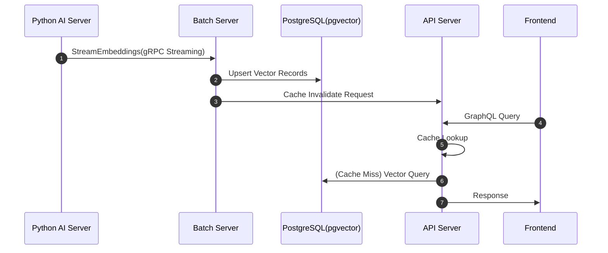
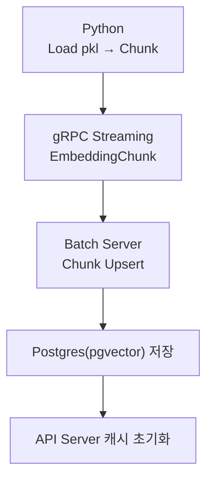
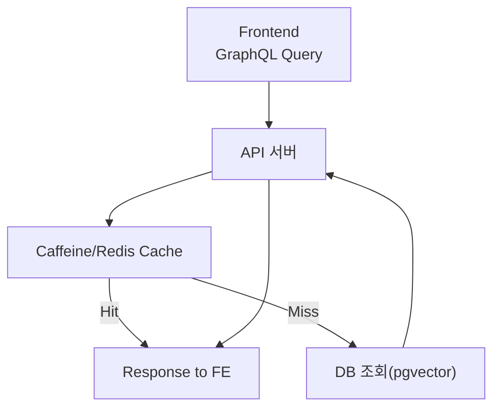

# 📘 프로젝트 전체 아키텍처 설계서

소유자: 김태현
태그: 가이드와 프로세스

> 이 문서는 전체 프로젝트가 어떤 구조로 동작하며, 각 컴포넌트가 어떤 책임을 갖는지
> 
> 
> **MCP(프론트·백엔드·AI·배치·인프라 전원이 빠르게 이해할 수 있도록 요약한 구조도**입니다.
> 

---

# 1. 프로젝트 목표(요약)

이 프로젝트는 다음 3가지 핵심 실험을 중심으로 설계되어 있다.

1. **Reactive 기반 API 서버(WebFlux)로 유연한 GraphQL 조회 환경 구축**
2. **Python Embedding 서버 ↔ Java Batch 서버 간 gRPC Streaming 설계**
3. **Embedding 데이터를 PostgreSQL(pgvector)에 저장하고 캐싱(메모리/Redis)으로 고속화**

즉, “**대규모 벡터 기반 추천 시스템의 파이프라인을 작은 단위로 직접 구축해보는 프로젝트**”이다.

참고: 구현 시 `Demo-Python`은 “Demo-Python/data/*.pkl”파일을 스트리밍 형식으로 gRPC를 통해 전달하는 것만 구현하면 된다

***.pkl 파일 자체는 용량이 크므로 절대 직접 조회해선 안된다.**

---

# 2. 전체 시스템 구성 요소

| 계층 | 구성 요소                                 | 역할 |
| --- |---------------------------------------| --- |
| **Frontend** | Next.js(16.0.7),TypeScript, React Query     | GraphQL API 소비, 데이터 캐싱 |
| **Backend (API 서버)** | Spring WebFlux + GraphQL              | 조회 API 제공, 캐싱 계층 관리, AI 서버와 gRPC 연동 |
| **AI Backend** | Python + PyTorch                      | Embedding 생성 및 추천 모델 추론 |
| **Batch Server** | Spring Batch + gRPC Client            | Python에서 Embedding 스트리밍 수신 → DB 저장 |
| **DB/Cache** | PostgreSQL + pgvector, Redis/Caffeine | Embedding 저장, 조회 캐싱 |

### 작업 디렉토리

```java
Alpha-Match/
 ├── Frontend/         
 │    └── Front-Server/     # Next.js + React Query
 │        ├── src/
 │        └── package.json
 │
 ├── Backend/
 │    ├── Api-Server/       # Spring WebFlux + Caffeine + PostgreSQL + PGVector
 │    │    └── src/
 │    └── Batch-Server/     # Spring Batch + gRPC << 현재 위치
 │         └── src/
 │
 ├── Demo-Python/          # python + gRPC
 │    ├── src/
 │    └── data/       
 │         └── *.pkl
 │
 └── deploy/                # GitHub Actions, Redis.conf, Dockerfile 등
```

---

# 3. 전체 구조도

```arduino
┌──────────────────────────────────────────────────────────────┐
│                          프론트엔드(Next.js)                 │
│  - React Query                                                │
│  - GraphQL Client                                             │
└───────────────▲───────────────────────────────┬───────────────┘
                │                               │ GraphQL
                │                               │ 요청/응답
                │                               │
        (사용자 요청)                           ▼
┌──────────────────────────────────────────────────────────────┐
│                    백엔드 Face API 서버(Spring)              │
│  - WebFlux (Reactive)                                        │
│  - GraphQL API                                               │
│  - Redis/Caffeine 캐싱                                       │
│  - gRPC Client → AI 서버 호출                                │
│  - PostgreSQL 조회(pgvector)                                 │
└───────────────┬──────────────────────┬────────────────────────┘
                │                      │
                │ gRPC                 │ DB 조회/저장
                ▼                      ▼
┌──────────────────────────┐   ┌───────────────────────────────┐
│      AI 백엔드(PyTorch)  │   │        PostgreSQL + pgvector   │
│  - Embedding 생성         │   │  - 사용자 벡터 / 공고 벡터 저장│
│  - 추천 모델 추론         │   │  - 유사도 검색                 │
│  - gRPC/REST 제공         │   └───────────────────────────────┘
└───────────────┬──────────┘
                │  모델 업데이트
                ▼
┌──────────────────────────────────────────────────────────────┐
│                  백엔드 Batch 서버(Spring Batch)             │
│  - 신규 데이터 수집                                          │
│  - embedding 재계산                                          │
│  - DB 갱신 / 캐시 초기화 요청                                │
│  - AI 서버 모델 업데이트 통지                                 │
└──────────────────────────────────────────────────────────────┘

```

**요약:**

- 프론트는 GraphQL을 통해 필요한 데이터만 조회
- API 서버는 캐시 → DB 순으로 조회
- AI 서버는 gRPC로 고속 Embedding/추천 처리
- 배치 서버는 Python에서 Embedding(스트리밍) 받아 DB 저장

---

# 4. 전체 흐름 구조(End-to-End)

## 4.1 데이터 생성 → 저장 → 조회 흐름



**요약 설명:**

1. Python은 `.pkl` 기반 Embedding을 chunk로 나눠 gRPC 스트리밍으로 전송
2. Batch 서버는 chunk 단위로 pgvector에 저장 + 체크포인트 업데이트
3. 저장 완료 시 API 서버의 캐시 무효화
4. 프론트는 React Query로 GraphQL 요청 → 캐시 기반으로 빠른 응답 제공

---

# 5. 각 컴포넌트별 역할 및 책임

## 5.1 Frontend (Next.js + React Query)

- GraphQL만 호출
- 필요한 데이터만 선택적으로 받아 효율적 렌더링
- React Query로 캐싱하여 API 호출 수 최소화

---

## 5.2 API 서버 (Spring WebFlux + GraphQL)

### 담당 역할

- GraphQL Resolver → Service → Repository 흐름 구성
- 캐싱 계층(Caffeine/Redis) 통합
- AI Backend와 gRPC를 통한 Embedding/추천 조회
- Batch 서버 완료 이벤트를 통한 캐시 무효화 처리

### 기술적 포인트

- 논블로킹 서버(WebFlux)로 고성능 처리
- gRPC AsyncStub + Mono/Flux 변환
- byte[] 기반 캐싱 구조 실험 (DB 결과를 Binary로 캐싱)
- 캐시 초기화 시 Monitor Lock으로 동시성 제어

---

## 5.3 AI Backend (Python + PyTorch)

### 역할

- Embedding 생성/추론 모델 보유
- gRPC 서버로서 EmbeddingChunk 스트리밍 제공
- API 서버의 추천 요청 처리

### 기술적 포인트

- `.pkl` → pandas DataFrame → Chunk 분리
- gRPC server-streaming
- Embedding vector(list<float>) 직렬화

---

## 5.4 Batch Server (Spring Batch + gRPC Client)

### 역할

- Python으로부터 EmbeddingChunk 스트리밍 수신
- pgvector 테이블에 upsert
- 체크포인트(Since ID) 기반 재시작/복구
- 캐시 무효화 요청(API 서버 호출)

### 기술적 포인트

- gRPC server-streaming → Reactor Flux로 변환
- blocking DB I/O를 boundedElastic에 분리
- chunk 단위 병렬 upsert로 대규모 벡터 처리
- pgvector 저장 시 PGobject(vector) 사용

---

## 5.5 Database Layer (PostgreSQL + pgvector / Redis)

### PostgreSQL(pgvector)

- Embedding 저장
- `<->` 연산자를 통한 유사도 검색
- ivfflat 인덱스 튜닝 가능

### Redis/Caffeine

- 캐싱 레이어
- byte[] 기반 저장으로 직렬화 비용 절감
- 캐시 만료/초기화 시 Race Condition 제어

---

# 6. 주요 처리 플로우(핵심만 요약)

## 6.1 Embedding 적재 플로우



---

## 6.2 GraphQL 조회 플로우



---

# 7. 예외 처리 및 장애 대응 설계

## 7.1 스트리밍 중단 시

- 체크포인트(`last_id`) 저장
- 재시작 시 `since_id`부터 재요청
- 동일 id는 upsert이므로 재처리 안전

## 7.2 캐시 초기화 동시성

- Monitor Lock 또는 AtomicBoolean + synchronized
- 동시에 여러 스레드가 캐시 초기화를 호출하지 못하게 보호

## 7.3 DB 벡터 삽입 오류

- vector dimension mismatch 체크
- invalid float 발생 시 별도 DLQ 테이블로 기록

---

# 8. 성능/확장성 고려사항

- DB upsert bulk 처리(100~2000 rows per chunk)
- gRPC 메시지 크기 상한 조정
- WebFlux → DB 접근은 boundedElastic Pool 분리
- Redis 확장 시 read/write throughput 증가
- 추천 모델 추론은 Python 서버에서 전담

---

# 9. 팀(MCP)별 액션 포인트

| 팀 | 해야 할 일 |
| --- | --- |
| **Frontend** | GraphQL 스키마 기반 데이터 소비 / React Query 캐싱 전략 |
| **API 백엔드** | Resolver → Service → Cache → DB 구조 구축 / gRPC 클라이언트 작성 |
| **AI 팀** | pkl → chunk stream 서버 구현 / Embedding 생성·추론 모델 관리 |
| **Batch 팀** | Embedding stream 소비 및 upsert / checkpoint 및 재시작 처리 |
| **Infra 팀** | Postgres(pgvector) + Redis + 서비스 네트워크 구성 / gRPC 설정 |

---