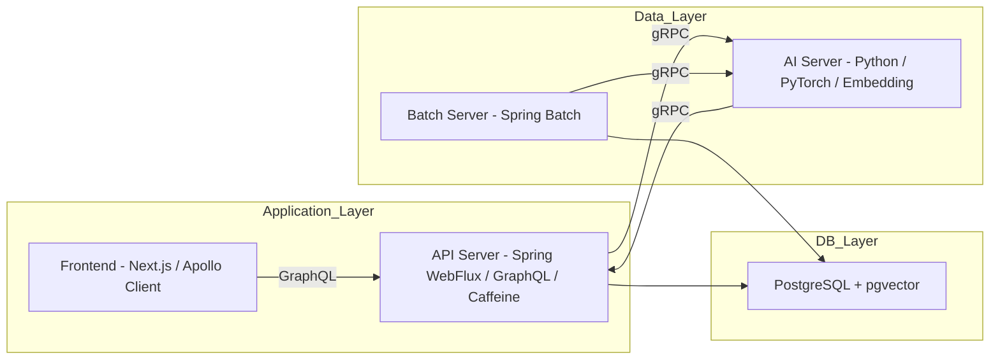
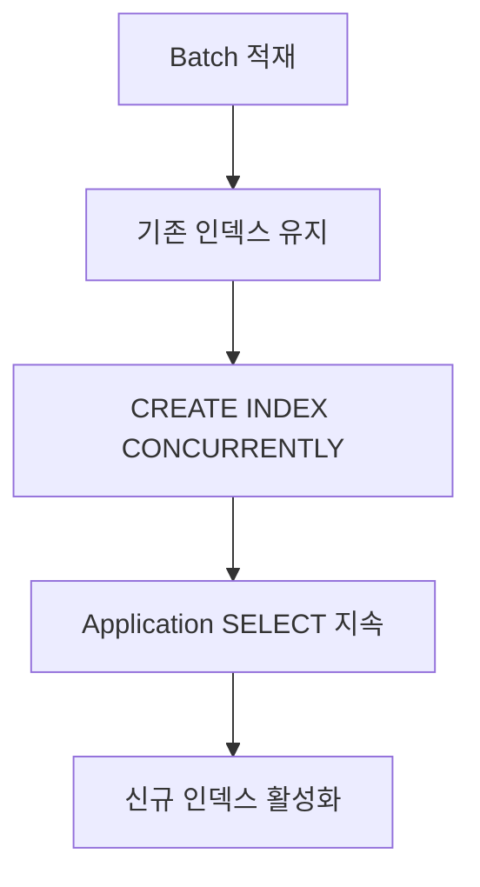

# Flyway를 활용한 통합 데이터베이스 스키마 & 마이그레이션 설계 문서

생성자: 김태현
생성 일시: 2026년 1월 6일 오후 1:21
카테고리: Backend
최종 편집자:: 김태현
최종 업데이트 시간: 2026년 1월 6일 오후 1:26

## 1. 개요

본 문서는 **Data Layer / Application Layer가 명확히 분리된 아키텍처**에서

Flyway 기반 데이터베이스 마이그레이션을 **정합성·운영 안정성·무중단** 관점에서 설계한 기준을 설명한다.

```
통합 데이터베이스 스키마 (pgvector + Spring Batch + Quartz)
도메인 스키마의 Source of Truth
비즈니스 핵심 테이블 정의
“이 DB가 무엇을 담는지”를 설명
```

---

## 2. 전체 아키텍처 설명

### 2.1 레이어 분리 원칙

- **Data Layer**
    - Batch / AI 서버
    - INSERT / UPDATE / DELETE 전담
    - 대량 데이터 적재 및 재계산
- **Application Layer**
    - API / Frontend
    - SELECT only
    - 실시간 조회 성능과 가용성 최우선

### 2.2 아키텍처 흐름



**요약**

쓰기 작업은 Data Layer에 집중되고, Application Layer는 **언제나 읽기 가능해야 한다**는 것이 핵심 제약이다.

---

## 3. Flyway 마이그레이션 버전 전략 개요

| Version | 책임 범위 | transactional | 목적 |
| --- | --- | --- | --- |
| V1 | 도메인 스키마 | O | Source of Truth |
| V2 | Batch / Infra 메타데이터 | O | 운영 기반 |
| V3 | Base Index | O | 조회 성능 |
| V4 | Embedding Index | X | 무중단 운영 |

---

## 4. V1 – 도메인 스키마 (Source of Truth)

### 4.1 역할 정의

V1은 **데이터베이스의 정체성 자체를 정의**한다.

- 비즈니스 핵심 테이블
- PK / FK / UNIQUE / NOT NULL
- 재현 가능해야 함
- 실패 시 **전체 롤백 가능**해야 함

```
“이 DB에는 어떤 도메인이 존재하는가”
```

### 4.2 설계 원칙

- transactional 유지
- CONCURRENTLY 사용 ❌
- 성능보다 **정합성 우선**

```sql
CREATE TABLE candidate (
    id uuidPRIMARY KEY,
    experience_yearsintNOT NULL
);
```

---

## 5. V2 – Batch / Infra 메타데이터

### 5.1 역할 정의

- Spring Batch
- Quartz
- Sequence / 메타 테이블
- 비즈니스 도메인과 분리

### 5.2 V1과 분리하는 이유

- 도메인과 성격 다름
- 인프라 교체 가능성 존재
- 책임 경계 명확화

---

## 6. CONCURRENTLY란 무엇인가

### 6.1 PostgreSQL의 기본 인덱스 생성

```sql
CREATE INDEX idx_exampleONtable(col);
```

- 테이블에 **AccessExclusiveLock**
- 읽기/쓰기 모두 차단
- 대용량 테이블에서 치명적

---

### 6.2 `CREATE INDEX CONCURRENTLY`

```sql
CREATE INDEX CONCURRENTLY idx_exampleONtable(col);
```

- 트랜잭션 블록 내부 실행 ❌
- 테이블 Full Scan 2회
- 읽기 / 쓰기 허용
- 운영 중 인덱스 생성 가능

```
“기존 쿼리를 살린 채 새로운 인덱스를 준비”
```

---

## 7. Flyway에서 `transactional=false`가 필요한 이유

### 7.1 Flyway 기본 동작

Flyway는 기본적으로 모든 SQL을 다음과 같이 실행한다.

```
BEGIN;
-- SQL 실행
COMMIT;
```

### 7.2 PostgreSQL 제약

```
ERROR: CREATE INDEX CONCURRENTLY cannot run inside a transaction block
```

### 7.3 해결 방법

```sql
-- flyway: transactional=false
CREATE INDEX CONCURRENTLY idx_embeddingON candidate(...);
```

➡ Flyway의 트랜잭션 래핑을 제거하여 PostgreSQL 제약을 만족시킨다.

---

## 8. V3 – Base Index 설계

### 8.1 대상 예시

```sql
CREATE INDEX idx_skill_category
ON skill_embedding_dic(category_id);
```

### 8.2 CONCURRENTLY가 필요 없는 이유

- 생성 시간 짧음
- Full Scan 없음
- 락 영향 미미
- 실패 시 롤백 중요

---

## 9. V4 – Embedding Index 설계

```sql
-- flyway: transactional=false
CREATE INDEX CONCURRENTLY idx_skill_vector ON skill_embedding_dic
    USING ivfflat (skill_vector vector_cosine_ops) WITH (lists = 100);

-- 9.1-2 skill_embedding_dic HNSW 인덱스
CREATE INDEX CONCURRENTLY IF NOT EXISTS skill_embedding_dic_hnsw_idx
    ON skill_embedding_dic
    USING hnsw (skill_vector vector_cosine_ops)
    WITH (m = 16, ef_construction = 64);
COMMENT ON INDEX skill_embedding_dic_hnsw_idx IS
'HNSW 벡터 인덱스 - 스킬 정규화 및 유사도 검색 최적화';
```

---

## 10. 무중단 보장 흐름



---

## 11. 결론

> V1·V2는 정합성과 재현성을 위해 트랜잭션 기반으로,
V3는 안정적인 조회 성능을 위해,
V4는 운영 무중단을 위해 CONCURRENTLY 기반으로 분리 설계한다.
이 구조는 현재 Data Layer / Application Layer 분리 아키텍처에 최적화된 방식이다.
>