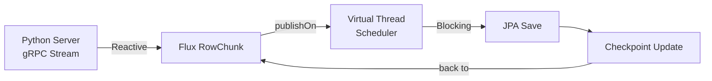

# ⚡ Reactive + Blocking 혼합 전략

**작성일:** 2025-12-10
**업데이트:** 2025-12-10

---

## 문제 정의

Batch Server는 다음 두 가지 상반된 기술을 함께 사용해야 합니다:
1. **Reactive (WebFlux)**: gRPC Streaming 수신 (Non-blocking)
2. **Blocking (JPA)**: PostgreSQL 저장 (Blocking I/O)

이 조합은 잘못 사용하면 전체 Reactive Stream이 정지되는 문제가 발생합니다.

---

## 전체 흐름



---

## 1. Reactive 수신 계층 (WebFlux)

### gRPC Streaming → Flux 변환

```java
@Component
public class EmbeddingGrpcClient {

    public Flux<RowChunk> streamEmbeddings(UUID lastProcessedUuid, int chunkSize) {
        // Reactive Sink 생성 (backpressure 지원)
        Sinks.Many<RowChunk> sink = Sinks.many().unicast().onBackpressureBuffer();

        // gRPC Async Stub
        asyncStub.streamEmbedding(request, new StreamObserver<>() {
            @Override
            public void onNext(RowChunk rowChunk) {
                sink.tryEmitNext(rowChunk);  // Reactive Stream으로 전달
            }

            @Override
            public void onError(Throwable throwable) {
                sink.tryEmitError(throwable);
            }

            @Override
            public void onCompleted() {
                sink.tryEmitComplete();
            }
        });

        return sink.asFlux();
    }
}
```

### Backpressure 지원
- `unicast().onBackpressureBuffer()`: 소비자가 처리 속도를 조절 가능
- gRPC 자체도 Flow Control 지원
- 메모리 효율적인 스트리밍

---

## 2. Scheduler를 통한 계층 분리

### ExecutorConfig 설정

```java
@Configuration
public class ExecutorConfig {

    /**
     * Virtual Thread Executor
     * JPA 등 Blocking I/O 작업을 처리하기 위한 Executor
     */
    @Bean(name = "virtualThreadExecutor")
    public Executor virtualThreadExecutor() {
        return Executors.newVirtualThreadPerTaskExecutor();
    }

    /**
     * JPA Scheduler
     * Reactive Stream에서 Blocking I/O (JPA) 처리를 위한 Scheduler
     */
    @Bean(name = "jpaScheduler")
    public Scheduler jpaScheduler(Executor virtualThreadExecutor) {
        return Schedulers.fromExecutor(virtualThreadExecutor);
    }

    /**
     * Bounded Elastic Scheduler
     * 제한된 병렬성을 가진 Elastic Scheduler
     * DB 커넥션 풀 고갈 방지
     */
    @Bean(name = "boundedElasticScheduler")
    public Scheduler boundedElasticScheduler() {
        return Schedulers.boundedElastic();
    }
}
```

### Scheduler 종류 및 용도

| Scheduler | 용도 | 특징 |
|----------|------|------|
| **immediate()** | 현재 스레드에서 실행 | 가벼운 작업 |
| **single()** | 단일 재사용 스레드 | 순차 처리 |
| **parallel()** | CPU 코어 수만큼 스레드 | CPU-intensive 작업 |
| **boundedElastic()** | 제한된 Elastic 스레드 | Blocking I/O (DB, File) |
| **fromExecutor()** | 커스텀 Executor | Virtual Thread 활용 |

---

## 3. Reactive → Blocking 전환

### publishOn을 사용한 Scheduler 전환

```java
@Service
public class StreamingService {

    @Autowired
    @Qualifier("jpaScheduler")
    private Scheduler jpaScheduler;

    @Autowired
    private EmbeddingGrpcClient grpcClient;

    @Autowired
    private ChunkProcessor chunkProcessor;

    public Mono<Void> processStream() {
        return grpcClient.streamEmbeddings(null, 300)
                // Reactive Stream (Event Loop)
                .doOnNext(chunk -> log.info("Received chunk with {} rows", chunk.getRowsCount()))

                // Scheduler 전환: Event Loop → Virtual Thread
                .publishOn(jpaScheduler)

                // Blocking 작업 (JPA)
                .flatMap(chunk -> Mono.fromCallable(() -> {
                    chunkProcessor.processChunk(chunk);  // JPA Save (Blocking)
                    return chunk;
                }))

                // 에러 처리
                .onErrorContinue((error, chunk) -> {
                    log.error("Error processing chunk: {}", error.getMessage());
                })

                .then();
    }
}
```

### 동작 원리

```
┌─────────────────────────────────────────┐
│  Reactive Event Loop (Non-blocking)     │
│  - gRPC Stream 수신                      │
│  - Backpressure 제어                     │
└─────────────┬───────────────────────────┘
              │ publishOn(jpaScheduler)
              ▼
┌─────────────────────────────────────────┐
│  Virtual Thread (Blocking 허용)         │
│  - JPA Save                             │
│  - Checkpoint Update                    │
│  - 느린 I/O 작업                         │
└─────────────────────────────────────────┘
```

---

## 4. Virtual Thread 활용

### Java 21 Virtual Thread란?

- **경량 스레드**: OS Thread가 아닌 JVM에서 관리
- **수백만 개 생성 가능**: 메모리 효율적
- **Blocking 코드 실행 최적화**: Carrier Thread 활용

### Virtual Thread 사용 예시

```java
// Before: Platform Thread (비효율)
ExecutorService executor = Executors.newFixedThreadPool(100);

// After: Virtual Thread (효율)
ExecutorService executor = Executors.newVirtualThreadPerTaskExecutor();
```

### Virtual Thread 주의사항

#### ⚠️ 1. Synchronized 사용 주의
```java
// Bad: synchronized block (Pinning 발생)
synchronized(lock) {
    repository.save(entity);
}

// Good: ReentrantLock 사용
lock.lock();
try {
    repository.save(entity);
} finally {
    lock.unlock();
}
```

#### ⚠️ 2. Connection Pool 고갈
```java
// Virtual Thread는 많지만, DB Connection은 제한적
spring:
  datasource:
    hikari:
      maximum-pool-size: 20  // 적절한 크기 설정
```

#### ⚠️ 3. ThreadLocal 사용 최소화
```java
// Virtual Thread는 재사용되지 않으므로 ThreadLocal 비효율
// 대신 Context 전달 방식 사용
```

---

## 5. Chunk 단위 병렬 처리

### 병렬 처리 전략

```java
@Service
public class ChunkProcessor {

    @Autowired
    private MetadataRepository metadataRepository;

    @Autowired
    private EmbeddingRepository embeddingRepository;

    public void processChunk(RowChunk chunk) {
        List<RecruitRow> rows = chunk.getRowsList();

        // 1. Metadata / Embedding 분리
        List<MetadataEntity> metadataList = rows.stream()
                .map(this::toMetadata)
                .toList();

        List<EmbeddingEntity> embeddingList = rows.stream()
                .map(this::toEmbedding)
                .toList();

        // 2. 순차 저장 (metadata → embedding)
        // FK 제약으로 인해 순서 중요!
        metadataRepository.upsertAll(metadataList);
        embeddingRepository.upsertAll(embeddingList);

        // 3. Checkpoint 업데이트
        UUID lastId = UUID.fromString(rows.get(rows.size() - 1).getId());
        checkpointRepository.updateLatestCheckpoint(lastId);
    }
}
```

### Parallel Chunk 처리 (실험적)

```java
public Mono<Void> processStreamParallel() {
    return grpcClient.streamEmbeddings(null, 300)
            .parallel(4)  // 4개 병렬 처리
            .runOn(jpaScheduler)  // 각각 Virtual Thread에서 실행
            .flatMap(chunk -> Mono.fromCallable(() -> {
                chunkProcessor.processChunk(chunk);
                return chunk;
            }))
            .sequential()  // 다시 순차 스트림으로
            .then();
}
```

#### ⚠️ 병렬 처리 주의사항
- Checkpoint 순서 보장 불가 → 재시작 시 문제
- DB Upsert 경쟁 조건 발생 가능
- Connection Pool 부족 위험

---

## 5-1. 청크 재분할 및 병렬 구독 전략 (NEW)

### 기존 방식의 한계

Python 서버에서 받은 큰 청크(예: 300 rows)를 그대로 DB에 전달하면:
- **단일 스레드 처리**: Reactive 스트림이지만 실제로는 순차 처리
- **DB 커넥션 풀 미활용**: 여러 커넥션이 있어도 하나만 사용
- **처리량 제한**: I/O 대기 시간 동안 다른 작업 불가

### 청크 재분할 전략

Python에서 받은 큰 청크를 **Reactive 파이프라인에서 더 작은 단위로 세분화**하여 병렬 처리합니다.

```java
@Service
public class StreamingService {

    @Autowired
    @Qualifier("jpaScheduler")
    private Scheduler jpaScheduler;

    @Autowired
    private EmbeddingGrpcClient grpcClient;

    @Autowired
    private ChunkProcessor chunkProcessor;

    public Mono<Void> processStreamWithRepartitioning() {
        return grpcClient.streamEmbeddings(null, 300)
                // 1. Python에서 받은 큰 청크 (300 rows)
                .doOnNext(chunk -> log.info("Received chunk with {} rows", chunk.getRowsCount()))

                // 2. 청크 재분할: 300 rows → 50 rows씩 6개
                .flatMap(chunk -> Flux.fromIterable(chunk.getRowsList())
                        .buffer(50)  // 50개씩 재분할
                        .map(rows -> RowChunk.newBuilder().addAllRows(rows).build())
                )

                // 3. 병렬 처리 (4개 병렬 스트림)
                .parallel(4)
                .runOn(jpaScheduler)  // 각 병렬 스트림을 Virtual Thread에서 실행

                // 4. Blocking I/O (JPA)
                .flatMap(subChunk -> Mono.fromCallable(() -> {
                    chunkProcessor.processSubChunk(subChunk);  // DB 저장
                    return subChunk;
                }))

                // 5. 순차 스트림으로 복귀
                .sequential()

                // 6. 에러 처리
                .onErrorContinue((error, subChunk) -> {
                    log.error("Error processing sub-chunk: {}", error.getMessage());
                })

                .then();
    }
}
```

### 동작 원리

```
┌────────────────────────────────────────────────────┐
│  Python Server                                     │
│  - RowChunk(300 rows)                              │
└────────────┬───────────────────────────────────────┘
             │ gRPC Stream
             ▼
┌────────────────────────────────────────────────────┐
│  Reactive Event Loop (Non-blocking)                │
│  - Backpressure 제어                                │
│  - Chunk 재분할: 300 → 50×6                        │
└────────┬───────────┬───────────┬───────────┬────────┘
         │           │           │           │
         │ parallel(4) → 4개 병렬 스트림        │
         ▼           ▼           ▼           ▼
┌─────────────┐┌─────────────┐┌─────────────┐┌─────────────┐
│VThread 1    ││VThread 2    ││VThread 3    ││VThread 4    │
│SubChunk 1   ││SubChunk 2   ││SubChunk 3   ││SubChunk 4   │
│(50 rows)    ││(50 rows)    ││(50 rows)    ││(50 rows)    │
│JPA Save     ││JPA Save     ││JPA Save     ││JPA Save     │
└─────────────┘└─────────────┘└─────────────┘└─────────────┘
         │           │           │           │
         └───────────┴───────────┴───────────┘
                     ▼
         ┌─────────────────────────┐
         │  PostgreSQL(pgvector)   │
         │  - 병렬 Insert/Upsert   │
         └─────────────────────────┘
```

### 병렬 구독의 이점

**1. DB 커넥션 풀 활용 극대화**
```yaml
# application.yml
spring:
  datasource:
    hikari:
      maximum-pool-size: 20  # 20개 커넥션

# parallel(4) 사용 시 → 4개 커넥션 동시 사용
# 처리량 약 4배 증가 (이론적)
```

**2. I/O 대기 시간 활용**
```
순차 처리:  [DB Write 1] → [DB Write 2] → [DB Write 3]
            ════════════════════════════════════════ 12초

병렬 처리:  [DB Write 1]
            [DB Write 2]
            [DB Write 3]
            [DB Write 4]
            ═════════════ 3초 (4배 빠름)
```

**3. Reactive의 진정한 활용**
- 단순 gRPC 수신 → JPA 저장이 아님
- **DB I/O 직전까지 비동기 파이프라인 구성**
- 병렬 구독으로 여러 I/O 스레드 활용

### 적절한 파라미터 설정

#### 재분할 크기 (buffer size)

| 크기 | 장점 | 단점 | 권장 사용 |
|-----|------|------|----------|
| 10~30 | 빠른 에러 격리 | 컨텍스트 스위칭 과다 | 테스트 환경 |
| 50~100 | 균형잡힌 성능 | - | **프로덕션 권장** |
| 200+ | DB 처리량 최대 | 메모리 부담, 에러 영향 증가 | 대용량 초기 로딩 |

#### 병렬도 (parallel degree)

```java
// 권장: CPU 코어 수 또는 DB 커넥션 풀의 1/2
int parallelism = Math.min(
    Runtime.getRuntime().availableProcessors(),  // CPU 코어 수
    hikariConfig.getMaximumPoolSize() / 2        // 커넥션 풀의 절반
);

.parallel(parallelism)
```

### 주의사항

#### 1. Checkpoint 순서 보장
```java
// Bad: 병렬 처리 시 순서 보장 안 됨
.parallel(4)
.flatMap(this::processChunk)
.doOnNext(chunk -> updateCheckpoint(chunk.lastId))  // 순서 꼬임!

// Good: sequential() 이후 checkpoint 업데이트
.parallel(4)
.flatMap(this::processChunk)
.sequential()  // 순서 복원
.reduce((first, second) -> second)  // 마지막 청크만 추출
.doOnNext(lastChunk -> updateCheckpoint(lastChunk.lastId))
```

#### 2. Connection Pool 고갈 방지
```yaml
# 병렬도보다 충분히 큰 커넥션 풀 설정
spring:
  datasource:
    hikari:
      maximum-pool-size: 20  # parallel(4) 사용 시 최소 8~10 권장
```

#### 3. 메모리 관리
```java
// buffer 크기 × 병렬도 = 동시 메모리 사용량
// 예: 50 rows × 4 parallel × 1536 vector dimension × 4 bytes
//   = 약 1.2MB (관리 가능)

// 너무 크면 위험:
// 500 rows × 10 parallel × 1536 × 4 = 약 30MB
```

---

## 6. 성능 최적화

### 1. Batch Upsert
```java
// Bad: 개별 저장 (N번 DB 호출)
for (MetadataEntity entity : metadataList) {
    metadataRepository.upsert(entity);
}

// Good: Batch Upsert (1번 DB 호출)
metadataRepository.upsertAll(metadataList);
```

### 2. Chunk Size 조정
```yaml
batch:
  embedding:
    chunk-size: 300  # 네트워크/DB 성능에 따라 조정
```

| Chunk Size | 장점 | 단점 |
|-----------|------|------|
| 100 | 메모리 효율, 에러 격리 | 네트워크 오버헤드 ↑ |
| 300 | 균형잡힌 성능 | - |
| 1000+ | DB 처리량 ↑ | 메모리 부담, 에러 영향 ↑ |

### 3. HikariCP 최적화
```yaml
spring:
  datasource:
    hikari:
      maximum-pool-size: 20
      minimum-idle: 5
      connection-timeout: 30000
      idle-timeout: 600000
      max-lifetime: 1800000
```

---

## 7. 모니터링 및 디버깅

### 로깅 설정

```yaml
logging:
  level:
    com.alpha.backend: DEBUG
    reactor.core: INFO  # Reactive 디버깅
    io.grpc: INFO       # gRPC 디버깅
```

### Reactor Debug Mode

```java
@SpringBootApplication
public class BatchApplication {
    public static void main(String[] args) {
        // Reactor Debug Mode 활성화 (개발 환경)
        Hooks.onOperatorDebug();

        SpringApplication.run(BatchApplication.class, args);
    }
}
```

### 성능 측정

```java
@Service
public class StreamingService {

    public Mono<Void> processStream() {
        return grpcClient.streamEmbeddings(null, 300)
                .doOnNext(chunk -> log.info("Processing chunk"))
                .elapsed()  // 시간 측정
                .doOnNext(tuple -> {
                    long elapsedMs = tuple.getT1();
                    RowChunk chunk = tuple.getT2();
                    log.info("Chunk processed in {}ms", elapsedMs);
                })
                .map(Tuple2::getT2)
                .publishOn(jpaScheduler)
                .flatMap(chunk -> processChunk(chunk))
                .then();
    }
}
```

---

## 8. 테스트

### Reactive Test

```java
@SpringBootTest
class StreamingServiceTest {

    @Autowired
    private StreamingService streamingService;

    @Test
    void processStream_성공() {
        StepVerifier.create(streamingService.processStream())
                .expectComplete()
                .verify(Duration.ofSeconds(60));
    }
}
```

---

## 관련 문서
- [프로젝트 구조](./프로젝트_구조.md)
- [gRPC 통신 가이드](./gRPC_통신_가이드.md)
- [동시성 제어](./동시성_제어.md)
