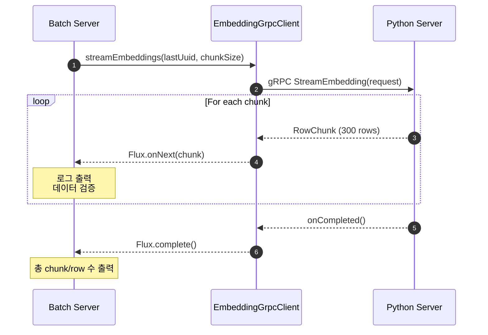

# gRPC 클라이언트 구현 가이드

**작성일:** 2025-12-11
**목적:** Python gRPC 서버로부터 Embedding 데이터를 스트리밍 방식으로 수신

---

## 📋 개요

Batch Server는 Python AI Server(port 50051)로부터 Recruit Embedding 데이터를 gRPC Streaming으로 수신합니다.

### 핵심 목표
- ✅ gRPC 연결 성공 확인
- ✅ 스트리밍 데이터 수신 및 로깅
- ✅ Backpressure 지원 (Reactive Flux)
- ✅ Chunk 단위 처리 (설정값 활용)

---

## 🏗️ 구현 구조

```
com.alpha.backend
├── grpc/                           # gRPC 클라이언트 계층
│   ├── EmbeddingGrpcClient.java    # Embedding 스트림 수신
│   └── CacheInvalidateGrpcClient.java  # API 서버 캐시 무효화
│
├── application/                    # 애플리케이션 서비스 계층
│   └── GrpcStreamTestService.java  # 통신 테스트 서비스
│
├── runner/                         # 시작 시 실행 Runner
│   └── GrpcTestRunner.java         # CommandLineRunner 구현
│
└── config/                         # 설정
    ├── GrpcClientConfig.java       # gRPC 채널 구성
    └── BatchProperties.java        # 배치 설정값
```

---

## 🔧 주요 구성 요소

### 1. EmbeddingGrpcClient

**위치:** `com.alpha.backend.grpc.EmbeddingGrpcClient`

**역할:** Python AI Server로부터 Embedding Stream 수신

**핵심 메서드:**
```java
public Flux<RowChunk> streamEmbeddings(UUID lastProcessedUuid, int chunkSize)
```

**특징:**
- Reactive Flux 반환 (backpressure 지원)
- StreamObserver로 gRPC 응답 처리
- Sinks.Many를 사용한 스트림 변환
- 에러 처리 및 완료 이벤트 로깅

**주요 로직:**
1. `StreamEmbeddingRequest` 생성 (checkpoint UUID, chunk size)
2. gRPC 비동기 스터브로 `streamEmbedding()` 호출
3. `StreamObserver`로 chunk 수신
   - `onNext()`: 각 chunk를 Flux로 emit
   - `onError()`: 에러 전파
   - `onCompleted()`: 완료 신호
4. Reactive Flux 반환

---

### 2. GrpcStreamTestService

**위치:** `com.alpha.backend.application.GrpcStreamTestService`

**역할:** gRPC 통신 테스트 및 데이터 수신 검증

**핵심 메서드:**

#### `testConnection()`
- 간단한 연결 테스트 (첫 번째 chunk만 받기)
- Python 서버 연결 여부 확인

#### `testFullStream()`
- 전체 스트리밍 수신 테스트
- 모든 chunk와 row 수 집계
- 샘플 데이터 로깅

#### `testEmbeddingStream(UUID lastProcessedUuid)`
- Checkpoint 기반 재시작 지원
- 각 chunk별 상세 로깅
  - Chunk 번호
  - Row 개수
  - 샘플 Row 데이터 (ID, company, experience, vector 등)
  - Vector 차원 확인 (첫 5개 값 출력)

**로깅 포맷:**
```
================================================================================
Starting gRPC Embedding Stream Test
Last Processed UUID: null
Chunk Size: 300
================================================================================
--------------------------------------------------------------------------------
Chunk #1: Received 300 rows
Sample Row - ID: 123e4567-e89b-12d3-a456-426614174000
Sample Row - Company: TechCorp
Sample Row - Experience: 5 years
Sample Row - English Level: Advanced
Sample Row - Primary Keyword: Java Developer
Sample Row - Vector Dimension: 1536
Vector Sample (first 5): [0.1234, -0.5678, 0.9012, -0.3456, 0.7890, ...]
--------------------------------------------------------------------------------
================================================================================
Stream Completed Successfully!
Total Chunks Received: 10
Total Rows Received: 3000
================================================================================
```

---

### 3. GrpcTestRunner

**위치:** `com.alpha.backend.runner.GrpcTestRunner`

**역할:** 애플리케이션 시작 시 자동 테스트 실행

**활성화 조건:**
```yaml
grpc:
  test:
    enabled: true  # application.yml에 설정
```

**실행 순서:**
1. 연결 테스트 (`testConnection()`)
2. 전체 스트리밍 테스트 (`testFullStream()`)
3. 결과 요약 출력

**에러 처리:**
- `UNAVAILABLE` 에러 시 Python 서버 미실행 안내
- 테스트 실패해도 애플리케이션은 계속 실행

---

### 4. GrpcClientConfig

**위치:** `com.alpha.backend.config.GrpcClientConfig`

**역할:** gRPC ManagedChannel 빈 생성

**Bean 정의:**

#### `pythonEmbeddingChannel`
```java
@Bean(name = "pythonEmbeddingChannel")
public ManagedChannel pythonEmbeddingChannel()
```
- Python AI Server 연결용
- 주소: `localhost:50051`
- Max inbound message size: 100MB
- Plaintext 통신

#### `apiCacheChannel`
```java
@Bean(name = "apiCacheChannel")
public ManagedChannel apiCacheChannel()
```
- API Server 캐시 무효화용
- 주소: `localhost:50052`

---

## ⚙️ 설정 파일

### application.yml

```yaml
# gRPC 설정
grpc:
  # 테스트 설정
  test:
    enabled: true  # 개발 시에만 true

  client:
    # Python AI Server (Embedding Stream)
    python-embedding:
      address: static://localhost:50051
      negotiation-type: plaintext
      max-inbound-message-size: 104857600  # 100MB

    # API Server (Cache Invalidate)
    api-cache:
      address: static://localhost:50052
      negotiation-type: plaintext

# 커스텀 배치 설정
batch:
  embedding:
    chunk-size: 300                    # 한 번에 처리할 row 수
    vector-dimension: 384             # Embedding vector 차원
    max-retry: 3                       # 실패 시 재시도 횟수
    retry-backoff-ms: 1000            # 재시도 대기 시간 (ms)
```

---

## 🚀 실행 방법

### 1. Python gRPC 서버 시작

```bash
cd Demo-Python
python src/grpc_server.py
```

**확인 사항:**
- 서버가 `localhost:50051`에서 실행 중
- `.pkl` 파일이 준비되어 있음

### 2. Batch Server 실행

```bash
cd Backend/Batch-Server
./gradlew bootRun
```

**자동 실행 항목:**
- Proto 파일 생성
- Java 클래스 컴파일
- Spring Boot 애플리케이션 시작
- `GrpcTestRunner` 자동 실행 (test.enabled=true인 경우)

### 3. 로그 확인

터미널에서 다음 로그를 확인:
```
Starting gRPC Connection and Streaming Test
[STEP 1] Testing gRPC Connection...
Connection successful! Received X rows
[STEP 2] Testing Full Streaming...
Chunk #1: Received 300 rows
...
All gRPC Tests Completed Successfully!
```

### 4. 실패 시 조치

**에러:** `UNAVAILABLE: io exception`
```
!!!!!!!!!!!!!!!!!!!!!!!!!!!!!!!!!!!!!!!!!!!!!!!!!!!!!!!!!!!!!!!!!!!!!!!!!!!!!!!
Python gRPC Server is not available!
Please make sure Python server is running on localhost:50051
Command: cd Demo-Python && python src/grpc_server.py
!!!!!!!!!!!!!!!!!!!!!!!!!!!!!!!!!!!!!!!!!!!!!!!!!!!!!!!!!!!!!!!!!!!!!!!!!!!!!!!
```

**조치:**
1. Python 서버가 실행 중인지 확인
2. 포트 50051이 사용 가능한지 확인
3. 방화벽 설정 확인

---

## 📊 데이터 흐름



---

## 🔍 프로토콜 정의

### embedding_stream.proto

```protobuf
message RecruitRow {
  string id = 1;                      // UUID
  string company_name = 2;            // 회사명
  int32 exp_years = 3;                // 경력 연수
  string english_level = 4;           // 영어 레벨
  string primary_keyword = 5;         // 주요 키워드
  repeated float vector = 6;          // Embedding Vector (384 dimension)
}

message RowChunk {
  repeated RecruitRow rows = 1;       // Row 배열 (최대 300개)
}

message StreamEmbeddingRequest {
  string last_processed_uuid = 1;     // Checkpoint UUID
  int32 chunk_size = 2;               // Chunk 크기
}

service EmbeddingStreamService {
  rpc StreamEmbedding(StreamEmbeddingRequest) returns (stream RowChunk);
}
```

---

## 🧪 테스트 시나리오

### 시나리오 1: 기본 연결 테스트
```java
grpcStreamTestService.testConnection();
```
- 첫 번째 chunk만 수신
- 연결 성공 여부 확인

### 시나리오 2: 전체 데이터 스트리밍
```java
grpcStreamTestService.testFullStream();
```
- 모든 데이터 수신
- 총 chunk 및 row 수 집계

### 시나리오 3: Checkpoint 재개
```java
String lastUuid = "123e4567-e89b-12d3-a456-426614174000";
grpcStreamTestService.testStreamWithCheckpoint(lastUuid);
```
- 특정 UUID 이후부터 재개
- 장애 복구 시나리오 검증

---

## 🛠️ 개발 모드 vs 운영 모드

### 개발 모드 (Test Enabled)
```yaml
grpc:
  test:
    enabled: true
```
- `GrpcTestRunner` 자동 실행
- 애플리케이션 시작 시 통신 테스트
- 상세 로그 출력

### 운영 모드 (Test Disabled)
```yaml
grpc:
  test:
    enabled: false  # 또는 생략
```
- 테스트 Runner 비활성화
- Scheduler 기반 배치 작업만 실행
- 필요한 로그만 출력

---

## 📈 성능 고려사항

### Backpressure 처리
- Reactive Flux 사용으로 자동 backpressure 지원
- Python 서버가 빠르게 전송해도 안전하게 처리
- `Sinks.Many.unicast().onBackpressureBuffer()` 사용

### 메모리 관리
- Chunk 단위 처리 (기본 300 rows)
- Vector 데이터가 크므로 적절한 chunk size 설정 필요
- Max inbound message size: 100MB

### 네트워크 최적화
- Plaintext 통신 (내부 네트워크)
- 필요 시 TLS 추가 가능
- Deadline 설정 가능

---

## 🔄 다음 단계

1. **데이터 저장 구현**
   - Repository를 통한 DB 저장
   - Metadata + Embedding 분리 저장
   - Upsert 로직 구현

2. **Batch Job 구성**
   - Spring Batch Job/Step 설정
   - Checkpoint 관리
   - DLQ 처리

3. **스케줄러 설정**
   - Quartz Job 등록
   - Cron 기반 자동 실행

4. **캐시 무효화**
   - API 서버 호출
   - 성공 여부 확인

---

## 📚 참고 문서

- **gRPC 통신 가이드**: `/docs/gRPC_통신_가이드.md`
- **Batch 설계서**: `/docs/Batch설계서.md`
- **Entire Structure**: `/docs/Entire_Structure.md`

---

**최종 수정일:** 2025-12-11
