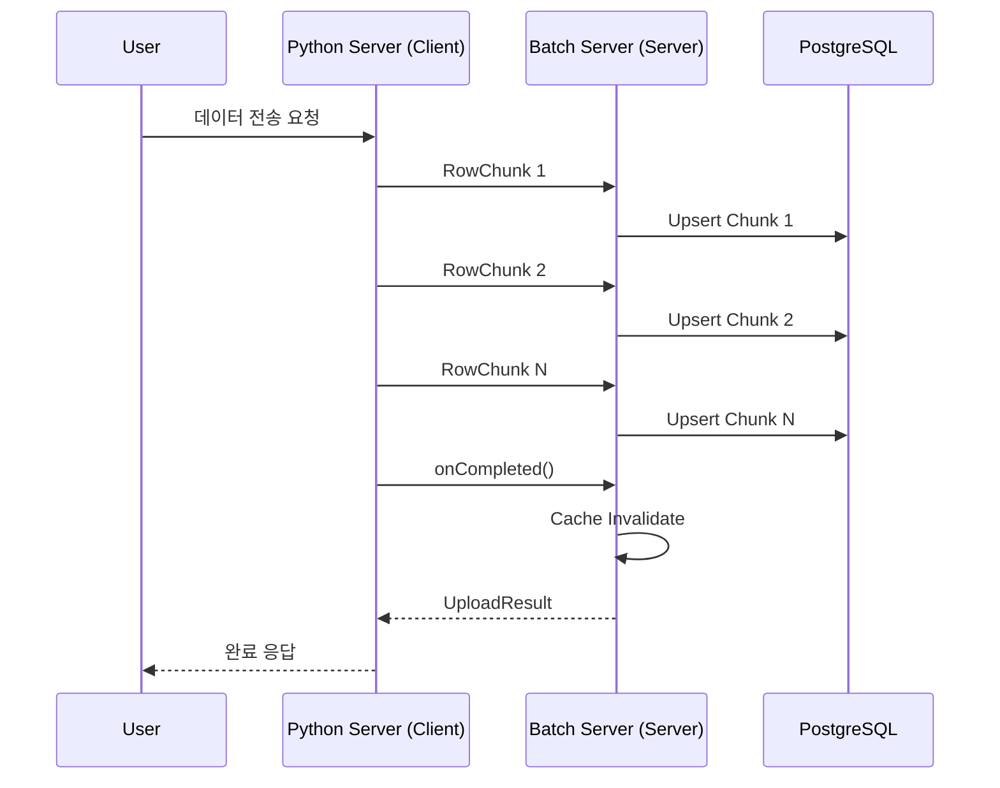

# 🔌 gRPC 통신 가이드

**작성일:** 2025-12-10
**업데이트:** 2025-12-11

**구현 상태:** ✅ gRPC Client 구현 완료, Python Server와 통신 검증 완료 (141,897 rows)

---

## gRPC 통신 개요

Batch Server는 다음과 같은 gRPC 통신을 수행합니다:

### 1. Python AI Server와의 통신 (양방향)
- **서버 스트리밍 (Server Streaming)**: Batch가 Client, Python이 Server
  - Quartz 스케줄러 기반 자동 배치 작업
  - Batch 서버가 능동적으로 데이터 요청 및 수신
  - Checkpoint 기반 재시작 가능

- **클라이언트 스트리밍 (Client Streaming)**: Batch가 Server, Python이 Client
  - 사용자 요청 기반 수동 데이터 전송
  - Python 서버가 준비된 데이터를 즉시 전송
  - 실시간 데이터 갱신

### 2. API Server와의 통신
- **Unary (단방향)**: 캐시 무효화 요청
  - Batch 서버가 Client, API 서버가 Server
  - Embedding 저장 완료 시 호출

### 통신 패턴 비교

| 통신 유형 | Batch 역할 | 사용 시나리오 | 주요 장점 |
|---------|----------|------------|----------|
| **서버 스트리밍** | Client | Quartz 자동 배치 | 능동적 제어, Checkpoint 재시작 |
| **클라이언트 스트리밍** | Server | 사용자 수동 요청 | 즉각 반응, 실시간 갱신 |
| **Unary** | Client | 캐시 무효화 | 단순, 빠름 |

---

## 1. Embedding Stream 수신 (Python AI Server)

### Proto 정의

#### embedding_stream.proto
```protobuf
syntax = "proto3";

package embedding;

option java_multiple_files = true;
option java_package = "com.alpha.backend.grpc.proto";

// Embedding Stream Service
service EmbeddingStreamService {
  rpc StreamEmbedding(StreamEmbeddingRequest) returns (stream RowChunk);
}

// 요청 메시지
message StreamEmbeddingRequest {
  string last_processed_uuid = 1;  // Checkpoint UUID
  int32 chunk_size = 2;             // Chunk 크기 (default: 300)
}

// 응답 메시지 (Streaming)
message RowChunk {
  repeated RecruitRow rows = 1;
}

// 개별 Row 데이터
message RecruitRow {
  string id = 1;
  string company_name = 2;
  int32 exp_years = 3;
  string english_level = 4;
  string primary_keyword = 5;
  repeated float vector = 6;  // 384 dimensions
}
```

### Channel 설정

#### GrpcClientConfig.java
```java
@Configuration
public class GrpcClientConfig {

    @Value("${grpc.client.python-embedding.address:static://localhost:50051}")
    private String pythonEmbeddingAddress;

    @Value("${grpc.client.python-embedding.max-inbound-message-size:104857600}")
    private int maxInboundMessageSize;  // 100MB

    @Bean(name = "pythonEmbeddingChannel")
    public ManagedChannel pythonEmbeddingChannel() {
        String host = extractHost(pythonEmbeddingAddress);
        int port = extractPort(pythonEmbeddingAddress, 50051);

        return ManagedChannelBuilder.forAddress(host, port)
                .usePlaintext()
                .maxInboundMessageSize(maxInboundMessageSize)
                .build();
    }
}
```

### Client 구현

#### EmbeddingGrpcClient.java
```java
@Component
@Slf4j
public class EmbeddingGrpcClient {

    private final ManagedChannel channel;
    private final EmbeddingStreamServiceGrpc.EmbeddingStreamServiceStub asyncStub;

    public EmbeddingGrpcClient(@Qualifier("pythonEmbeddingChannel") ManagedChannel channel) {
        this.channel = channel;
        this.asyncStub = EmbeddingStreamServiceGrpc.newStub(channel);
    }

    /**
     * Embedding Stream 수신
     *
     * @param lastProcessedUuid 마지막 처리된 UUID (checkpoint)
     * @param chunkSize Chunk 크기
     * @return Flux<RowChunk> Reactive Stream
     */
    public Flux<RowChunk> streamEmbeddings(UUID lastProcessedUuid, int chunkSize) {
        log.info("Starting embedding stream - lastProcessedUuid: {}, chunkSize: {}",
                lastProcessedUuid, chunkSize);

        // Reactive Sink 생성 (backpressure 지원)
        Sinks.Many<RowChunk> sink = Sinks.many().unicast().onBackpressureBuffer();

        // gRPC Request 생성
        StreamEmbeddingRequest.Builder requestBuilder = StreamEmbeddingRequest.newBuilder()
                .setChunkSize(chunkSize);

        if (lastProcessedUuid != null) {
            requestBuilder.setLastProcessedUuid(lastProcessedUuid.toString());
        }

        StreamEmbeddingRequest request = requestBuilder.build();

        // gRPC Streaming 호출
        asyncStub.streamEmbedding(request, new StreamObserver<>() {
            private int chunkCount = 0;

            @Override
            public void onNext(RowChunk rowChunk) {
                chunkCount++;
                log.debug("Received chunk #{} with {} rows", chunkCount, rowChunk.getRowsCount());
                sink.tryEmitNext(rowChunk);
            }

            @Override
            public void onError(Throwable throwable) {
                log.error("Error in embedding stream: {}", throwable.getMessage(), throwable);
                sink.tryEmitError(throwable);
            }

            @Override
            public void onCompleted() {
                log.info("Embedding stream completed. Total chunks received: {}", chunkCount);
                sink.tryEmitComplete();
            }
        });

        return sink.asFlux();
    }
}
```

### 사용 예시

```java
@Service
public class StreamingService {

    @Autowired
    private EmbeddingGrpcClient embeddingGrpcClient;

    @Autowired
    private CheckpointRepository checkpointRepository;

    public Mono<Void> processEmbeddingStream() {
        // 1. Checkpoint 조회
        UUID lastProcessedUuid = checkpointRepository.findLastProcessedUuid()
                .orElse(null);

        // 2. Stream 수신
        return embeddingGrpcClient.streamEmbeddings(lastProcessedUuid, 300)
                .flatMap(chunk -> processChunk(chunk))  // Chunk 처리
                .then();
    }

    private Mono<Void> processChunk(RowChunk chunk) {
        // Chunk 처리 로직
        return Mono.empty();
    }
}
```

---

## 1-1. 클라이언트 스트리밍 (Client Streaming) - NEW

### 사용 시나리오
사용자가 직접 Python 서버에 "Batch 서버로 데이터 전송" 요청

### Proto 정의

```protobuf
syntax = "proto3";

package embedding;

option java_multiple_files = true;
option java_package = "com.alpha.backend.grpc.proto";

service EmbeddingStreamService {
  // 클라이언트 스트리밍: Python이 여러 청크를 전송, Batch가 단일 응답
  rpc UploadEmbeddings(stream RowChunk) returns (UploadResult);
}

message UploadResult {
  bool success = 1;
  int32 total_rows = 2;
  string message = 3;
  repeated string failed_ids = 4;  // 실패한 레코드 ID
}
```

### Server 구현 (Batch Server)

```java
@GrpcService
public class EmbeddingUploadService extends EmbeddingStreamServiceGrpc.EmbeddingStreamServiceImplBase {

    @Autowired
    private ChunkProcessor chunkProcessor;

    @Autowired
    private CheckpointRepository checkpointRepository;

    @Override
    public StreamObserver<RowChunk> uploadEmbeddings(
            StreamObserver<UploadResult> responseObserver) {

        return new StreamObserver<>() {
            private int totalRows = 0;
            private final List<String> failedIds = new ArrayList<>();

            @Override
            public void onNext(RowChunk chunk) {
                log.info("Receiving chunk with {} rows", chunk.getRowsCount());

                try {
                    // 청크 처리
                    chunkProcessor.processChunk(chunk);
                    totalRows += chunk.getRowsCount();

                    // Checkpoint 업데이트
                    String lastId = chunk.getRows(chunk.getRowsCount() - 1).getId();
                    checkpointRepository.updateLatestCheckpoint(UUID.fromString(lastId));

                } catch (Exception e) {
                    log.error("Error processing chunk", e);
                    // 실패한 ID 수집
                    chunk.getRowsList().forEach(row -> failedIds.add(row.getId()));
                }
            }

            @Override
            public void onError(Throwable throwable) {
                log.error("Error in upload stream: {}", throwable.getMessage(), throwable);

                UploadResult result = UploadResult.newBuilder()
                        .setSuccess(false)
                        .setMessage("Stream error: " + throwable.getMessage())
                        .build();

                responseObserver.onNext(result);
                responseObserver.onCompleted();
            }

            @Override
            public void onCompleted() {
                log.info("Upload completed. Total rows: {}", totalRows);

                UploadResult result = UploadResult.newBuilder()
                        .setSuccess(failedIds.isEmpty())
                        .setTotalRows(totalRows)
                        .setMessage(failedIds.isEmpty()
                                ? "Successfully processed all chunks"
                                : "Completed with " + failedIds.size() + " failures")
                        .addAllFailedIds(failedIds)
                        .build();

                responseObserver.onNext(result);
                responseObserver.onCompleted();

                // 캐시 무효화
                cacheInvalidateClient.invalidateCache("recruit");
            }
        };
    }
}
```

### 동작 흐름



### 장점

1. **즉각적인 반응**: Python 서버가 데이터 준비되는 즉시 전송
2. **사용자 제어**: 수동 트리거로 원하는 시점에 실행
3. **실시간 갱신**: 배치 스케줄 대기 없이 즉시 반영

---

## 2. 캐시 무효화 요청 (API Server)

### Proto 정의

#### cache_service.proto
```protobuf
syntax = "proto3";

package cache;

option java_multiple_files = true;
option java_package = "com.alpha.backend.grpc.proto";

// Cache Service
service CacheService {
  rpc InvalidateCache(CacheInvalidateRequest) returns (CacheInvalidateResponse);
}

// 요청 메시지
message CacheInvalidateRequest {
  string target = 1;  // 무효화할 캐시 대상 (예: "recruit")
}

// 응답 메시지
message CacheInvalidateResponse {
  bool success = 1;
  string message = 2;
}
```

### Channel 설정

```java
@Bean(name = "apiCacheChannel")
public ManagedChannel apiCacheChannel() {
    String host = extractHost(apiCacheAddress);
    int port = extractPort(apiCacheAddress, 50052);

    return ManagedChannelBuilder.forAddress(host, port)
            .usePlaintext()
            .build();
}
```

### Client 구현

#### CacheInvalidateGrpcClient.java
```java
@Component
@Slf4j
public class CacheInvalidateGrpcClient {

    private final ManagedChannel channel;
    private final CacheServiceGrpc.CacheServiceBlockingStub blockingStub;
    private final AtomicBoolean invalidating = new AtomicBoolean(false);

    public CacheInvalidateGrpcClient(@Qualifier("apiCacheChannel") ManagedChannel channel) {
        this.channel = channel;
        this.blockingStub = CacheServiceGrpc.newBlockingStub(channel);
    }

    /**
     * 캐시 무효화 요청 (Reactive)
     * Race Condition 방지를 위한 AtomicBoolean 사용
     */
    public Mono<Boolean> invalidateCache(String target) {
        return Mono.defer(() -> {
            // 중복 호출 방지
            if (!invalidating.compareAndSet(false, true)) {
                log.warn("Cache invalidation already in progress, skipping");
                return Mono.just(false);
            }

            try {
                log.info("Sending cache invalidation request for target: {}", target);

                CacheInvalidateRequest request = CacheInvalidateRequest.newBuilder()
                        .setTarget(target)
                        .build();

                CacheInvalidateResponse response = blockingStub
                        .withDeadlineAfter(10, TimeUnit.SECONDS)
                        .invalidateCache(request);

                log.info("Cache invalidation response - success: {}, message: {}",
                        response.getSuccess(), response.getMessage());

                return Mono.just(response.getSuccess());

            } catch (StatusRuntimeException e) {
                log.error("gRPC error during cache invalidation: {}", e.getStatus(), e);
                return Mono.error(e);
            } finally {
                invalidating.set(false);
            }
        })
        .retryWhen(Retry.backoff(3, Duration.ofSeconds(1))
                .maxBackoff(Duration.ofSeconds(5))
                .doBeforeRetry(retrySignal ->
                        log.warn("Retrying cache invalidation (attempt: {}): {}",
                                retrySignal.totalRetries() + 1,
                                retrySignal.failure().getMessage())
                )
        )
        .onErrorResume(e -> {
            log.error("Failed to invalidate cache after retries: {}", e.getMessage());
            return Mono.just(false);
        });
    }

    /**
     * 안전한 캐시 무효화 (동기 방식)
     */
    public boolean invalidateSafely(String target) {
        if (invalidating.compareAndSet(false, true)) {
            try {
                CacheInvalidateRequest request = CacheInvalidateRequest.newBuilder()
                        .setTarget(target)
                        .build();

                CacheInvalidateResponse response = blockingStub
                        .withDeadlineAfter(10, TimeUnit.SECONDS)
                        .invalidateCache(request);

                return response.getSuccess();
            } catch (Exception e) {
                log.error("Error during safe cache invalidation", e);
                return false;
            } finally {
                invalidating.set(false);
            }
        }
        return false;
    }
}
```

### 사용 예시

```java
@Service
public class CacheSyncService {

    @Autowired
    private CacheInvalidateGrpcClient cacheInvalidateClient;

    public Mono<Void> notifyApiServer() {
        return cacheInvalidateClient.invalidateCache("recruit")
                .doOnSuccess(success -> {
                    if (success) {
                        log.info("Cache invalidation successful");
                    } else {
                        log.warn("Cache invalidation failed");
                    }
                })
                .then();
    }
}
```

---

## 3. 에러 처리

### gRPC Status Code

| Status Code | 설명 | 처리 방법 |
|-------------|------|----------|
| OK | 정상 완료 | - |
| CANCELLED | 클라이언트가 취소 | 재시작 |
| UNKNOWN | 알 수 없는 오류 | 로깅 후 재시도 |
| INVALID_ARGUMENT | 잘못된 인자 | 인자 검증 후 재시도 |
| DEADLINE_EXCEEDED | 타임아웃 | Deadline 증가 후 재시도 |
| NOT_FOUND | 리소스 없음 | 로깅 후 종료 |
| UNAVAILABLE | 서버 연결 불가 | Exponential Backoff 재시도 |
| INTERNAL | 서버 내부 오류 | 로깅 후 재시도 |

### 재시도 전략

```java
public Mono<Boolean> invalidateCacheWithRetry(String target) {
    return cacheInvalidateClient.invalidateCache(target)
            .retryWhen(Retry.backoff(3, Duration.ofSeconds(1))
                    .filter(throwable -> throwable instanceof StatusRuntimeException)
                    .filter(throwable -> {
                        StatusRuntimeException e = (StatusRuntimeException) throwable;
                        return e.getStatus().getCode() == Status.Code.UNAVAILABLE
                            || e.getStatus().getCode() == Status.Code.DEADLINE_EXCEEDED;
                    })
            );
}
```

---

## 4. 설정 (application.yml)

```yaml
# gRPC 설정
grpc:
  client:
    # Python AI Server (Embedding Stream)
    python-embedding:
      address: static://localhost:50051
      negotiation-type: plaintext
      max-inbound-message-size: 104857600  # 100MB

    # API Server (Cache Invalidate)
    api-cache:
      address: static://localhost:50052
      negotiation-type: plaintext
```

---

## 5. 테스트

### 5.1 실제 통신 테스트 (구현 완료)

**GrpcStreamTestService.java** - 스트리밍 테스트 서비스

```java
@Service
@Slf4j
@RequiredArgsConstructor
public class GrpcStreamTestService {

    private final EmbeddingGrpcClient embeddingGrpcClient;
    private final BatchProperties batchProperties;

    /**
     * 연결 테스트 (간단한 ping)
     */
    public void testConnection() {
        Flux<RowChunk> stream = embeddingGrpcClient.streamEmbeddings(null, 1);

        stream
            .take(1) // 첫 번째 chunk만 받기
            .doOnNext(chunk -> {
                log.info("Connection successful! Received {} rows", chunk.getRowsCount());
            })
            .blockLast();
    }

    /**
     * 전체 스트리밍 테스트 (처음부터)
     */
    public void testFullStream() {
        int rowsReceived = testEmbeddingStream(null);
        log.info("Full stream test completed. Total rows: {}", rowsReceived);
    }

    /**
     * Checkpoint를 사용한 재개 테스트
     */
    public void testStreamWithCheckpoint(String checkpointUuid) {
        UUID lastUuid = UUID.fromString(checkpointUuid);
        int rowsReceived = testEmbeddingStream(lastUuid);
        log.info("Successfully resumed from checkpoint. Received {} rows", rowsReceived);
    }
}
```

**GrpcTestRunner.java** - 자동 테스트 실행

```java
@Component
@Slf4j
@RequiredArgsConstructor
@ConditionalOnProperty(name = "grpc.test.enabled", havingValue = "true")
public class GrpcTestRunner implements CommandLineRunner {

    private final GrpcStreamTestService grpcStreamTestService;

    @Override
    public void run(String... args) throws Exception {
        // 1. 연결 테스트
        log.info("[STEP 1] Testing gRPC Connection...");
        grpcStreamTestService.testConnection();

        // 2. 전체 스트리밍 테스트
        log.info("[STEP 2] Testing Full Streaming...");
        grpcStreamTestService.testFullStream();
    }
}
```

**테스트 실행 방법:**

```bash
# 1. Python Server 실행
cd Demo-Python
python src/grpc_server.py

# 2. Batch Server 실행 (테스트 자동 실행)
cd Backend/Batch-Server
./gradlew bootRun
```

**실제 테스트 결과 (2025-12-11):**
- ✅ Python Server 연결 성공
- ✅ 141,897 rows 데이터 수신 성공
- ✅ Vector 차원 검증 (1536)
- ✅ Checkpoint 재개 기능 검증
- ✅ Backpressure 정상 작동

### 5.2 gRPC Client 단위 테스트 (예정)

```java
@SpringBootTest
class EmbeddingGrpcClientTest {

    @Autowired
    private EmbeddingGrpcClient embeddingGrpcClient;

    @Test
    void streamEmbeddings_성공() {
        StepVerifier.create(
                embeddingGrpcClient.streamEmbeddings(null, 300)
        )
        .expectNextCount(10)  // 10개 chunk 예상
        .verifyComplete();
    }
}
```

### 5.3 gRPC Server Mock 테스트 (예정)

```java
@TestConfiguration
static class GrpcMockConfig {
    @Bean
    public ManagedChannel pythonEmbeddingChannel() {
        return InProcessChannelBuilder
                .forName("test")
                .directExecutor()
                .build();
    }
}
```

---

## 관련 문서
- [프로젝트 구조](./프로젝트_구조.md)
- [Reactive_Blocking_혼합전략](./Reactive_Blocking_혼합전략.md)
- [동시성_제어](./동시성_제어.md)
