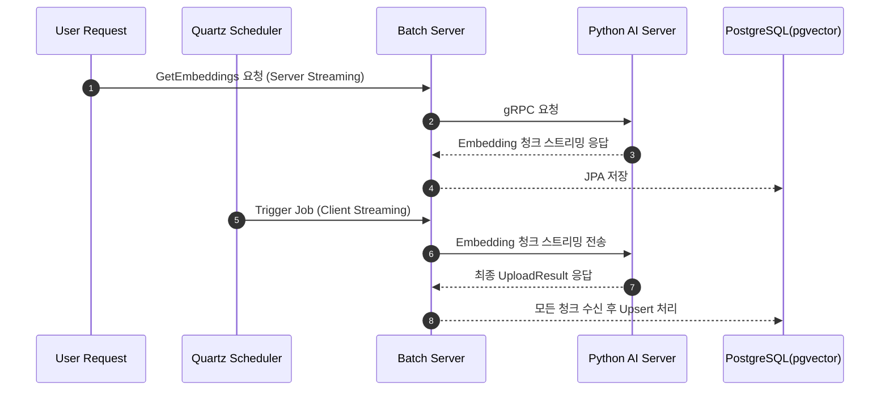

## 🎯 구현 현황 (2025-12-11 업데이트)

### ✅ 완료된 구현
- **gRPC Client 구현** (2025-12-11)
  - `EmbeddingGrpcClient.java`: Python Server와 스트리밍 통신
  - `CacheInvalidateGrpcClient.java`: API Server 캐시 무효화
  - 통신 성공 검증 완료 (141,897 rows)

- **gRPC 통신 테스트** (2025-12-11)
  - `GrpcStreamTestService.java`: 스트리밍 테스트 서비스
    - `testConnection()`: 연결 테스트
    - `testFullStream()`: 전체 스트리밍 테스트
    - `testStreamWithCheckpoint()`: Checkpoint 재개 테스트
  - `GrpcTestRunner.java`: CommandLineRunner 자동 테스트
  - `application.yml`: `grpc.test.enabled` 설정 추가

### 🔄 진행 중
- **Application Services**
  - `StreamingService`: gRPC Stream → DB 저장 파이프라인 (미구현)
  - `ChunkProcessor`: Metadata/Embedding 분리 및 Upsert (미구현)
  - `CacheSyncService`: 캐시 무효화 통합 (미구현)

### ⏳ 예정
- **Batch Job/Step 구성**
- **Scheduler 구현**
- **DLQ 처리 로직**

---

## 🔧 보완 설계

### 1. **청크 재분할 및 병렬 구독**

- Python 서버가 보낸 청크를 Batch 서버에서 그대로 JPA에 던지지 않고, Reactive 단계에서 **더 작은 단위로 세분화**합니다.
- Reactor의 `publishOn(Schedulers.boundedElastic())` 같은 스케줄러를 활용해 **여러 I/O 스레드에 병렬 분배**합니다.
- 이를 통해 DB 커넥션 풀을 최대한 활용하고, 병렬 insert/upsert 성능을 높일 수 있습니다.
- 단, 너무 작은 단위로 나누면 컨텍스트 스위칭 비용이 커지고, 너무 크게 잡으면 메모리 압박이 생기므로 **적절한 배치 사이즈 조절**이 필요합니다.

### 2. **UUID 기반 PK 활용**

- AutoIncrement 대신 **UUID를 그대로 PK로 활용**하여 PK 생성 시점의 경합을 제거합니다.
- 대규모 병렬 insert 환경에서도 시퀀스/identity 경합이 발생하지 않습니다.
- 다만 인덱스 관리와 트랜잭션 경합은 여전히 존재하므로, **UUID v7/ULID 같은 시간순 정렬형 UUID**를 활용하거나 인덱스 최적화를 병행하는 것이 바람직합니다.

### 3. **Reactive의 의미 있는 적용**

- 단순히 gRPC 스트림을 받아 JPA에 넘기는 구조라면 Reactive는 유명무실해질 수 있습니다.
- Reactive의 진짜 장점은 **DB I/O 직전까지의 파이프라인**에서 발휘되므로,

  캐시 갱신, 전처리, 필터링, 데이터 변환 같은 작업을 Reactive로 처리하고,

  **병렬 구독**을 통해 여러 I/O 스레드가 동시에 DB에 접근하도록 설계해야 합니다.


### 4. **서버 스트리밍과 클라이언트 스트리밍 병행 적용**



**`서버 스트리밍(Server Streaming)` - 클라이언트 단일 호출, 서버 다중 응답**
>
> Quartz 스케줄러 실행 → Batch 서버가 **클라이언트**가 되는 경우
>
> - Quartz가 Batch 서버를 트리거 → Batch 서버: 클라이언트 / Python 서버: 서버
>
> ---
>
> **구현**
>
> ```protobuf
> rpc GetEmbeddings (RequestParams) returns (stream Embedding);
> ```
>
> **클라이언트(Batch 서버)**
>
> - `stub.GetEmbeddings(params)` 호출 후, 응답 스트림을 반복(iterate)하면서 청크를 수신.
>
> 예: Java에서는 `for (Embedding e : responseStream)` 형태로 처리.
>
> **서버(Python 서버)**
>
> - 요청을 받고, `responseObserver.onNext()`를 여러 번 호출해 Embedding 청크를 push.
>
> 마지막에 `onCompleted()` 호출.
>

**`클라이언트 스트리밍(Client Streaming)` - 클라이언트 다중 호출, 서버 단일 응답**
> 사람이 직접 요청 → Python 서버가 **클라이언트**가 되는 경우
>
> - 사용자가 직접 Python 서버에 “데이터를 Batch 서버에 보내라” 요청 →  Batch 서버: 서버 / Python 서버: 클라이언트
>
> ---
>
> **구현**
>
> ```protobuf
> rpc UploadEmbeddings (stream Embedding) returns (UploadResult);
> ```
>
> **클라이언트(Python 서버)**
>
> - `requestObserver.onNext()`를 여러 번 호출해 Embedding 청크를 전송.
> - 모든 청크를 보낸 뒤 `onCompleted()` 호출.
>
> **서버(Batch 서버)**
>
> - 스트림을 수신하면서 청크를 모아 처리.
> - 모든 요청이 끝나면 최종적으로 `UploadResult` 반환.

### ⚖️ 최종 정리

- **청크 재분할 + 병렬 구독** → DB 스레드풀 활용 극대화
- **UUID 기반 PK** → AutoIncrement 경합 제거, 대규모 병렬 insert 안정성 확보
- **Reactive 파이프라인** → DB I/O 직전까지 비동기 처리 최적화
- **서버 스트리밍 + 클라이언트 스트리밍 병행** →
    1. 사람 직접 요청 시: `클라이언트 스트리밍`
    2. Quartz 스케줄러 기반 자동 배치 시: `서버 스트리밍`
- 결과적으로 **수동 요청 + 자동 배치 처리** 두 가지 시나리오를 모두 안정적으로 지원하는 구조 완성