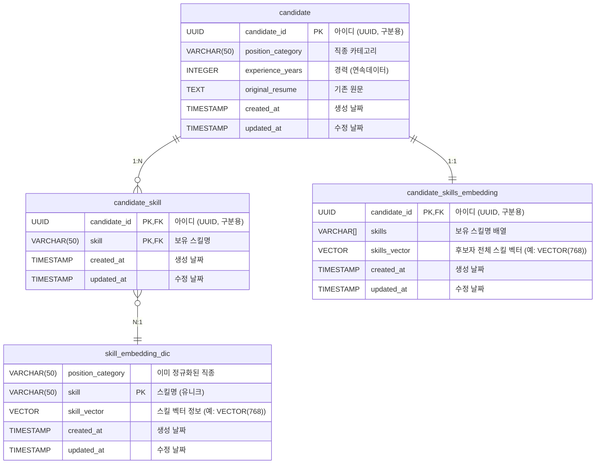
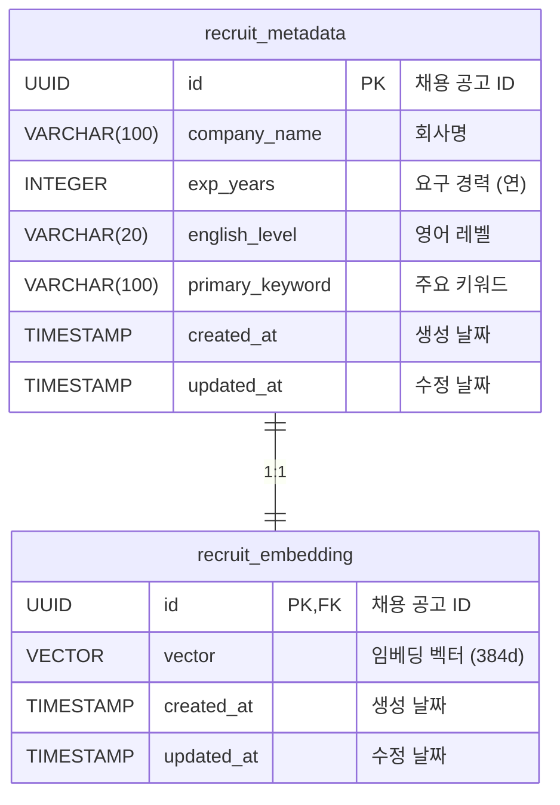

# 테이블 명세서

소유자: 김태현
태그: 아키텍쳐
최종 수정일: 2025-12-16

---

# 도메인

## 1. 지원자 (Candidate)

### 기초 요구 사항

구인자가 원하는 구직자를 기술 스택 리스트를 통해 검색할 테이블.

작성한 기술 스택의 문자열 List를 통해 가장 적합한 기술스택을 가진 지원자를 검색한다.

( ex - [Java, python, C] → candidate_detail 상위 5명 조회 )

### ERD



### 1. `candidate` (지원자 이력서)

> 구인자가 검색하게 될 이력서

| column_name | data_type | nullable | default_value | constraint | description |
| --- | --- | --- | --- | --- | --- |
| candidate_id | `UUID`  | Not Null |  | PK | 아이디 (UUID, 구분용) |
| position_category | `VARCHAR(50)` | Not Null |  |  | 직종 카테고리 |
| experience_years | `INTEGER` | Not Null | 0 |  | 경력 (연) |
| original_resume | `TEXT` | Not Null |  |  | 기존 원문 |
| created_at | `TIMESTAMP` | Not Null | NOW() |  | 생성 날짜 |
| updated_at | `TIMESTAMP` | Not Null | NOW() |  | 수정 날짜 |

### 2. `candidate_skill` (기술 스택 상세)

> 한 지원자의 이력서가 가진 기술 스택 모음
> candidate와 1:N 관계

| column_name | data_type | nullable | default_value | constraint | description |
| --- | --- | --- | --- | --- | --- |
| candidate_id | `UUID`  | Not Null |  | PK, FK | 아이디 (UUID, 구분용) |
| skill | `VARCHAR(50)` | Not Null |  | PK, FK | 보유 스킬명 |
| created_at | `TIMESTAMP` | Not Null | NOW() |  | 생성 날짜 |
| updated_at | `TIMESTAMP` | Not Null | NOW() |  | 수정 날짜 |

**제약조건:**
- PRIMARY KEY (candidate_id, skill) -- 복합 PK (DDD Aggregate 패턴)
- FOREIGN KEY (candidate_id) REFERENCES candidate(candidate_id) ON DELETE CASCADE
- FOREIGN KEY (skill) REFERENCES skill_embedding_dic(skill) ON DELETE RESTRICT

### 3. `candidate_skills_embedding` (기술 스택 뭉치 벡터 테이블)

> 한 지원자의 이력서가 가진 기술 스택 뭉치의 임베딩 테이블

| column_name | data_type   | nullable | default_value | constraint | description |
| --- |-------------| --- | --- | --- | --- |
| candidate_id | `UUID`      | Not Null |  | PK, FK | 아이디 (UUID, 구분용) |
| skills | `VARCHAR[]` | Not Null |  |  | 보유 스킬명 배열 |
| skills_vector | `VECTOR(768)` | Not Null |  |  | 기술 스택 벡터 정보 |
| created_at | `TIMESTAMP` | Not Null | NOW() |  | 생성 날짜 |
| updated_at | `TIMESTAMP` | Not Null | NOW() |  | 수정 날짜 |

**제약조건:**
- FOREIGN KEY (candidate_id) REFERENCES candidate(candidate_id) ON DELETE CASCADE

### 4. `skill_embedding_dic` (기술 스택 사전 + 벡터 테이블)

> 기술 스택별 임베딩 정보를 저장

| column_name | data_type | nullable | default_value | constraint | description |
| --- | --- | --- | --- | --- | --- |
| position_category | `VARCHAR(50)`  | Not Null |  |  | 이미 정규화된 직종명 |
| skill | `VARCHAR(50)` | Not Null |  | PK | 기술 스택 스킬명 |
| skill_vector | `VECTOR(768)` | Not Null |  |  | 기술 스택 벡터 정보 |
| created_at | `TIMESTAMP` | Not Null | NOW() |  | 생성 날짜 |
| updated_at | `TIMESTAMP` | Not Null | NOW() |  | 수정 날짜 |

```sql
-- 인덱스: IVFFlat (벡터 유사도 검색 최적화)
CREATE INDEX idx_skill_vector ON skill_embedding_dic
USING ivfflat (skill_vector vector_cosine_ops) WITH (lists = 100);
```

---

## 2. 채용 공고 (Recruit)

### 기초 요구 사항

구직자가 원하는 채용 공고를 기술 스택과 조건을 통해 검색할 테이블.

### ERD



### 1. `recruit_metadata` (채용 공고 메타데이터)

| column_name | data_type | nullable | default_value | constraint | description |
| --- | --- | --- | --- | --- | --- |
| id | `UUID` | Not Null |  | PK | 채용 공고 ID |
| company_name | `VARCHAR(100)` | Not Null |  |  | 회사명 |
| exp_years | `INTEGER` | Not Null | 0 |  | 요구 경력 (연) |
| english_level | `VARCHAR(20)` | Nullable |  |  | 영어 레벨 |
| primary_keyword | `VARCHAR(100)` | Nullable |  |  | 주요 키워드 |
| created_at | `TIMESTAMP` | Not Null | NOW() |  | 생성 날짜 |
| updated_at | `TIMESTAMP` | Not Null | NOW() |  | 수정 날짜 |

**인덱스:**
```sql
CREATE INDEX idx_recruit_position_category ON recruit_metadata(primary_keyword);
CREATE INDEX idx_recruit_experience_years ON recruit_metadata(exp_years);
```

### 2. `recruit_embedding` (채용 공고 임베딩)

| column_name | data_type | nullable | default_value | constraint | description |
| --- | --- | --- | --- | --- | --- |
| id | `UUID` | Not Null |  | PK, FK | 채용 공고 ID |
| vector | `VECTOR(384)` | Not Null |  |  | 임베딩 벡터 |
| created_at | `TIMESTAMP` | Not Null | NOW() |  | 생성 날짜 |
| updated_at | `TIMESTAMP` | Not Null | NOW() |  | 수정 날짜 |

**제약조건:**
- FOREIGN KEY (id) REFERENCES recruit_metadata(id) ON DELETE CASCADE

**인덱스:**
```sql
-- IVFFlat 인덱스: 벡터 유사도 검색 최적화
CREATE INDEX idx_recruit_vector ON recruit_embedding
USING ivfflat (vector vector_cosine_ops) WITH (lists = 100);
```

---

## 3. 공통 테이블 (Batch 관리)

### 1. `dlq` (Dead Letter Queue)

실패한 레코드를 저장하여 나중에 재처리 가능

| column_name | data_type | nullable | default_value | constraint | description |
| --- | --- | --- | --- | --- | --- |
| id | `BIGSERIAL` | Not Null |  | PK | DLQ ID (자동 증가) |
| domain | `VARCHAR(50)` | Not Null |  |  | 도메인명 (recruit, candidate) |
| failed_id | `UUID` | Nullable |  |  | 실패한 레코드 ID |
| error_message | `TEXT` | Not Null |  |  | 에러 메시지 |
| payload | `TEXT` | Not Null |  |  | 원본 데이터 (JSON) |
| created_at | `TIMESTAMP` | Not Null | NOW() |  | 생성 날짜 |

**인덱스:**
```sql
CREATE INDEX idx_dlq_domain ON dlq(domain);
CREATE INDEX idx_dlq_created_at ON dlq(created_at);
```

### 2. `checkpoint` (체크포인트)

배치 처리 체크포인트 관리 (재시작 지원)

| column_name | data_type | nullable | default_value | constraint | description |
| --- | --- | --- | --- | --- | --- |
| id | `BIGSERIAL` | Not Null |  | PK | Checkpoint ID |
| domain | `VARCHAR(50)` | Not Null |  | UNIQUE | 도메인명 (recruit, candidate) |
| last_processed_uuid | `UUID` | Nullable |  |  | 마지막 처리 UUID |
| processed_count | `BIGINT` | Not Null | 0 |  | 처리된 레코드 수 |
| updated_at | `TIMESTAMP` | Not Null | NOW() |  | 수정 날짜 |

**인덱스:**
```sql
CREATE UNIQUE INDEX idx_checkpoint_domain ON checkpoint(domain);
```

---

## 4. Spring Batch 메타데이터 테이블

Spring Batch가 Job 실행 상태를 관리하기 위한 테이블

- `BATCH_JOB_INSTANCE` - Job 인스턴스
- `BATCH_JOB_EXECUTION` - Job 실행 이력
- `BATCH_JOB_EXECUTION_PARAMS` - Job 파라미터
- `BATCH_JOB_EXECUTION_CONTEXT` - Job 실행 컨텍스트
- `BATCH_STEP_EXECUTION` - Step 실행 이력
- `BATCH_STEP_EXECUTION_CONTEXT` - Step 실행 컨텍스트
- `BATCH_JOB_SEQ` - Job 시퀀스
- `BATCH_JOB_EXECUTION_SEQ` - Job Execution 시퀀스
- `BATCH_STEP_EXECUTION_SEQ` - Step Execution 시퀀스

> **참고:** Spring Batch 6.0 공식 스키마 사용
> https://github.com/spring-projects/spring-batch/blob/main/spring-batch-core/src/main/resources/org/springframework/batch/core/schema-postgresql.sql

---

## 5. Quartz 스케줄러 테이블

Quartz 스케줄러가 Job/Trigger 상태를 관리하기 위한 테이블

- `QRTZ_JOB_DETAILS` - Job 상세 정보
- `QRTZ_TRIGGERS` - Trigger 정보
- `QRTZ_CRON_TRIGGERS` - Cron Trigger
- `QRTZ_SIMPLE_TRIGGERS` - Simple Trigger
- `QRTZ_SIMPROP_TRIGGERS` - SimpleProp Trigger
- `QRTZ_BLOB_TRIGGERS` - Blob Trigger
- `QRTZ_CALENDARS` - Calendar 정보
- `QRTZ_PAUSED_TRIGGER_GRPS` - 일시 정지된 Trigger 그룹
- `QRTZ_FIRED_TRIGGERS` - 실행 중인 Trigger
- `QRTZ_SCHEDULER_STATE` - 스케줄러 상태
- `QRTZ_LOCKS` - 스케줄러 락

> **참고:** Quartz 2.3.2 PostgreSQL 스키마 사용
> http://www.quartz-scheduler.org/documentation/quartz-2.3.0/tutorials/tutorial-lesson-09.html

---

## 테이블 생성 순서 (FK 제약 고려)

1. **Extension 활성화**
   - pgvector
   - uuid-ossp

2. **Candidate 도메인**
   1. `skill_embedding_dic` (FK 참조 대상, 먼저 생성)
   2. `candidate`
   3. `candidate_skill` (복합 PK)
   4. `candidate_skills_embedding`

3. **Recruit 도메인**
   1. `recruit_metadata`
   2. `recruit_embedding`

4. **공통 테이블**
   1. `dlq`
   2. `checkpoint`

5. **Spring Batch 메타데이터**

6. **Quartz 스케줄러**

7. **인덱스 생성**

---

## 주요 설계 원칙

### 1. DDD Aggregate 패턴
- `candidate_skill`: 복합 PK (candidate_id, skill)
- candidate → candidate_skill: CASCADE DELETE (Aggregate Root)

### 2. 벡터 차원 수
- `recruit`: 384d (BERT Small)
- `candidate`: 768d (BERT Base)

### 3. ON DELETE CASCADE
- candidate → candidate_skill: CASCADE
- candidate → candidate_skills_embedding: CASCADE
- recruit_metadata → recruit_embedding: CASCADE

### 4. IVFFlat 인덱스
- 벡터 유사도 검색 최적화 (pgvector)
- lists = 100 (중소 규모 데이터셋 최적화)

---

**최종 수정일:** 2025-12-16
