```mermaid
flowchart LR
    A["입력: 기술 스택 List<br/>예: [Java, Python, C]"]

    subgraph Normalization["스킬 정규화 단계"]
        B[skill_embedding_dic에서<br/>기술 스택 각각 조회]
        C[쿼리 벡터 생성<br/>스킬 벡터 평균/합산]
        B --> C
    end

    subgraph DomainProcessing["벡터 조회 단계"]
        D["도메인 벡터 조회<br/>${domain}_skills_embedding에서 불러오기"]
    end

    subgraph Matching["매칭 및 추천 단계"]
        F["쿼리 벡터와 도메인 벡터 유사도 계산<br/>pgvector 연산자 (<->, <=>)"]
        G[상위 N명 도메인 정렬 및 조회<br/>예: Top 5<br/>유사도 0.7 이상]
        F --> G
    end

    subgraph Output["결과 반환 단계"]
        H["API 응답 반환<br/>${도메인}<br/>+${도메인}_description"]
    end

    A --> B
    C --> D
    D --> F
    G --> H
```

# 테이블 명세서

소유자: 김태현
태그: 아키텍쳐

# 도메인

---



---

## 1. 지원자 ( Candidate )

### 기초 요구 사항

<aside>

구인자가 원하는 구직자를 기술 스택 리스트를 통해 검색할 테이블.

---

작성한 기술 스택의 문자열 List를 통해 가장 적합한 기술스택을 가진 지원자를 검색한다.

( ex - [Java, python, C] → candidate_detail상위 5명 조회 )

```mermaid
erDiagram
    candidate {
        UUID candidate_id PK "아이디 (UUID, 구분용)"
        TEXT position_category "직종 카테고리"
        INTEGER experience_years "경력 (연속데이터)"
        TEXT original_resume "기존 원문"
        TIMESTAMPTZ created_at "생성 날짜"
        TIMESTAMPTZ updated_at "수정 날짜"
    }

    candidate_description {
        UUID candidate_id PK,FK "아이디 (UUID, 구분용)"
        TEXT original_resume "이력서 원문 (Markdown)"
        TEXT resume_lang "원문 언어"
        TEXT moreinfo "추가 정보 (프로젝트, 성과)"
        TEXT looking_for "구직 희망사항"
        TIMESTAMPTZ created_at "생성 날짜"
        TIMESTAMPTZ updated_at "수정 날짜"
    }
    
    candidate_skill {
        UUID candidate_id PK,FK "아이디 (UUID, 구분용)"
        TEXT skill PK "보유 스킬명"
        TIMESTAMPTZ created_at "생성 날짜"
        TIMESTAMPTZ updated_at "수정 날짜"
    }

    candidate_skills_embedding {
        UUID candidate_id PK,FK "아이디 (UUID, 구분용)"
        TEXT[] skills "보유 스킬명 배열"
        VECTOR skills_vector "후보자 전체 스킬 벡터 (VECTOR(1536))"
        TIMESTAMPTZ created_at "생성 날짜"
        TIMESTAMPTZ updated_at "수정 날짜"
    }

    candidate ||--o{ candidate_skill : "1:N"
    candidate ||--|| candidate_description : "1:1"
    candidate ||--|| candidate_skills_embedding : "1:1"
```

</aside>



### 1. `candidate` (지원자 이력서 메타 데이터)

> 구인자가 검색하게 될 이력서
> 

| column_name | data_type | nullable | default_value | constraint | description |
| --- | --- | --- | --- | --- | --- |
| candidate_id | `UUID`  | Not Null |  | PK | 지원자 아이디 |
| position_category | `TEXT` | Not Null |  |  | 직종 카테고리 |
| experience_years | `INTEGER`  | Null |  |  | 경력 |
| original_resume | `TEXT` | Not Null |  |  | 기존 원문 |
| created_at | `TIMESTAMPTZ` | Not Null | `NOW()` |  | 생성 날짜 |
| updated_at | `TIMESTAMPTZ` | Not Null | `NOW()` |  | 수정 날짜 |

---

### 2. `candidate_description` (이력서 상세 원문)

> 지원자 이력서의 Original Resume (Markdown 원문) 및 추가 정보
>

| column_name | data_type | nullable | default_value | constraint | description |
| --- | --- | --- | --- | --- | --- |
| candidate_id | `UUID` | Not Null |  | PK / FK | candidate.candidate_id |
| original_resume | `TEXT` | Not Null |  |  | 이력서 원문 |
| resume_lang | `TEXT` | Null |  |  | 원문 언어 (en, ko 등) |
| moreinfo | `TEXT` | Null |  |  | 추가 정보 (프로젝트, 성과, 경력 상세) |
| looking_for | `TEXT` | Null |  |  | 구직 희망사항 (선호 직무, 근무 조건) |
| created_at | `TIMESTAMPTZ` | Not Null | `NOW()` |  | 생성 날짜 |
| updated_at | `TIMESTAMPTZ` | Not Null | `NOW()` |  | 수정 날짜 |

📌 **설계 포인트**

- 개행·Markdown·리스트 그대로 저장
- moreinfo: 프로젝트 경험, 성과, 상세 경력 등 (nullable)
- looking_for: 구직 희망사항, 선호 직무 등 (nullable, 약 50%만 작성)
- 요약·재임베딩의 기준 데이터

### 3. `candidate_skill`(기술 스택 상세)

> 한 지원자의 이력서가 가진 기술 스택 모음
> 
> 
> candidate와 1:N 관계
> 

| column_name | data_type | nullable | default_value | constraint | description |
| --- | --- | --- | --- | --- | --- |
| candidate_id | `UUID`  | Not Null |  | PK / FK | candidate.candidate_id |
| skill | `TEXT` | Not Null |  | PK | 보유 스킬명 |
| created_at | `TIMESTAMPTZ` | Not Null | `NOW()` |  | 생성 날짜 |
| updated_at | `TIMESTAMPTZ` | Not Null | `NOW()` |  | 수정 날짜 |

### 4. `candidate_skills_embedding`(이력서 기술 스택 뭉치 벡터 테이블)

> 한 지원자의 이력서가 가진 기술 스택 뭉치의 임베딩 테이블
>

| column_name | data_type | nullable | default_value | constraint | description |
| --- | --- | --- | --- | --- | --- |
| candidate_id | `UUID`  | Not Null |  | PK / FK | candidate.candidate_id |
| skills | `TEXT[]` | Not Null |  |  | 보유 스킬명 |
| skills_vector | `vector(1536)` | Not Null |  |  | 기술 스택 벡터 정보 (text-embedding-3-large) |
| created_at | `TIMESTAMPTZ` | Not Null | `NOW()` |  | 생성 날짜 |
| updated_at | `TIMESTAMPTZ` | Not Null | `NOW()` |  | 수정 날짜 |

**벡터 임베딩 인덱스**

```sql
-- HNSW 인덱스 (고정확도, 권장)
CREATE INDEX candidate_skills_embedding_hnsw_idx
ON candidate_skills_embedding
USING hnsw (skills_vector vector_cosine_ops)
WITH (m = 32, ef_construction = 128);
```

📌 **설계 포인트**
- 벡터 차원: 1536d (OpenAI text-embedding-3-large)
- HNSW 인덱스: m=32, ef_construction=128 (고정확도)
- 중간 유사도(60-70%) 검색 정확도 99%+

---

## 2. 채용 공고 ( Recruit )

- **스트리밍 전송 전, 가공되지 않은 샘플 데이터**
    
    > `.pkl`, `.csv` 파일로 존재
    > 
    > 
    > ---
    > 
    > python 아래의 전처리를 청크 단위로 진행한 뒤, 배치 서버에 스트리밍으로 데이터를 보냅니다.
    > 
    > 순서는 가장 최적화가 잘되는 형식으로 진행
    > 
    > - `skills`가 비어있는 배열인 데이터 제외
    > - `Exp Years` - value가 no_exp인 경우 null처리, 2y과 같은 형식 Integer 형식으로 고정 ( ex - 2y → 2 )
    > - **`index_level_0` ,** `normalized_skills`, `embedding_input_text`, `embedding_sample` 컬럼 삭제
    
    | Position | Long Description | Company Name | Exp Years | Primary Keyword | English Level | Published | Long Description_lang | id | **index_level_0** | skills | normalized_skills | embedding_input_text | embedding_sample | skill_vector |
    | --- | --- | --- | --- | --- | --- | --- | --- | --- | --- | --- | --- | --- | --- | --- |
    | 10X Engineer (co-founder, #4 employee, USD 11-12k, 1-4% equity) | **Product**
    The product is a live video chat and co-browsing with website visitors. It helps companies generate more customers with instant video meetings directly on visitor’s website while they’re browsing a company’s page. It’s like a virtual web attendant that greets you on the web and guides through company’s products, much like they do in real-world stores.
    
    It’s been in development for 5 months, sales started 2 months ago, already has 7 paid enterprise customers.
    
    It already received $3mln funding, incl. from Google and couple of US tech billionaries.
    
    **Team**
    - Daniel — Founder, previously Co-founder / CTO at couple other companies, incl. CTO at [myetherwallet.com](http://myetherwallet.com/), winner of Peter Thiel Foundation scholarship
    - Will — founding engineer, 11 yrs experience, previously VP Engineering at [coder.com](http://coder.com/) and Senior Engineer at [OkCupid.com](http://okcupid.com/)
    - Aaron — founding engineer, 15 yrs experience
    - You — founding engineer, with 1-4% equity
    
    **Stage**
    - 5 months in development, e.g. almost from scratch
    - You will be a co-founder and #4 on the team with 1-4% equity
    - Already has 7 paying enterprise customers
    - Received $3mln funding, incl. from Google
    - New features development only; no legacy
    
    **Tech stack**
    - React, Typescript, Redux, Python, Flask, SQLAlchemy, Celery, WebRTC, WebSockets, Heroku
    - Expert-level with frontend is a must, but you have to be comfortable working across the stack
    - Highly preferred if you’re experienced with a broader range of technologies (Python, Java, Go, C#, PHP etc)
    
    **What will you do**
    - Build prototypes and features from start to finish: plan, build, test, deploy, iterate
    - Work in a small, very experienced, high performing, self-managed team
    - Have a lot of remote collaboration and getting feedback directly from users
    
    **Nearest features**
    - Scaling the system (WebSockets is a challenge here)
    - Session replay
    - Mobile app
    - Analytics
    - Video voicemails
    
    **Your profile**
    - Have an ownership mindset, value low process, high impact and real ownership in the company
    - Expert-level with the browser, incl. for example knowing Chrome RFCs
    - Experience developing products from scratch and in a “move fast and break things” environment
    - Have strong opinions on tech decisions, but happy to continuously challenge it
    - Thoughtful about creating and mantaining a world-class engineering culture in the company
    
    **What’s offered**
    - $11-12k/m compensation + 1-4% equity
    - Fully remote work, important are results
    - Move fast and break things approach
    - Low process, high impact environment
    - Direct contract with client (after 1-2 months of outstaffing) | Innoteka | 5y | JavaScript | fluent | 2021-07-01T00:00:00+03:00 | en | b9a1303e-dd0c-5ed1-8f62-be2bc4c7da4f | 27461 | ['c#' 'java' 'php' 'python' 'react' 'sql'] | ['C#', 'Java', 'PHP', 'Python', 'React', 'SQL'] | C# Java PHP Python React SQL | [np.float32(-0.0278), np.float32(-0.0189), np.float32(-0.032), np.float32(0.072), np.float32(-0.071)] | [-0.027826689183712006, -0.018867969512939453, -0.03204839304089546, 0.07196152955293655, -0.07099585235118866, -0.010462656617164612, 0.044044144451618195, 0.08806505054235458, -0.06491710245609283, -0.027394037693738937, -0.05973207578063011, -0.06366591155529022, 0.059069935232400894, -0.0127139613032341, 0.043236143887043, 0.096995510160923, -0.04417722299695015, -0.12312193959951401, 0.06753223389387131, 0.014362837187945843, -0.026903174817562103, -0.08861108869314194, 0.066971056163311, 0.03225914016366005, 0.06815473735332489, 0.010538964532315731, 0.024888381361961365, 0.014206712134182453, -0.02828020416200161, 0.05499163642525673, -0.05829863250255585, 0.04327883943915367, -0.09441819041967392, 0.04460255056619644, 0.01178571954369545, 0.06953726708889008, -0.013061361387372017, -0.04478888586163521, -0.01735050231218338, -0.045587871223688126, 0.008832799270749092, 0.026879340410232544, -0.05190197750926018, -0.035742029547691345, -0.00022740065469406545, -0.009828610345721245, -0.038553427904844284, -0.011637111194431782, 0.010202890262007713, -0.07968059927225113, -0.07409753650426865, 0.00792598631232977, 0.015745030716061592, 0.0020061766263097525, 0.062263116240501404, 0.024368343874812126, 0.03556055203080177, 0.03384831175208092, -0.06692994385957718, -0.09466636925935745, 0.020131107419729233, -0.07153353840112686, 0.02259720303118229, 0.025973722338676453, -0.026500480249524117, -0.004258683882653713, -0.04554928094148636, -0.016795439645648003, 0.09563685208559036, -0.12545591592788696, -0.10568613559007645, -0.054788168519735336, -0.03637661412358284, 0.03685641661286354, -0.013789846561849117, -0.05591534450650215, 0.051378823816776276, -0.050119563937187195, 0.028876373544335365, 0.07364750653505325, -0.04089844971895218, -0.0658276379108429, -0.08497536927461624, 0.06971751153469086, 0.0442630909383297, -0.001566789811477065, 0.08184593915939331, 0.014318964444100857, -0.020547660067677498, 0.05918519198894501, -0.05234629660844803, -0.07197427749633789, 0.0260554701089859, 0.06803887337446213, 0.0007065428653731942, 0.019858092069625854, -0.020884143188595772, 0.002845450071617961, 0.0732048898935318, 0.05639989674091339, 0.005495790392160416, 0.002668839180842042, -0.13481572270393372, 0.011709735728800297, -0.06478869169950485, 0.01641256920993328, 0.04869844764471054, -0.11973679810762405, 0.05028483271598816, -0.024759195744991302, -0.05389334633946419, 0.06186818704009056, -0.024361873045563698, -0.004720692522823811, -0.09999553114175797, -0.00979048851877451, 0.015588057227432728, -0.053067516535520554, 0.014287280850112438, -0.020487600937485695, 0.10157084465026855, 0.011819660663604736, -0.07152483612298965, 0.006637153681367636, 0.016225164756178856, 0.06066573038697243, 0.013997666537761688, 5.934311497748503e-34, 0.02297275699675083, -0.05508649721741676, 0.1367277204990387, -0.0634523332118988, 0.08040186762809753, 0.0678645670413971, 0.08519306033849716, 0.016481129452586174, 0.006686088629066944, -0.03846827149391174, -0.022162536159157753, -0.0017466495046392083, -0.007389940787106752, 0.02706591784954071, -0.09229640662670135, 0.021514344960451126, 0.021107690408825874, -0.024072464555501938, 0.03784609213471413, -0.003997705411165953, -0.07953085005283356, 0.02297806739807129, 0.04686538502573967, 0.015915891155600548, 0.043117981404066086, -0.006984011270105839, -0.07323665171861649, 0.13397280871868134, 0.0412418469786644, 0.012158280238509178, -0.0019252508645877242, -0.09023591130971909, -0.12775778770446777, 0.046502310782670975, 0.016331393271684647, 0.009462167508900166, -0.043202631175518036, -0.023817121982574463, -0.024941476061940193, -0.00244830921292305, -0.004845154471695423, -0.009442885406315327, 0.056142840534448624, 0.054477300494909286, 0.0025190513115376234, 0.006365458946675062, -0.06155141070485115, -0.02184661291539669, -0.025738472118973732, 0.02442220412194729, -0.057985614985227585, 0.04455303028225899, 0.03114961087703705, 0.019948570057749748, 0.04385221004486084, -0.004213131032884121, 0.024849863722920418, -0.0056529841385781765, 0.019909506663680077, -0.050557516515254974, -0.1125873476266861, 0.005384963005781174, 0.019715087488293648, -0.08322418481111526, 0.028930412605404854, 0.0426483117043972, -0.016847286373376846, -0.011074608191847801, 0.06662655621767044, 0.02008654735982418, 0.014701110310852528, 0.08301712572574615, 0.04280688613653183, -0.007690688129514456, -0.02266302891075611, 0.049732208251953125, 0.006125040352344513, -0.08663490414619446, 0.042451124638319016, 0.0216590017080307, 0.04200585186481476, -0.033075522631406784, -0.04691232740879059, 0.07821308076381683, -0.013442768715322018, 0.03447766974568367, -0.10105281323194504, 0.04592953622341156, 0.041990675032138824, 0.027341919019818306, -0.004709301050752401, -0.028735561296343803, 0.11365454643964767, -0.07581990212202072, -0.06783843040466309, -2.7742981763710968e-33, -0.0025219167582690716, -0.012284510768949986, -0.03150850161910057, -0.052744656801223755, 0.0007646101294085383, -0.05048702284693718, -0.022699857130646706, 0.01804421655833721, 0.0032254555262625217, 0.015609913505613804, 0.038570377975702286, -0.020262068137526512, 0.03858990967273712, 0.09727327525615692, 0.034653425216674805, 0.08763748407363892, -0.04929133877158165, 0.05929941311478615, 0.04882828891277313, -0.0034351572394371033, 0.012442265637218952, 0.1347702294588089, -0.05464695766568184, 0.07632516324520111, -0.06443393975496292, -0.009439265355467796, -0.023992298170924187, -0.059960171580314636, -0.030997414141893387, 0.061121631413698196, 0.020454831421375275, -0.007255714852362871, -0.06395573168992996, 0.045711588114500046, 0.00839721504598856, -0.07032444328069687, 0.05932532623410225, -0.03312493860721588, 0.031094469130039215, 0.06427320092916489, -0.021732885390520096, -0.019691526889801025, 0.023867975920438766, 0.019739508628845215, -0.017081767320632935, -0.0837654396891594, -0.06186694651842117, 0.0794280469417572, 0.0031092967838048935, 0.022481685504317284, -0.024730756878852844, -0.03866850584745407, 0.02692803181707859, -0.06957210600376129, 0.09191656857728958, -0.11351636052131653, 0.002500552451238036, -0.07301592081785202, -0.004449562635272741, -0.04665780067443848, -0.024120545014739037, 0.016727231442928314, 0.003996895160526037, 0.0047060586512088776, -0.034833233803510666, -0.001945599797181785, -0.14622287452220917, 0.052663639187812805, -0.02002832293510437, -0.027248727157711983, 0.020213589072227478, 0.07613413035869598, 0.025248555466532707, 0.01125422678887844, 0.07115417718887329, 0.03473232313990593, -0.02563212625682354, 0.0885133370757103, 0.06112728640437126, 0.13652627170085907, 0.06536223739385605, -0.019029447808861732, 0.026031147688627243, -0.05140510946512222, -0.07824220508337021, -0.06632538139820099, -0.014913402497768402, -0.041227083653211594, -0.05139743164181709, -0.00029526749858632684, -0.006587882526218891, 0.021574024111032486, 0.011784004978835583, 0.007442236412316561, 0.03601522743701935, -1.5365452910032218e-08, 0.02972067892551422, -0.03788619488477707, -0.036301299929618835, 0.0033454413060098886, 0.06914833188056946, 0.025747016072273254, -0.03281617537140846, 0.0018106363713741302, -0.032046232372522354, 0.03916222229599953, 0.002014318248257041, 0.07751522213220596, 0.10482143610715866, 0.005698125809431076, -0.07935889065265656, -0.009153295308351517, -0.04015684872865677, -0.03747935593128204, -0.011619680561125278, -0.004425725433975458, -0.020011896267533302, 0.03216535598039627, -0.1041119396686554, 0.021068332716822624, 0.08465798199176788, -0.01311478577554226, 0.06341583281755447, 0.07962363213300705, -0.049114737659692764, -0.03905802592635155, -0.05029277503490448, 0.004531445447355509, -0.036860812455415726, -0.018548810854554176, 0.040480874478816986, -0.050544191151857376, 0.09379766881465912, -0.02234213799238205, -0.04317006096243858, -0.004978310316801071, 0.019236136227846146, 0.0701393187046051, -0.008869310840964317, 0.022825712338089943, 0.029161246493458748, -0.038015712052583694, -0.0021649852860718966, 0.05045889690518379, -0.008170519024133682, -0.05197367072105408, 0.06533069908618927, -0.045289285480976105, -0.02948646992444992, -0.02225402370095253, -0.0029281347524374723, 0.027574198320508003, -0.05563684180378914, 0.05788874998688698, 0.02161833643913269, -0.0026727491058409214, -0.026878559961915016, 0.04270300269126892, 0.09127623587846756, -0.028398536145687103] |

### 기초 요구 사항

<aside>

구직자가 원하는 채용 공고를 **기술 스택 기반으로 검색**하기 위한 테이블.

---

채용 공고에 명시된 기술 스택 문자열 List를 기반으로 가장 적합한 공고를 벡터 유사도로 검색한다.

( ex - [Java, Python, C] → recruit 상위 5건 조회 )

</aside>

## ERD

```mermaid
erDiagram
    recruit {
        UUID recruit_id PK "아이디 (UUID, 구분용)"
        TEXT position "포지션 원문"
        TEXT company_name "회사명"
        INTEGER experience_years "요구 경력"
        TEXT primary_keyword "주요 키워드"
        TEXT english_level "영어 수준"
        TIMESTAMPTZ published_at "게시 날짜"
        TIMESTAMPTZ created_at "생성 날짜"
        TIMESTAMPTZ updated_at "수정 날짜"
    }

    recruit_skill {
        UUID recruit_id PK,FK "아이디 (UUID, 구분용)"
        TEXT skill PK "요구 기술 스택명"
        TIMESTAMPTZ created_at "생성 날짜"
        TIMESTAMPTZ updated_at "수정 날짜"
    }

    recruit_description {
        UUID recruit_id PK,FK "아이디 (UUID, 구분용)"
        TEXT long_description "채용 공고 원문 (Markdown)"
        TEXT description_lang " 원문 언어"
        TIMESTAMPTZ created_at "생성 날짜"
        TIMESTAMPTZ updated_at "수정 날짜"
    }

    recruit_skills_embedding {
        UUID recruit_id PK,FK "아이디 (UUID, 구분용)"
        TEXT[] skills "요구 기술 스택 배열"
        VECTOR skills_vector "채용 공고 기술 스택 벡터 (VECTOR(1536))"
        TIMESTAMPTZ created_at "생성 날짜"
        TIMESTAMPTZ updated_at "수정 날짜"
    }

    recruit ||--o{ recruit_skill : "1:N"
    recruit ||--|| recruit_description : "1:1"
    recruit ||--|| recruit_skills_embedding : "1:1"

```



**요약**

- recruit: 채용 공고 메타 정보
- recruit_description: JD 원문 저장
- recruit_skill: 기술 스택 정규화 연결
- recruit_skills_embedding: 공고 단위 집합 벡터

### 1. `recruit` (채용 공고 메타 데이터)

> 구직자가 검색하게 될 채용 공고 기본 정보
> 

| column_name | data_type | nullable | default_value | constraint | description |
| --- | --- | --- | --- | --- | --- |
| recruit_id | `UUID` | Not Null |  | PK | 채용 공고 ID |
| position | `TEXT` | Not Null |  |  | 포지션 원문 |
| company_name | `TEXT` | Not Null |  |  | 회사명 |
| experience_years | `INTEGER`  | Null |  |  | 요구 경력  |
| primary_keyword | `TEXT` | Null |  |  | 주요 키워드 |
| english_level | `TEXT` | Null |  |  | 영어 수준 |
| published_at | `TIMESTAMPTZ` | Null |  |  | 게시 날짜 |
| created_at | `TIMESTAMPTZ` | Not Null | `NOW()` |  | 생성 날짜 |
| updated_at | `TIMESTAMPTZ` | Not Null | `NOW()` |  | 수정 날짜 |

---

### 2. `recruit_description` (채용 공고 상세 원문)

> 채용 공고의 Long Description (Markdown 원문)
> 

| column_name | data_type | nullable | default_value | constraint | description |
| --- | --- | --- | --- | --- | --- |
| recruit_id | `UUID` | Not Null |  | PK / FK | recruit.recruit_id |
| long_description | `TEXT` | Not Null |  |  | 채용 공고 원문 |
| description_lang | `TEXT` | Null |  |  | 원문 언어 |
| created_at | `TIMESTAMPTZ` | Not Null | `NOW()` |  | 생성 날짜 |
| updated_at | `TIMESTAMPTZ` | Not Null | `NOW()` |  | 수정 날짜 |

📌 **설계 포인트**

- 개행·Markdown·리스트 그대로 저장
- 요약·재임베딩의 기준 데이터

---

### 3. `recruit_skill` (기술 스택 상세)

> 한 채용 공고에 명시된 개별 기술 스택 목록
> 
> 
> `recruit : recruit_skill = 1 : N`
> 

| column_name | data_type | nullable | default_value | constraint | description |
| --- | --- | --- | --- | --- | --- |
| recruit_id | `UUID` | Not Null |  | PK / FK | recruit.recruit_id |
| skill | `TEXT` | Not Null |  | PK | 기술 스택명 |
| created_at | `TIMESTAMPTZ` | Not Null | `NOW()` |  | 생성 날짜 |
| updated_at | `TIMESTAMPTZ` | Not Null | `NOW()` |  | 수정 날짜 |

📌 **권장 제약**

- `(recruit_id, skill)` 복합 PK 또는 UNIQUE

---

### 4. `recruit_skills_embedding`(채용 공고 기술 스택 뭉치 벡터 테이블)

> 한 채용 공고에 포함된 기술 스택 전체를 하나의 벡터로 표현
>

| column_name | data_type | nullable | default_value | constraint | description |
| --- | --- | --- | --- | --- | --- |
| recruit_id | `UUID` | Not Null |  | PK / FK | recruit.recruit_id |
| skills | `TEXT[]` | Not Null |  |  | 기술 스택 배열 |
| skills_vector | `VECTOR(1536)` | Not Null |  |  | 기술 스택 집합 벡터 (text-embedding-3-large) |
| created_at | `TIMESTAMPTZ` | Not Null | `NOW()` |  | 생성 날짜 |
| updated_at | `TIMESTAMPTZ` | Not Null | `NOW()` |  | 수정 날짜 |

📌 **설계 포인트**

- candidate 구조와 **완전히 대칭**
- 매칭 시 cosine similarity 계산 대상
- 벡터 차원: 1536d (OpenAI text-embedding-3-large)

**벡터 임베딩 인덱스**

```sql
-- HNSW 인덱스 (고정확도, 권장)
CREATE INDEX recruit_skills_embedding_hnsw_idx
ON recruit_skills_embedding
USING hnsw (skills_vector vector_cosine_ops)
WITH (m = 32, ef_construction = 128);
```

---

## 3. 기술 스택 임베딩 사전

- **스트리밍 전송 전, 가공되지 않은 샘플 데이터**
    
    > `.pkl`, `.csv` , `.json` 파일로 존재
    > 
    > 
    > ---
    > 
    > python 아래의 전처리를 청크 단위로 진행한 뒤, 배치 서버에 스트리밍으로 데이터를 보냅니다.
    > 
    > - `synonyms` 컬럼 제외
    
    ```json
    [
        {
            "name": "C",
            "category": "Backend",
            "synonyms": [
                "C Language",
                "CLang"
            ],
            "vector": [
                -0.018280336633324623,
                0.07142022252082825,
                -0.06651122123003006,
                0.04979754984378815,
                -0.06440401077270508,
                0.0029189169872552156,
                0.10093189030885696,
                0.08046931773424149,
                0.013881185092031956,
                -0.0032791225239634514,
                0.06479163467884064,
                -0.16593152284622192,
                0.004335297271609306,
                -0.010409893468022346,
                -0.055509768426418304,
                0.016582485288381577,
                -0.09685024619102478,
                -0.039817925542593,
                -0.0967230498790741,
                0.009252315387129784,
                -0.1311485767364502,
                -0.015074809081852436,
                -0.01620720699429512,
                0.0637805163860321,
                -0.030094394460320473,
                -0.020252609625458717,
                -0.04118622839450836,
                0.04318099468946457,
                -0.053945571184158325,
                -0.1013571247458458,
                -0.0609629787504673,
                0.02525336481630802,
                0.09705337882041931,
                0.0026270581874996424,
                0.02868974581360817,
                -0.05670486390590668,
                -0.03054306097328663,
                -0.04117025062441826,
                0.014790225774049759,
                0.033775366842746735,
                -0.05484354868531227,
                -0.027137715369462967,
                0.04896380007266998,
                0.08233937621116638,
                0.014914697967469692,
                0.032448917627334595,
                0.014995487406849861,
                0.03796936199069023,
                -0.061590973287820816,
                0.021357271820306778,
                -0.04916929081082344,
                -0.010213108733296394,
                -0.0919489860534668,
                0.028713366016745567,
                -0.011496391147375107,
                -0.03362736478447914,
                -0.06859950721263885,
                0.01948913000524044,
                0.025748690590262413,
                -0.0019231183687224984,
                -0.05654348060488701,
                0.01116484310477972,
                -0.06575619429349899,
                0.07361412793397903,
                0.02651129476726055,
                -0.02473142370581627,
                0.0077027082443237305,
                -0.007205391302704811,
                0.013872107490897179,
                0.012274114415049553,
                -0.02593347430229187,
                -0.009047051891684532,
                -0.046553123742341995,
                -0.049866534769535065,
                0.051944293081760406,
                -0.07024671137332916,
                -0.025674879550933838,
                -0.05623963847756386,
                0.06331949681043625,
                -0.03511840105056763,
                0.02087162807583809,
                0.041293200105428696,
                -0.059974152594804764,
                0.06184765323996544,
                -0.034106265753507614,
                0.022588908672332764,
                0.00040819437708705664,
                -0.010258836671710014,
                -0.05623720958828926,
                0.01120294351130724,
                -0.021797282621264458,
                0.01982189156115055,
                0.06737788766622543,
                -0.0022808590438216925,
                -0.13093720376491547,
                0.03464376553893089,
                0.057066239416599274,
                -0.06663510948419571,
                -0.020171333104372025,
                0.2355947345495224,
                0.0020606019534170628,
                0.022083383053541183,
                -0.016265427693724632,
                0.05164002627134323,
                -0.030190393328666687,
                0.0068629710003733635,
                -0.0341857448220253,
                0.017789578065276146,
                0.012964271940290928,
                0.06604447960853577,
                -0.00797984842211008,
                -0.018801668658852577,
                -0.0694480836391449,
                -0.02142113633453846,
                0.01134281512349844,
                0.052012961357831955,
                0.01673971489071846,
                -0.03468510881066322,
                -0.0034258670639246702,
                0.026209749281406403,
                -0.004164376296103001,
                -0.0005775094614364207,
                -0.013514026999473572,
                0.005297552794218063,
                -0.10358066111803055,
                -0.08661949634552002,
                0.0015871862415224314,
                -3.161834419266219e-33,
                -0.02377697080373764,
                -0.08050639182329178,
                0.05303468927741051,
                0.017288658767938614,
                0.02901097573339939,
                0.0018353634513914585,
                -0.037731386721134186,
                -0.00802565086632967,
                -0.05314408987760544,
                0.021353602409362793,
                -0.08787469565868378,
                -0.028745293617248535,
                0.02185218781232834,
                0.05314893648028374,
                0.0654202550649643,
                0.012172630988061428,
                0.08860817551612854,
                -0.002511846600100398,
                -0.04494212195277214,
                -0.052063602954149246,
                0.006840558256953955,
                0.05638373643159866,
                0.01112548727542162,
                -0.01753653585910797,
                0.021748490631580353,
                -0.10327816754579544,
                0.005534031428396702,
                -0.03315632417798042,
                0.05646194890141487,
                0.008032409474253654,
                0.030398869886994362,
                0.019825194031000137,
                -0.023836787790060043,
                0.00847011897712946,
                0.0249696746468544,
                -0.00964680127799511,
                0.049372848123311996,
                -0.00722533231601119,
                0.04062266647815704,
                -0.07669627666473389,
                -0.0334954559803009,
                -0.009121427312493324,
                -0.023761723190546036,
                -0.0012796218506991863,
                0.05646874010562897,
                0.03645649924874306,
                0.0340554304420948,
                0.06719864904880524,
                0.03375303000211716,
                0.044213663786649704,
                0.006573385093361139,
                -0.01466307695955038,
                -0.03588394448161125,
                0.056929849088191986,
                0.02089414931833744,
                0.0003358930116519332,
                -0.026830308139324188,
                1.4686600479763001e-05,
                -0.011367048136889935,
                0.025260379537940025,
                0.1377696394920349,
                0.09928535670042038,
                0.01847994141280651,
                0.02608255110681057,
                -0.05249757319688797,
                -0.04049373418092728,
                -0.09386637806892395,
                -0.021799426525831223,
                0.06983853876590729,
                -0.019639965146780014,
                -0.07968391478061676,
                -0.01673886366188526,
                0.15809042751789093,
                -0.032741472125053406,
                -0.0007844417705200613,
                0.012127839028835297,
                -0.06910759210586548,
                0.033730052411556244,
                -0.07669563591480255,
                -0.0283039603382349,
                -0.06372812390327454,
                0.026833627372980118,
                -0.03126980736851692,
                0.03323882445693016,
                0.04741289094090462,
                0.007338110823184252,
                0.0007195982616394758,
                -0.08150983601808548,
                0.03785395249724388,
                0.03865045681595802,
                -0.06464485079050064,
                0.033870380371809006,
                0.035017408430576324,
                0.005968499928712845,
                -0.006831375882029533,
                1.9284919710590515e-33,
                0.0042800297960639,
                0.044514529407024384,
                -0.05307842046022415,
                0.02771412953734398,
                -0.04393346235156059,
                -0.012380569241940975,
                -0.013042452745139599,
                -0.10705091059207916,
                -0.06326062232255936,
                0.07679000496864319,
                0.008536661975085735,
                -0.08744307607412338,
                0.01168324425816536,
                -0.026053931564092636,
                -0.009279127232730389,
                0.02711346372961998,
                0.057259444147348404,
                -0.009553751908242702,
                -0.09360572695732117,
                0.09984494000673294,
                -0.03598668426275253,
                -0.0879659354686737,
                -0.03152305260300636,
                -0.02602296695113182,
                -0.007560015190392733,
                0.07484231889247894,
                -0.004723952151834965,
                0.08272339403629303,
                0.042529139667749405,
                0.04748039320111275,
                0.014698803424835205,
                0.0028756640385836363,
                -0.05457841977477074,
                -0.019450780004262924,
                0.04214158654212952,
                0.010221434757113457,
                0.06501229852437973,
                -0.0836135521531105,
                0.015919091179966927,
                0.020840510725975037,
                0.09509584307670593,
                -0.008830060251057148,
                0.05929943174123764,
                0.17680472135543823,
                0.052881911396980286,
                -0.0067403893917799,
                -0.0005943093565292656,
                0.0012476607225835323,
                0.002174051245674491,
                0.013900494202971458,
                -0.07289939373731613,
                -0.12605735659599304,
                -0.021567318588495255,
                -0.006660196464508772,
                -0.0122509291395545,
                0.10782833397388458,
                0.007441527675837278,
                0.024770671501755714,
                0.03127004951238632,
                -0.020260265097022057,
                0.030583539977669716,
                0.006680136080831289,
                -0.0069129569455981255,
                -0.00991234090179205,
                0.0031403708271682262,
                -0.032282013446092606,
                -0.03702874481678009,
                0.04945699870586395,
                -0.006729272659868002,
                -0.06495635211467743,
                0.140500009059906,
                0.0938195064663887,
                -0.027830544859170914,
                -0.06627702713012695,
                -0.11512365937232971,
                -0.012469966895878315,
                -0.021980224177241325,
                -0.000649681081995368,
                0.03962118178606033,
                0.03879263997077942,
                -0.09141985327005386,
                0.07278308272361755,
                0.010012288577854633,
                0.00919257290661335,
                -0.01327984593808651,
                0.023457607254385948,
                0.05179869011044502,
                -0.05296630784869194,
                -0.017698101699352264,
                0.01154334843158722,
                0.029291091486811638,
                0.07832382619380951,
                0.0695243626832962,
                -0.0172417014837265,
                0.04871436581015587,
                -1.3601426651632664e-08,
                0.008601674810051918,
                -0.014885078184306622,
                -0.014975711703300476,
                -0.028793776407837868,
                0.12202165275812149,
                0.016053538769483566,
                -0.0562857910990715,
                -0.001471764757297933,
                0.00445020105689764,
                0.045942243188619614,
                -0.008217758499085903,
                0.023058081045746803,
                0.025734378024935722,
                0.03476842865347862,
                -0.012775429524481297,
                -0.050821635872125626,
                -0.11254896968603134,
                -0.019007714465260506,
                -0.01098208874464035,
                0.00161163997836411,
                -0.04256001114845276,
                0.0043236562050879,
                0.0016838369192555547,
                0.06902587413787842,
                -0.029948625713586807,
                0.013908361084759235,
                -0.02002817951142788,
                0.06115914508700371,
                -0.006305552553385496,
                0.0350460521876812,
                0.04905841127038002,
                0.056774262338876724,
                0.018730441108345985,
                -0.03673465549945831,
                0.03543708473443985,
                -0.0018518150318413973,
                0.02415846660733223,
                0.023825107142329216,
                -0.029043637216091156,
                0.07611371576786041,
                0.03992791101336479,
                -0.0432731918990612,
                -0.028797730803489685,
                -0.00629090704023838,
                0.0022877126466482878,
                -0.05239934101700783,
                -0.03941133990883827,
                0.04337809979915619,
                -0.0028020101599395275,
                -0.0451507605612278,
                -0.06327535957098007,
                0.008556520566344261,
                0.050500765442848206,
                0.06619924306869507,
                0.08568358421325684,
                -0.01774575188755989,
                -0.011970470659434795,
                0.04449453949928284,
                -0.08883964270353317,
                0.07524649053812027,
                0.10481715202331543,
                0.03860456123948097,
                -0.0013944501988589764,
                0.0359281487762928
            ]
        },
        ...
    ]
    ```
    

### 기초 요구 사항

<aside>

구직자/구인자가 원하는 채용 공고/이력서를 **기술 스택 기반으로 검색**하기 사전 테이블.

---

여러 기술 스택을 입력받고 사전을 통해 조회한 각각의 벡터값을 합쳐

`candidate_skills_embedding`, `recruit_skills_embedding` 의 임베딩 값과 유사도 비교를 하여 가장 유사한 검색 결과 5개를 도출한다. 

이 때 유사도는 0.7 이상인 경우만 검색되도록 한다.

```mermaid
erDiagram 
		skill_category_dic {
        UUID category_id PK "정규화된 직종 UUID"
        TEXT category UK "정규화된 직종"
        TIMESTAMPTZ created_at "생성 날짜"
        TIMESTAMPTZ updated_at "수정 날짜"
		}
		
    skill_embedding_dic {
        UUID category_id FK "정규화된 직종 UUID"
        UUID skill_id PK "스킬 UUID"
        TEXT skill UK "스킬명 (유니크)"
        VECTOR skill_vector "스킬 벡터 정보 (VECTOR(1536))"
        TIMESTAMPTZ created_at "생성 날짜"
        TIMESTAMPTZ updated_at "수정 날짜"
    }

    skill_category_dic ||--o{ skill_embedding_dic : "1:N"
```

</aside>



### 1. `skill_category_dic` (직종 카테고리 사전)

> 서비스에서 관리하는 기술 스택이 해당하는 직종 이름을 관리하는 테이블
ex - Backend, Frontend
> 

| column_name | data_type | nullable | default_value | constraint | description |
| --- | --- | --- | --- | --- | --- |
| category_id | `UUID` | Not Null |  | PK |  |
| category | `TEXT` | Not Null |  |  | 직종명 |
| created_at | `TIMESTAMPTZ` | Not Null | `NOW()` |  | 생성 날짜 |
| updated_at | `TIMESTAMPTZ` | Not Null | `NOW()` |  | 수정 날짜 |

### 2. `skill_embedding_dic` (기술 스택 임베딩 사전)

> 개별 기술 스택에 대한 임베딩 값을 저장한 사전
> 쿼리 벡터 생성 시 스킬별 벡터를 조회하여 평균/합산
>

| column_name | data_type | nullable | default_value | constraint | description |
| --- | --- | --- | --- | --- | --- |
| category_id | `UUID` | Not Null |  | FK | skill_category_dic.category_id |
| skill_id  | `UUID` | Not Null |  | PK | 스킬 UUID (자동 생성) |
| skill | `TEXT`  | Not Null |  | UK | 스킬명 (유니크) |
| skill_vector | `VECTOR(1536)` | Not Null |  |  | 스킬 벡터 (text-embedding-3-large) |
| created_at | `TIMESTAMPTZ` | Not Null | `NOW()` |  | 생성 날짜 |
| updated_at | `TIMESTAMPTZ` | Not Null | `NOW()` |  | 수정 날짜 |

📌 **설계 포인트**
- 벡터 차원: 1536d (OpenAI text-embedding-3-large)
- skill 컬럼: UNIQUE 제약 (비즈니스 키)
- HNSW 인덱스로 유사 스킬 검색 가능

---

## ✅ 전제 확인 요약

| 항목 | 판단 |
| --- | --- |
| candidate / recruit UUID 외부 주입 | ✅ 문제 없음 (오히려 안정적) |
| dic 계열 UUID 자동 생성 | ✅ 정석 |
| (domain_id, skill) 복합 PK | ✅ 중복/재처리 안전 |
| pgvector 인덱스 명시 | ✅ 필수 요건 충족 |
| TEXT[] skills 비서비스용 | ✅ 합리적 중복 |
| experience_years 정책 | ✅ 데이터셋 특성 반영 |

👉 **“이 상태면 DB 적재 OK”** 라고 판단해도 됩니다.

---

## 1️⃣ `category_dic`, `skill_embedding_dic` UUID 자동 생성 + UK 기반 UPSERT

- UUID는 내부 식별자
- `category`, `skill`은 비즈니스 키

👉 **UK + UPSERT가 정답**

### 📌 권장 DDL 포인트

```sql
CREATE EXTENSION IFNOTEXISTS "pgcrypto";

CREATE TABLE skill_category_dic (
    category_id UUIDPRIMARY KEYDEFAULT gen_random_uuid(),
    category TEXTNOT NULLUNIQUE,
    created_at TIMESTAMPTZNOT NULLDEFAULT NOW(),
    updated_at TIMESTAMPTZNOT NULLDEFAULT NOW()
);
```

```sql
CREATE TABLE skill_embedding_dic (
    skill_id UUIDPRIMARY KEYDEFAULT gen_random_uuid(),
    category_id UUIDNOT NULL,
    skill TEXTNOT NULLUNIQUE,
    skill_vector VECTOR(384)NOT NULL,
    created_at TIMESTAMPTZNOT NULLDEFAULT NOW(),
    updated_at TIMESTAMPTZNOT NULLDEFAULT NOW(),
CONSTRAINT fk_skill_category
FOREIGN KEY (category_id)
REFERENCES skill_category_dic(category_id)
);
```

### 📌 UPSERT 패턴 (배치 기준)

```sql
INSERT INTO skill_embedding_dic (category_id, skill, skill_vector)
VALUES (?, ?, ?)
ON CONFLICT (skill)
DOUPDATESET
    skill_vector= EXCLUDED.skill_vector,
    updated_at= NOW();

```

👉 **벡터 모델 교체 시에도 안전**

---

## 2️⃣ `(domain_id + skill)` 복합 PK 적용

### 📌 candidate 기준 예시

```sql
CREATE TABLE candidate_skill (
    candidate_id UUIDNOT NULL,
    skill TEXTNOT NULL,
    created_at TIMESTAMPTZNOT NULLDEFAULT NOW(),
    updated_at TIMESTAMPTZNOT NULLDEFAULT NOW(),
PRIMARY KEY (candidate_id, skill),
CONSTRAINT fk_candidate_skill
FOREIGN KEY (candidate_id)
REFERENCES candidate(candidate_id)
);

```

👉 이러면

- 배치 재처리
- 동일 이력서 재임포트
- 스트리밍 중 중복

전부 안전합니다.

---

## 3️⃣ `experience_years` 정책 (unsigned + NULL 의미 명확)

### ✔️ 판단

데이터셋 특성까지 고려한 **아주 좋은 정리**입니다.

정책이 명확함:

| 값 | 의미 |
| --- | --- |
| NULL | 신입 + 경력 무관 |
| 1 이상 | 경력 연차 |
| 0 | ❌ 존재하지 않음 |

### 📌 PostgreSQL에서의 구현

PostgreSQL에는 unsigned integer가 없으므로

**CHECK 제약으로 보완**하는 게 정석입니다.

```sql
experience_yearsINTEGERCHECK (experience_years>0)
```

👉 NULL은 자동으로 허용됨