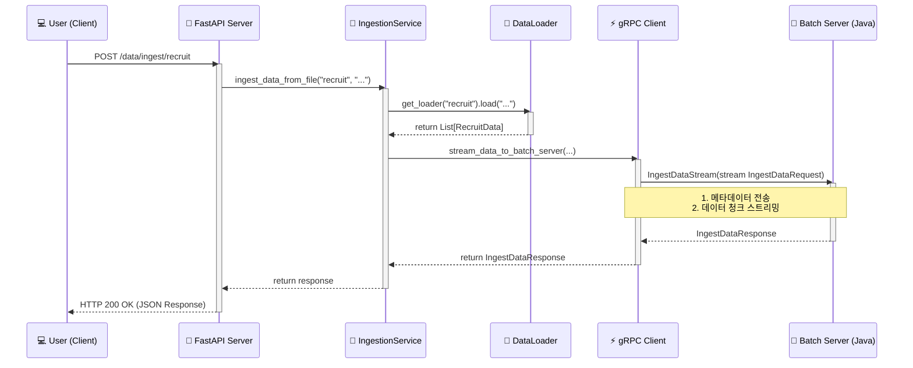

# 설계 문서: FastAPI와 gRPC 클라이언트 스트리밍 아키텍처

---

## 1. 🧩 개요 (Overview)

이 문서는 `Demo-Python` 서버의 새로운 아키텍처를 설명합니다. 기존의 gRPC 서버 역할에 더해, **FastAPI를 통해 외부 제어**가 가능해지고 **gRPC 클라이언트로서 배치 서버에 데이터를 능동적으로 전송**하는 기능이 추가되었습니다.

이 아키텍처의 핵심 목표는 다음과 같습니다.
- **유연한 트리거**: HTTP 요청을 통해 특정 도메인 및 파일에 대한 데이터 처리를 유연하게 시작합니다.
- **효율적인 데이터 전송**: 대용량 `.pkl` 데이터를 gRPC 클라이언트 스트리밍을 통해 메모리 효율적으로 배치 서버에 전송합니다.
- **확장 가능한 구조**: 제네릭과 역할 기반 계층 분리를 통해 새로운 데이터 도메인과 로더를 쉽게 추가할 수 있는 구조를 제공합니다.

## 2. ⚙️ 구성 / 구조 (Architecture / Components)

### 가. 프로젝트 구조 (리팩토링 후)

역할 기반의 계층형 아키텍처를 적용하여 각 컴포넌트의 책임과 역할을 명확히 분리했습니다.

```
src/
├── api/           # 1. API 계층: FastAPI 엔드포인트 정의
├── services/      # 2. 서비스 계층: 핵심 비즈니스 로직 처리
├── domain/        # 3. 도메인 계층: 데이터 모델 및 핵심 유틸리티
├── infrastructure/  # 4. 인프라 계층: 외부 시스템 연동 (gRPC, 파일 I/O)
├── config/        # 환경 설정
├── proto/         # Protobuf 파일 및 생성된 코드
└── main.py        # 애플리케이션 진입점
```

### 나. 컴포넌트 다이어그램 (Mermaid Class Diagram)

주요 컴포넌트 간의 관계는 다음과 같습니다.

```mermaid
classDiagram
    direction LR

    class FastAPI_Endpoint {
        <<API>>
        + /data/ingest/{domain}
    }

    class IngestionService {
        <<Service>>
        + ingest_data_from_file()
    }

    class DataLoader {
        <<Protocol>>
        + load(file_path) List~T_Row~
    }

    class PklRecruitLoader {
        <<Infrastructure>>
        + load(file_path) List~RecruitData~
    }

    class GrpcClient {
        <<Infrastructure>>
        + stream_data_to_batch_server()
    }

    FastAPI_Endpoint ..> IngestionService : calls
    IngestionService ..> DataLoader : uses
    IngestionService ..> GrpcClient : calls
    DataLoader <|.. PklRecruitLoader : implements
```

📝 **요약:** FastAPI 엔드포인트는 `IngestionService`를 호출하고, 서비스는 `DataLoader`를 사용해 파일을 읽은 뒤 `GrpcClient`를 통해 데이터를 전송합니다.

## 3. 🧠 처리 흐름 (Flow / Sequence Diagram)

HTTP 요청부터 배치 서버로의 gRPC 스트리밍까지 전체 데이터 흐름은 다음과 같습니다.



📝 **요약:** 사용자 요청은 FastAPI → 서비스 → 로더 → gRPC 클라이언트를 거쳐 최종적으로 배치 서버까지 데이터 스트림을 생성하여 전달됩니다.

## 4. 💡 예외 및 디버깅 (Edge Cases / Debugging)

- **파일을 찾을 수 없는 경우 (`FileNotFoundError`):**
  - `DataLoader`에서 예외가 발생합니다.
  - `IngestionService`를 거쳐 `FastAPI` 엔드포인트에서 `HTTP 404 Not Found` 예외로 변환되어 클라이언트에게 응답합니다.
- **지원하지 않는 도메인 (`ValueError`):**
  - `get_loader` 팩토리 함수에서 예외가 발생합니다.
  - `FastAPI` 엔드포인트에서 `HTTP 400 Bad Request` 예외로 변환되어 응답합니다.
- **gRPC 서버 연결 실패 (`AioRpcError`):**
  - `GrpcClient`에서 예외가 발생합니다.
  - `FastAPI` 엔드포인트에서 `HTTP 500 Internal Server Error` 예외로 변환되어 응답합니다. 이 경우 배치 서버의 상태를 확인해야 합니다.

## 5. 🧱 참고 및 부록 (Reference / Appendix)

### 가. API 테스트 명령어 (`curl`)

```bash
curl -X POST "http://localhost:8000/data/ingest/recruit?file_name=processed_recruitment_data.pkl" -H "accept: application/json"
```

### 나. 관련 문서

- **작업 히스토리**: [./hist/2025-12-12_01_FastAPI_및_클라이언트_스트리밍_구현.md](./hist/2025-12-12_01_FastAPI_및_클라이언트_스트리밍_구현.md)
- **gRPC 인터페이스**: `src/proto/embedding_stream.proto`
