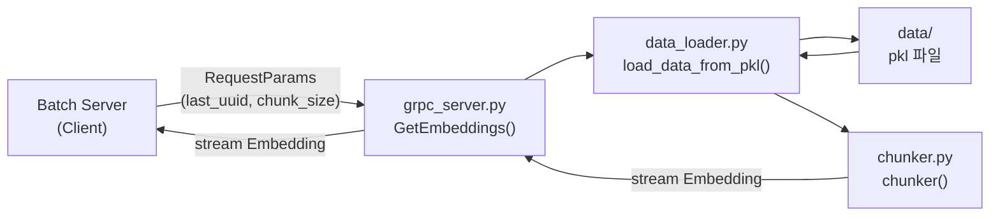
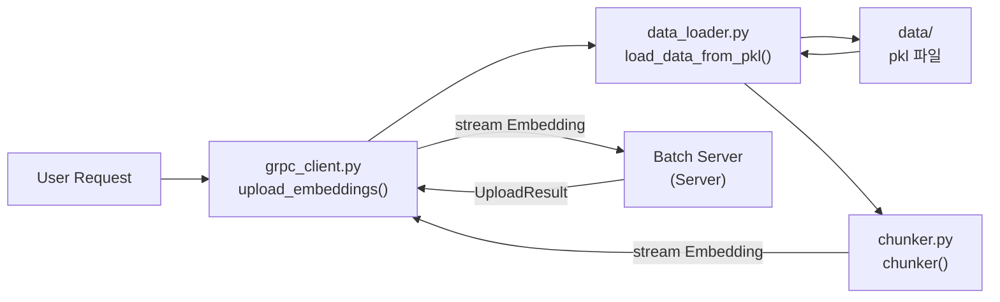
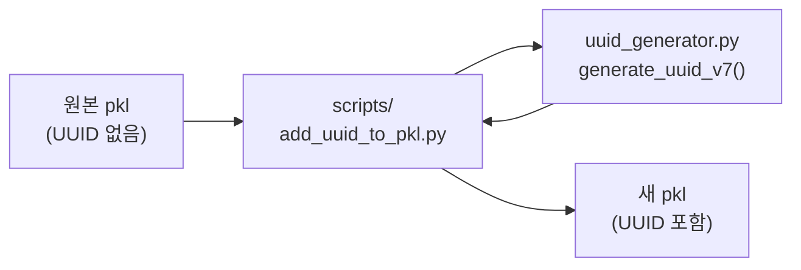

# 📂 Demo-Python 프로젝트 구조

*Python AI Embedding Streaming Server - 파일 구조 및 역할*

---

## 📋 목차

1. [전체 구조](#1-전체-구조)
2. [디렉토리별 설명](#2-디렉토리별-설명)
3. [파일별 역할](#3-파일별-역할)
4. [데이터 흐름](#4-데이터-흐름)
5. [개발 가이드](#5-개발-가이드)

---

# 1. 전체 구조

```
C:/Final_2025-12-09/Alpha-Match/Demo-Python/
│
├── src/                          # 소스 코드
│   ├── grpc_server.py           # gRPC 서버 메인 (Server Streaming)
│   ├── grpc_client.py           # gRPC 클라이언트 (Client Streaming)
│   ├── data_loader.py           # pkl 파일 로딩
│   ├── uuid_generator.py        # UUID v7/ULID 생성
│   ├── chunker.py               # Chunk 분할 로직
│   ├── config.py                # 환경 설정
│   └── proto/                   # Proto 파일 및 생성된 코드
│       ├── embedding_stream.proto
│       ├── embedding_stream_pb2.py
│       └── embedding_stream_pb2_grpc.py
│
├── data/                         # 데이터 파일
│   ├── processed_recruitment_data.pkl        # Embedding 데이터 (약 500MB)
│   └── processed_recruitment_data_with_uuid.pkl  # UUID 추가된 버전
│
├── docs/                         # 문서
│   ├── Python_서버_설계서.md
│   ├── UUID_생성_전략.md
│   ├── gRPC_서버_구현_가이드.md
│   ├── 데이터_로딩_전략.md
│   ├── 스트리밍_전략.md
│   └── 프로젝트_구조.md         # 현재 문서
│
├── tests/                        # 테스트 코드
│   ├── test_data_loader.py
│   ├── test_uuid_generator.py
│   ├── test_chunker.py
│   └── test_grpc_server.py
│
├── scripts/                      # 유틸리티 스크립트
│   ├── add_uuid_to_pkl.py       # pkl 파일에 UUID 추가
│   ├── create_test_data.py      # 테스트 데이터 생성
│   └── benchmark.py             # 성능 벤치마크
│
├── requirements.txt              # Python 의존성
├── .env.example                  # 환경 변수 예시
├── .gitignore                    # Git 무시 파일
├── README.md                     # 실행 가이드
└── CLAUDE.md                     # Claude 가이드
```

---

# 2. 디렉토리별 설명

## 2.1 src/ - 소스 코드

### 핵심 파일

| 파일 | 역할 | 설명 |
|-----|-----|-----|
| `grpc_server.py` | gRPC 서버 | Server Streaming 구현 (Batch Server 요청 처리) |
| `grpc_client.py` | gRPC 클라이언트 | Client Streaming 구현 (Batch Server로 전송) |
| `data_loader.py` | 데이터 로더 | pkl 파일 로딩 및 최적화 |
| `uuid_generator.py` | UUID 생성기 | UUID v7/ULID 생성 |
| `chunker.py` | Chunk 분할 | DataFrame을 Chunk로 분할 |
| `config.py` | 환경 설정 | 환경 변수 및 설정 관리 |

### proto/ - Protocol Buffers

| 파일 | 역할 | 설명 |
|-----|-----|-----|
| `embedding_stream.proto` | Proto 정의 | gRPC 서비스 및 메시지 정의 |
| `embedding_stream_pb2.py` | 메시지 클래스 | protoc로 생성된 메시지 클래스 |
| `embedding_stream_pb2_grpc.py` | 서비스 클래스 | protoc로 생성된 서비스 클래스 |

## 2.2 data/ - 데이터 파일

### pkl 파일

| 파일 | 크기 | 설명 |
|-----|-----|-----|
| `processed_recruitment_data.pkl` | ~500MB | 원본 Embedding 데이터 |
| `processed_recruitment_data_with_uuid.pkl` | ~500MB | UUID 추가된 버전 (권장) |

**⚠️ 주의:** pkl 파일은 `.gitignore`에 포함되어 Git에 커밋되지 않음

## 2.3 docs/ - 문서

### 설계 문서

| 파일 | 내용 |
|-----|-----|
| `Python_서버_설계서.md` | 전체 아키텍처 설계 |
| `UUID_생성_전략.md` | UUID v7/ULID 생성 전략 |
| `gRPC_서버_구현_가이드.md` | gRPC 서버/클라이언트 구현 |
| `데이터_로딩_전략.md` | pkl 파일 로딩 최적화 |
| `스트리밍_전략.md` | Streaming 최적화 전략 |
| `프로젝트_구조.md` | 현재 문서 |

## 2.4 tests/ - 테스트 코드

### 단위 테스트

| 파일 | 테스트 대상 |
|-----|-----------|
| `test_data_loader.py` | data_loader.py |
| `test_uuid_generator.py` | uuid_generator.py |
| `test_chunker.py` | chunker.py |
| `test_grpc_server.py` | grpc_server.py |

## 2.5 scripts/ - 유틸리티 스크립트

### 유틸리티

| 파일 | 용도 |
|-----|-----|
| `add_uuid_to_pkl.py` | pkl 파일에 UUID 추가 |
| `create_test_data.py` | 테스트용 pkl 파일 생성 |
| `benchmark.py` | UUID 생성 및 Streaming 성능 측정 |

---

# 3. 파일별 역할

## 3.1 grpc_server.py

### 역할
- gRPC Server Streaming 구현
- Batch Server의 요청을 받아 Embedding 데이터 전송
- Checkpoint (`last_processed_uuid`) 지원

### 주요 함수

```python
class EmbeddingStreamService:
    def GetEmbeddings(self, request, context):
        """Server Streaming: Batch Server 요청 처리"""
        pass

def serve():
    """gRPC 서버 시작"""
    pass
```

### 실행 방법

```bash
python src/grpc_server.py
# 또는
python -m src.grpc_server
```

## 3.2 grpc_client.py

### 역할
- gRPC Client Streaming 구현
- 사용자 요청 시 Batch Server로 데이터 전송

### 주요 함수

```python
def upload_embeddings_to_batch_server():
    """Client Streaming: Batch Server로 전송"""
    pass

def upload_with_retry(max_retries=3):
    """재시도 로직 포함 업로드"""
    pass
```

### 실행 방법

```bash
python src/grpc_client.py
# 또는
python -m src.grpc_client
```

## 3.3 data_loader.py

### 역할
- pkl 파일 로딩
- 메모리 최적화 (데이터 타입 변환)
- Checkpoint 기반 필터링

### 주요 함수

```python
def load_data_from_pkl(pkl_path: str) -> pd.DataFrame:
    """pkl 파일 로딩"""
    pass

def load_data_optimized(pkl_path: str) -> pd.DataFrame:
    """메모리 최적화 로딩"""
    pass

def filter_by_last_processed_uuid(
    df: pd.DataFrame,
    last_processed_uuid: str
) -> pd.DataFrame:
    """Checkpoint 기반 필터링"""
    pass
```

## 3.4 uuid_generator.py

### 역할
- UUID v7/ULID 생성
- DataFrame에 UUID 추가
- UUID 중복 검사

### 주요 함수

```python
def generate_uuid_v7() -> str:
    """UUID v7 생성"""
    pass

def generate_ulid() -> str:
    """ULID 생성"""
    pass

def add_uuid_to_dataframe(
    df: pd.DataFrame,
    uuid_type: str = 'uuid7'
) -> pd.DataFrame:
    """DataFrame에 UUID 추가"""
    pass

def check_uuid_uniqueness(df: pd.DataFrame) -> bool:
    """UUID 중복 검사"""
    pass
```

## 3.5 chunker.py

### 역할
- DataFrame을 Chunk로 분할
- 동적 Chunk 크기 계산

### 주요 함수

```python
def chunker(
    df: pd.DataFrame,
    chunk_size: int
) -> Iterator[pd.DataFrame]:
    """DataFrame을 Chunk로 분할"""
    pass

def calculate_optimal_chunk_size(
    vector_dimension: int = 1536,
    available_memory_mb: float = 100,
    safety_factor: float = 0.5
) -> int:
    """최적 Chunk 크기 계산"""
    pass
```

## 3.6 config.py

### 역할
- 환경 변수 로딩
- 설정 관리

### 주요 클래스

```python
class Config:
    # 서버 설정
    GRPC_PORT = 50051
    MAX_WORKERS = 10

    # 데이터 설정
    PKL_PATH = 'data/processed_recruitment_data.pkl'
    CHUNK_SIZE = 300

    # Batch Server 설정
    BATCH_SERVER_HOST = 'localhost'
    BATCH_SERVER_PORT = 50052
```

---

# 4. 데이터 흐름

## 4.1 Server Streaming (Quartz 기반)



## 4.2 Client Streaming (사용자 요청)



## 4.3 UUID 추가 프로세스



---

# 5. 개발 가이드

## 5.1 초기 설정

### 1. 의존성 설치

```bash
cd Demo-Python
pip install -r requirements.txt
```

### 2. Proto 파일 컴파일

```bash
# Batch Server의 proto 파일 복사
cp ../Backend/Batch-Server/src/main/proto/embedding_stream.proto src/proto/

# Python 코드 생성
python -m grpc_tools.protoc \
    -I src/proto \
    --python_out=src/proto \
    --grpc_python_out=src/proto \
    src/proto/embedding_stream.proto
```

### 3. 환경 변수 설정

```bash
# .env 파일 생성
cp .env.example .env

# .env 파일 편집
vim .env
```

### 4. pkl 파일에 UUID 추가

```bash
python scripts/add_uuid_to_pkl.py
```

## 5.2 개발 워크플로우

### 1. 새로운 기능 추가

```bash
# 1. 기능 브랜치 생성
git checkout -b feat/new-feature

# 2. 코드 작성
vim src/new_module.py

# 3. 테스트 작성
vim tests/test_new_module.py

# 4. 테스트 실행
pytest tests/test_new_module.py

# 5. 커밋
git add .
git commit -m "feat: Add new feature"
```

### 2. 테스트 실행

```bash
# 전체 테스트
pytest

# 특정 파일 테스트
pytest tests/test_data_loader.py

# Coverage 포함
pytest --cov=src tests/
```

### 3. 코드 포맷팅

```bash
# black 포맷팅
black src/

# isort import 정렬
isort src/

# flake8 린팅
flake8 src/
```

## 5.3 디버깅

### 로그 활성화

```python
# grpc_server.py
import logging

logging.basicConfig(
    level=logging.DEBUG,  # DEBUG 레벨로 변경
    format='%(asctime)s - %(name)s - %(levelname)s - %(message)s'
)

logger = logging.getLogger(__name__)
```

### gRPC 디버깅

```python
# gRPC 디버그 로깅 활성화
import grpc

# 서버
server = grpc.server(
    futures.ThreadPoolExecutor(max_workers=10),
    options=[('grpc.so_reuseport', 0)]
)

# 클라이언트
channel = grpc.insecure_channel(
    'localhost:50051',
    options=[('grpc.enable_http_proxy', 0)]
)
```

## 5.4 성능 프로파일링

### Memory Profiler

```bash
# memory_profiler 설치
pip install memory_profiler

# 프로파일링 실행
python -m memory_profiler src/data_loader.py
```

### cProfile

```bash
# cProfile 실행
python -m cProfile -s cumulative src/grpc_server.py > profile.txt

# 결과 분석
cat profile.txt
```

---

# 6. 배포

## 6.1 Docker 배포

### Dockerfile

```dockerfile
FROM python:3.11-slim

WORKDIR /app

# 의존성 설치
COPY requirements.txt .
RUN pip install --no-cache-dir -r requirements.txt

# 소스 코드 복사
COPY src/ src/
COPY data/ data/

# gRPC 포트 노출
EXPOSE 50051

# 서버 실행
CMD ["python", "src/grpc_server.py"]
```

### docker-compose.yml

```yaml
version: '3.8'

services:
  python-server:
    build: .
    ports:
      - "50051:50051"
    environment:
      - GRPC_PORT=50051
      - PKL_PATH=/app/data/processed_recruitment_data_with_uuid.pkl
      - CHUNK_SIZE=300
    volumes:
      - ./data:/app/data
```

### 실행

```bash
# 빌드 및 실행
docker-compose up --build

# 백그라운드 실행
docker-compose up -d

# 로그 확인
docker-compose logs -f
```

## 6.2 환경별 설정

### 개발 환경

```bash
# .env.development
GRPC_PORT=50051
PKL_PATH=data/processed_recruitment_data_with_uuid.pkl
CHUNK_SIZE=10
LOG_LEVEL=DEBUG
```

### 프로덕션 환경

```bash
# .env.production
GRPC_PORT=50051
PKL_PATH=/data/processed_recruitment_data_with_uuid.pkl
CHUNK_SIZE=300
LOG_LEVEL=INFO
```

---

# 7. 트러블슈팅

## 7.1 자주 발생하는 문제

### Proto 파일 import 오류

```python
# ❌ 에러
ModuleNotFoundError: No module named 'embedding_stream_pb2'

# ✅ 해결
# 1. proto 파일 재컴파일
python -m grpc_tools.protoc ...

# 2. PYTHONPATH 설정
export PYTHONPATH="${PYTHONPATH}:$(pwd)/src"
```

### pkl 파일 로딩 오류

```python
# ❌ 에러
FileNotFoundError: [Errno 2] No such file or directory: 'data/processed_recruitment_data.pkl'

# ✅ 해결
# 1. 파일 경로 확인
ls data/

# 2. 절대 경로 사용
import os
pkl_path = os.path.join(os.path.dirname(__file__), '..', 'data', 'processed_recruitment_data.pkl')
```

### gRPC 포트 충돌

```bash
# ❌ 에러
[Errno 98] Address already in use

# ✅ 해결
# 1. 포트 사용 프로세스 확인
lsof -i :50051

# 2. 프로세스 종료
kill -9 <PID>

# 3. 다른 포트 사용
GRPC_PORT=50052 python src/grpc_server.py
```

---

# 8. 요약

## 8.1 핵심 디렉토리

- **src/**: 소스 코드 (gRPC 서버/클라이언트, 데이터 로더 등)
- **data/**: pkl 파일 (Embedding 데이터)
- **docs/**: 설계 문서
- **tests/**: 테스트 코드
- **scripts/**: 유틸리티 스크립트

## 8.2 핵심 파일

- **grpc_server.py**: Server Streaming (Batch Server 요청 처리)
- **grpc_client.py**: Client Streaming (Batch Server로 전송)
- **data_loader.py**: pkl 파일 로딩 및 최적화
- **uuid_generator.py**: UUID v7/ULID 생성
- **chunker.py**: Chunk 분할

## 8.3 체크리스트

- [ ] 의존성 설치 완료
- [ ] Proto 파일 컴파일 완료
- [ ] pkl 파일에 UUID 추가 완료
- [ ] 환경 변수 설정 완료
- [ ] gRPC 서버 실행 테스트 완료
- [ ] Batch Server와 통신 테스트 완료

---

**최종 수정일:** 2025-12-11
