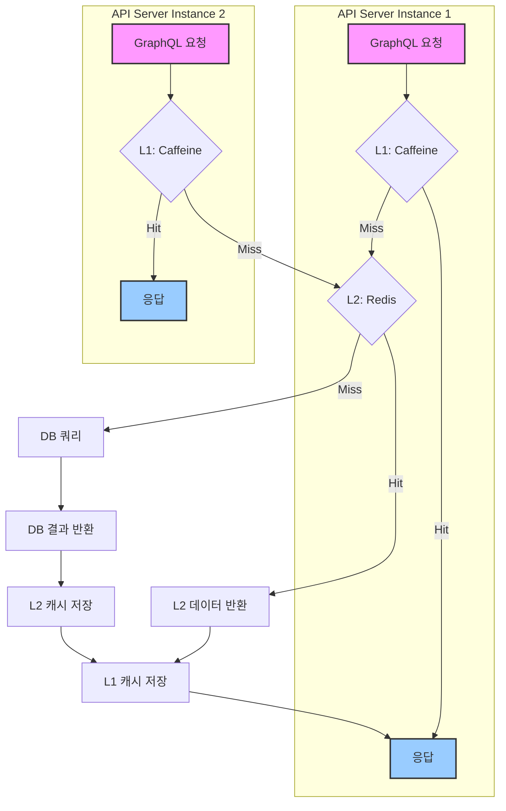
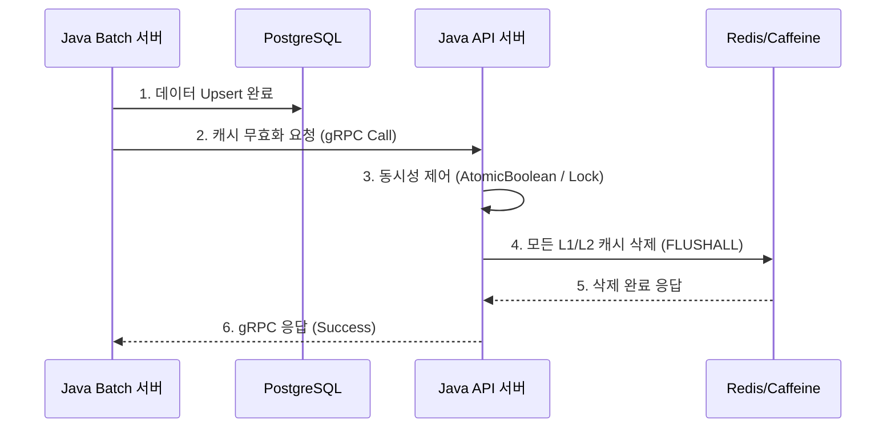

# Frontend Caching Strategy (Apollo Client)

## 1. 개요

프론트엔드 애플리케이션은 서버 상태 관리 및 캐싱을 위해 **Apollo Client**를 사용합니다. Apollo Client에 내장된 `InMemoryCache`는 GraphQL 쿼리 결과를 클라이언트 측에 저장하여, 동일한 데이터 요청 시 네트워크 호출 없이 즉시 응답하도록 지원합니다. 이를 통해 사용자 경험(UX)을 향상시키고 백엔드 API 서버의 부하를 줄입니다.

또한, Apollo Client 설정에는 `errorLink`가 포함되어 있어 GraphQL 및 네트워크 요청 중 발생하는 모든 에러를 전역적으로 가로채 Redux `notificationSlice`를 통해 사용자에게 알림을 제공하는 역할을 수행합니다.

## 2. 핵심 메커니즘: `InMemoryCache`

-   **구현**: `@apollo/client` 라이브러리의 `InMemoryCache` 클래스
-   **목적**: API로부터 받은 서버 상태를 클라이언트 메모리에 정규화된(normalized) 형태로 저장하고 관리하는 캐시 저장소입니다.
-   **전략**:
    -   **자동 정규화 (Automatic Normalization)**:
        -   `InMemoryCache`는 GraphQL 쿼리 응답에 포함된 `__typename`과 `id` (또는 커스텀 `keyFields`)를 조합하여 각 데이터 객체의 고유 ID를 생성합니다.
        -   이 고유 ID를 키로 사용하여 모든 객체를 평탄화된(flat) 구조로 저장합니다. 예를 들어, 중첩된 응답에 포함된 `Recruit` 객체는 `Recruit:<id>` 와 같은 키로 저장되어 여러 쿼리에서 재사용됩니다.
        -   이를 통해 서로 다른 쿼리가 동일한 데이터를 공유할 수 있으며, 한 객체가 업데이트되면 해당 객체를 사용하는 모든 UI가 자동으로 일관성 있게 업데이트됩니다.
    -   **쿼리 결과 캐싱**: 각 GraphQL 쿼리는 쿼리 이름과 변수의 조합을 키로 하여, 정규화된 객체를 가리키는 포인터들의 집합을 캐시에 저장합니다.
    -   **선언적 데이터 페칭**: React 컴포넌트에서 `useQuery` 훅을 사용하면, Apollo Client가 자동으로 캐시를 먼저 확인합니다.
        1.  **Cache Hit**: 캐시에 유효한 데이터가 있으면, 네트워크 요청 없이 즉시 캐시된 데이터를 반환합니다.
        2.  **Cache Miss**: 캐시에 데이터가 없으면, API 서버로 GraphQL 쿼리를 보냅니다.
        3.  응답을 받으면, 데이터를 정규화하여 캐시에 저장한 후 컴포넌트에 전달하여 렌더링합니다.

## 3. 캐시 관리 정책 (`fetchPolicy`)

`useQuery` 훅의 `fetchPolicy` 옵션을 통해 데이터 요청 시 캐시와 네트워크를 어떻게 사용할지 제어할 수 있습니다.

-   `cache-first` (기본값): 캐시를 먼저 확인하고, 없으면 네트워크 요청. 가장 일반적인 사용 사례.
-   `network-only`: 항상 네트워크 요청을 보내고, 응답을 캐시에 저장. 데이터의 최신성이 매우 중요할 때 사용.
-   `cache-and-network`: 캐시 데이터를 먼저 반환하여 UI를 빠르게 그리고, 그 후 네트워크 요청을 보내 최신 데이터로 UI를 다시 업데이트.
-   `no-cache`: 네트워크 요청만 보내고, 응답을 캐시에 저장하지 않음.

---

# Backend (API 서버) 캐싱 전략

## 1. 개요

Alpha-Match의 API 서버는 사용자에게 빠르고 일관된 검색 경험을 제공하기 위해 **다계층 캐싱(Multi-Layer Caching)** 전략을 사용합니다. 이 전략은 DB 부하를 최소화하고, 반복적인 요청에 대한 응답 시간을 극적으로 단축시키는 것을 목표로 합니다.

캐싱은 **읽기 성능 최적화**에 초점을 맞추며, 데이터의 최종 일관성(Eventual Consistency)을 전제로 합니다.

## 2. 캐싱 아키텍처

API 서버는 **L1(In-Memory) 캐시**와 **L2(Distributed)** 캐시의 두 계층으로 구성됩니다.

## 3. L1 캐시: Caffeine

-   **종류**: 인-메모리(In-Memory) 캐시
-   **구현**: `com.github.ben-manes.caffeine` 라이브러리 사용
-   **목적**: 가장 빠르고 빈번하게 접근하는 데이터를 각 API 서버 인스턴스의 메모리에 직접 저장하여, 네트워크 지연 시간 없이 가장 빠른 속도로 응답합니다.
-   **주요 캐싱 대상**:
    -   ID 기반의 단일 조회 결과 (예: `getRecruit(id: "...")`)
    -   자주 요청되는 소규모 메타데이터
-   **전략**:
    -   **크기 제한 (Size-based)**: 캐시가 차지하는 최대 메모리 양 또는 항목 수를 제한하여, 인스턴스의 메모리 고갈을 방지합니다. (예: `maximumSize=10000`)
    -   **시간 제한 (Time-based)**: 지정된 시간(예: 10분)이 지나면 캐시된 항목을 자동으로 만료시킵니다. (`expireAfterWrite=10m`)

## 4. L2 캐시: Redis

-   **종류**: 분산(Distributed) 캐시
-   **구현**: `Spring Data Redis` 사용
-   **목적**: 여러 API 서버 인스턴스가 공유하는 중앙 캐시 저장소 역할을 합니다. L1 캐시에 없는 데이터나, 크기가 커서 메모리에 부담을 주는 데이터를 저장합니다.
-   **주요 캐싱 대상**:
    -   복잡한 검색 쿼리 결과 (예: `searchMatches` 쿼리 전체 응답)
    -   사용자 세션 정보 (인증/인가 구현 시)
-   **전략**:
    -   **키(Key) 생성**: 요청된 GraphQL 쿼리와 변수(Variables)를 조합하고 해시(SHA-256 등)하여 고유한 캐시 키를 생성합니다.
        -   `Key = hash(query + variables)`
    -   **직렬화(Serialization)**: 캐시할 객체(주로 DTO)는 `JSON` 또는 성능이 중요한 경우 `Protobuf`/`MsgPack` 같은 바이너리 형식으로 직렬화하여 Redis에 저장합니다.
    -   **만료 정책**: TTL(Time-To-Live)을 설정하여 데이터의 최신성을 보장하고, 메모리 정책은 `LRU(Least Recently Used)` 또는 `LFU(Least Frequently Used)`를 사용하여 효율적으로 관리합니다.

## 5. 캐시 무효화 (Cache Invalidation)

**"Cache is hard, naming things is hard, and cache invalidation is one of the hardest problems in computer science."**

데이터베이스의 원본 데이터가 변경되었을 때, 캐시된 데이터와의 불일치를 해결하는 것은 매우 중요합니다. Alpha-Match에서는 **Batch 서버가 데이터 업데이트를 완료하는 시점**에 캐시를 무효화합니다.

-   **트리거**: `Batch-Server`의 배치 작업(`Job`)이 성공적으로 완료된 후, `JobExecutionListener`에서 실행됩니다.
-   **메커니즘**: Batch 서버는 gRPC 클라이언트를 통해 API 서버에 있는 `CacheInvalidateService`의 RPC를 호출합니다.
-   **실행**: API 서버는 요청을 받으면 **모든 캐시를 삭제(Flush)**합니다.
    -   **단순하지만 확실한 전략**: 가장 간단하고 확실하게 데이터 정합성을 맞추는 방법은 모든 키를 삭제하는 것입니다. 특정 키만 선별하여 삭제하는 것은 로직이 복잡해지고 실수할 가능성이 높습니다.
    -   **동시성 제어**: 여러 배치 작업 또는 외부 요인에 의해 동시에 캐시 무효화 요청이 들어올 경우를 대비해, `AtomicBoolean` 플래그나 `ReentrantLock`을 사용하여 한 번에 하나의 스레드만 무효화 작업을 수행하도록 보장해야 합니다.
