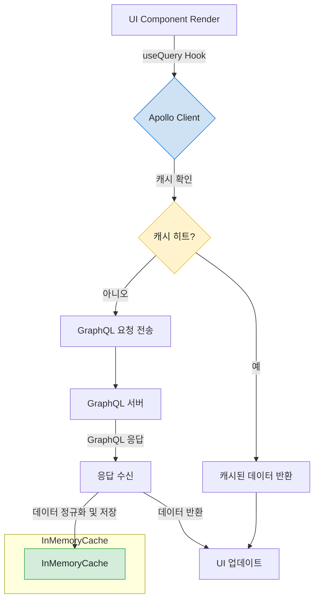

# Frontend Caching Strategy (Apollo Client)

## 1. 개요

프론트엔드 애플리케이션은 서버 상태 관리 및 캐싱을 위해 **Apollo Client**를 사용합니다. Apollo Client에 내장된 `InMemoryCache`는 GraphQL 쿼리 결과를 클라이언트 측에 저장하여, 동일한 데이터 요청 시 네트워크 호출 없이 즉시 응답하도록 지원합니다. 이를 통해 사용자 경험(UX)을 향상시키고 백엔드 API 서버의 부하를 줄입니다.

또한, Apollo Client 설정에는 `errorLink`가 포함되어 있어 GraphQL 및 네트워크 요청 중 발생하는 모든 에러를 전역적으로 가로채 Redux `notificationSlice`를 통해 사용자에게 알림을 제공하는 역할을 수행합니다.

## 2. 핵심 메커니즘: `InMemoryCache`

Apollo Client의 `InMemoryCache`는 클라이언트 측 데이터 관리의 핵심입니다. GraphQL 쿼리 요청이 발생하면, `InMemoryCache`는 다음과 같은 흐름으로 데이터를 처리하여 네트워크 요청을 최소화하고 UI 응답성을 높입니다.


*그림 2: Apollo Client InMemoryCache 동작 흐름도*

-   **구현**: `@apollo/client` 라이브러리의 `InMemoryCache` 클래스
-   **목적**: API로부터 받은 서버 상태를 클라이언트 메모리에 정규화된(normalized) 형태로 저장하고 관리하는 캐시 저장소입니다.
-   **전략**:
    -   **자동 정규화 (Automatic Normalization)**:
        -   `InMemoryCache`는 GraphQL 쿼리 응답에 포함된 `__typename`과 `id` (또는 커스텀 `keyFields`)를 조합하여 각 데이터 객체의 고유 ID를 생성합니다.
        -   이 고유 ID를 키로 사용하여 모든 객체를 평탄화된(flat) 구조로 저장합니다. 예를 들어, 중첩된 응답에 포함된 `Recruit` 객체는 `Recruit:<id>` 와 같은 키로 저장되어 여러 쿼리에서 재사용됩니다.
        -   이를 통해 서로 다른 쿼리가 동일한 데이터를 공유할 수 있으며, 한 객체가 업데이트되면 해당 객체를 사용하는 모든 UI가 자동으로 일관성 있게 업데이트됩니다.
    -   **쿼리 결과 캐싱**: 각 GraphQL 쿼리는 쿼리 이름과 변수의 조합을 키로 하여, 정규화된 객체를 가리키는 포인터들의 집합을 캐시에 저장합니다.
    -   **선언적 데이터 페칭**: React 컴포넌트에서 `useQuery` 훅을 사용하면, Apollo Client가 자동으로 캐시를 먼저 확인합니다.
        1.  **Cache Hit**: 캐시에 유효한 데이터가 있으면, 네트워크 요청 없이 즉시 캐시된 데이터를 반환합니다.
        2.  **Cache Miss**: 캐시에 데이터가 없으면, API 서버로 GraphQL 쿼리를 보냅니다.
        3.  응답을 받으면, 데이터를 정규화하여 캐시에 저장한 후 컴포넌트에 전달하여 렌더링합니다.

## 3. 캐시 관리 정책 (`fetchPolicy`)

`useQuery` 훅의 `fetchPolicy` 옵션을 통해 데이터 요청 시 캐시와 네트워크를 어떻게 사용할지 제어할 수 있습니다.

-   `cache-first` (기본값): 캐시를 먼저 확인하고, 없으면 네트워크 요청. 가장 일반적인 사용 사례.
-   `network-only`: 항상 네트워크 요청을 보내고, 응답을 캐시에 저장. 데이터의 최신성이 매우 중요할 때 사용.
-   `cache-and-network`: 캐시 데이터를 먼저 반환하여 UI를 빠르게 그리고, 그 후 네트워크 요청을 보내 최신 데이터로 UI를 다시 업데이트.
-   `no-cache`: 네트워크 요청만 보내고, 응답을 캐시에 저장하지 않음.

---

## 4. User Mode별 클라이언트 측 데이터 세분화 및 캐싱 (Client-Side Data Segmentation & Caching by User Mode)

프론트엔드 애플리케이션은 사용자 경험을 최적화하고, `UserMode` (CANDIDATE 또는 RECRUITER) 전환 시 각 모드별로 독립적인 작업 상태를 유지하기 위해 Redux를 활용한 클라이언트 측 데이터 세분화 전략을 적용합니다. 이는 마치 각 `UserMode`가 자신만의 `InMemoryCache`를 가지는 것처럼 동작하게 하여, 모드 전환 시 불필요한 데이터 재로딩이나 UI 초기화를 방지합니다.

### 4.1. 동작 흐름 시각화

```mermaid
graph TD
    subgraph User Interaction
        U[User] -- UserMode 변경 --> Header
        U -- 검색 수행 --> InputPanel
    end

    subgraph Frontend Components
        Header --> page.tsx
        InputPanel --> page.tsx
        page.tsx --> MainContent[메인 콘텐츠 영역]
    end

    subgraph Redux State (Mode-Specific)
        Header -- dispatch setUserMode(newMode) --> uiSlice[uiSlice (UserMode, PageViewMode, MatchId)]
        InputPanel -- dispatch search actions --> searchSlice[searchSlice (Skills, Experience)]

        uiSlice -- get userMode --> searchSlice
        uiSlice -- get pageViewMode, selectedMatchId --> page.tsx
        searchSlice -- get selectedSkills, selectedExperience --> page.tsx
    end

    subgraph Data Flow & State Preservation
        page.tsx -- 현재 userMode, 입력값 --> useSearchMatches[useSearchMatches Hook]
        useSearchMatches -- GraphQL 쿼리 (모드 포함) --> Backend

        Backend -- 결과 --> useSearchMatches
        useSearchMatches -- 결과 저장 (모드별) --> useSearchMatches

        useSearchMatches -- get matches (현재 userMode) --> page.tsx
        page.tsx -- matches --> MainContent

        MainContent -- pageViewMode, matches 기반 렌더링 --> UI

        classDef green fill:#d4edda,stroke:#28a745,color:#212529;
        classDef blue fill:#cfe2f3,stroke:#007bff,color:#212529;
        classDef purple fill:#e2d4f3,stroke:#6f42c1,color:#212529;

        uiSlice:::green
        searchSlice:::green
        useSearchMatches:::blue
        MainContent:::purple
    end

    style Header fill:#f9f9f9,stroke:#333,stroke-width:2px
    style InputPanel fill:#f9f9f9,stroke:#333,stroke-width:2px
    style MainContent fill:#f9f9f9,stroke:#333,stroke-width:2px
```
*그림 1: User Mode별 클라이언트 측 데이터 세분화 및 캐싱 흐름도*

### 4.2. 메커니즘

-   **상태 구조화**: Redux `searchSlice` 및 `uiSlice`는 `UserMode` (CANDIDATE, RECRUITER)를 키로 하는 객체 형태로 상태를 관리합니다.
    -   `searchSlice`: 각 `UserMode`별로 `selectedSkills`, `selectedExperience`, `isInitial` 등의 검색 입력 상태를 독립적으로 저장합니다.
    -   `uiSlice`: 각 `UserMode`별로 `pageViewMode` (dashboard, results, detail) 및 `selectedMatchId`와 같은 UI/뷰 상태를 독립적으로 저장합니다.
-   **동적 접근**: 애플리케이션은 현재 활성화된 `userMode`에 따라 해당 모드의 세분화된 상태에 접근하여 데이터를 읽거나 업데이트합니다.
-   **결과 캐싱**: `useSearchMatches` 훅은 `UserMode`별로 검색 결과(`matches`)를 내부적으로 관리합니다. 이전에 수행된 검색 결과는 다른 모드로 전환하더라도 메모리에 유지됩니다.

### 4.3. 동작 방식 예시

1.  **CANDIDATE 모드**:
    -   사용자가 CANDIDATE 모드에서 특정 기술 스택을 선택하고 검색을 수행합니다.
    -   Redux `searchSlice`의 `CANDIDATE` 객체에 `selectedSkills`, `selectedExperience`가 저장되고, `uiSlice`의 `CANDIDATE` 객체에 `pageViewMode = 'results'` 및 검색 결과가 저장됩니다.
2.  **RECRUITER 모드로 전환**:
    -   사용자가 RECRUITER 모드로 전환하면, `uiSlice`의 `userMode`가 RECRUITER로 변경됩니다.
    -   `page.tsx`의 `useEffect`는 `userMode` 변경을 감지하고, 이전에 RECRUITER 모드에서 저장된 `pageViewMode` (아마도 'dashboard' 또는 이전 검색 결과 뷰)에 따라 해당 모드의 상태를 표시합니다.
    -   만약 RECRUITER 모드에서 이전에 검색을 수행했다면, `useSearchMatches`는 RECRUITER 모드에 해당하는 저장된 `matches`를 반환하여 즉시 화면에 표시합니다.
3.  **CANDIDATE 모드로 재전환**:
    -   사용자가 CANDIDATE 모드로 다시 전환하면, 시스템은 CANDIDATE 모드에 저장된 검색 입력 상태와 검색 결과 뷰(`pageViewMode = 'results'`)를 즉시 복원하여 이전 검색 결과를 보여줍니다.

### 4.4. 이점

-   **Seamless User Experience**: `UserMode` 전환 시 UI가 깜빡이거나 초기화되지 않고, 각 모드의 작업 컨텍스트가 부드럽게 유지됩니다.
-   **성능 최적화**: 이전 검색 결과가 메모리에 유지되므로, 동일한 모드로 재진입 시 불필요한 네트워크 요청 없이 즉시 결과를 표시할 수 있습니다.
-   **상태 격리**: 각 모드의 상태가 독립적으로 관리되어 한 모드의 변경이 다른 모드에 영향을 주지 않습니다.

이 전략은 Apollo Client의 `InMemoryCache`와 상호 보완적으로 작동하며, 클라이언트 애플리케이션의 전반적인 반응성과 사용자 경험을 크게 향상시킵니다.