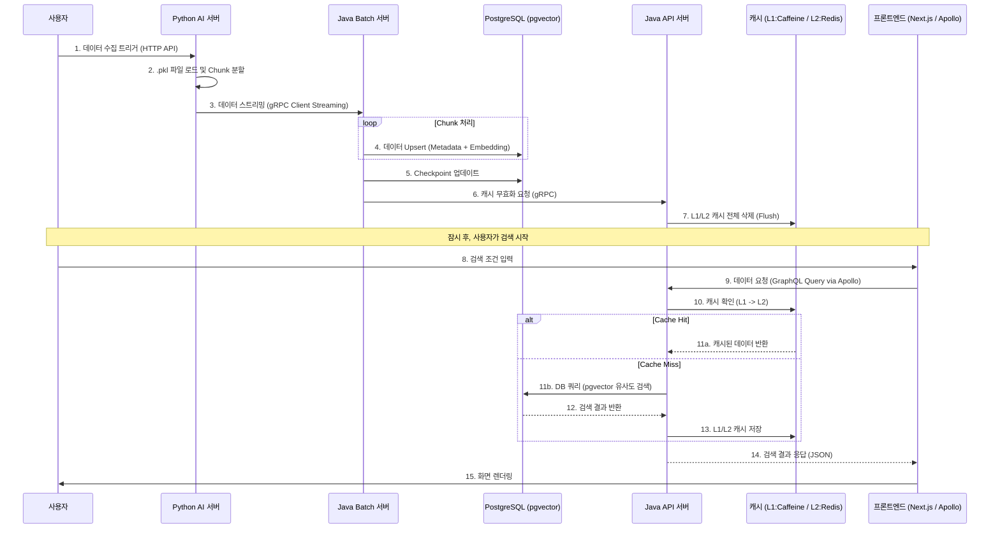

# 데이터 흐름 (End-to-End)

## 1. 개요

Alpha-Match 시스템의 데이터는 **Python AI 서버**에서 생성되어 **Java Batch 서버**를 통해 DB에 저장되고, **API 서버**를 거쳐 **프론트엔드**에 최종적으로 표시됩니다. 각 단계는 gRPC와 GraphQL을 통해 효율적으로 통신합니다.

## 2. 데이터 흐름 다이어그램

## 3. 단계별 상세 설명

### 가. 데이터 수집 및 저장 (Ingestion)
1.  **HTTP API 트리거**: 사용자가 Python 서버의 FastAPI 엔드포인트(`POST /data/ingest/{domain}`)를 호출하여 데이터 처리를 시작합니다.
2.  **데이터 로딩 및 분할**: Python 서버는 지정된 `.pkl` 파일을 Pandas DataFrame으로 로드한 후, 메모리 효율성을 위해 작은 `Chunk` 단위로 데이터를 분할합니다.
3.  **gRPC 스트리밍**: 분할된 `Chunk`들을 gRPC `Client Streaming`을 통해 Java Batch 서버로 실시간 전송합니다.
4.  **DB 저장 (Upsert)**: Batch 서버는 스트림으로 받은 데이터를 `ChunkProcessor`를 통해 처리합니다. 각 도메인(`recruit`, `candidate`)에 맞는 `metadata`와 `embedding` 테이블에 `UPSERT` (INSERT ON CONFLICT) 연산을 수행하여 데이터를 저장/업데이트합니다.
5.  **체크포인트 업데이트**: 한 `Chunk`의 처리가 완료될 때마다 `checkpoint` 테이블에 마지막으로 처리된 데이터의 UUID와 처리된 개수를 기록합니다. 이를 통해 작업 실패 시 중단된 지점부터 안전하게 재시작할 수 있습니다.

### 나. 캐시 관리 (Cache Management)
6.  **캐시 무효화 요청**: 전체 데이터 스트리밍 및 저장이 성공적으로 완료되면, Batch 서버는 gRPC를 통해 API 서버의 캐시 무효화 엔드포인트를 호출합니다.
7.  **캐시 삭제**: API 서버는 해당 요청을 받아, 데이터 일관성을 위해 L1(Caffeine) 캐시와 L2(Redis) 캐시에 저장된 모든 관련 데이터를 즉시 삭제(Flush)합니다.

### 다. 데이터 조회 및 렌더링 (Serving)
8.  **사용자 검색**: 프론트엔드에서 사용자가 원하는 기술 스택, 경력 등을 입력하고 검색 버튼을 클릭합니다.
9.  **GraphQL 요청**: 프론트엔드는 **Apollo Client**를 통해 사용자의 입력값을 변수로 담아 API 서버에 GraphQL 쿼리(`searchMatches`)를 보냅니다. Apollo Client는 `useQuery` 훅을 사용하여 선언적으로 데이터를 요청하고, 내장된 `InMemoryCache`를 통해 결과를 자동으로 캐싱합니다.
10. **캐시 조회**: API 서버는 요청을 받으면 가장 먼저 캐시를 확인합니다.
    - **L1 캐시 (Caffeine)**: 인-메모리 캐시에 해당 쿼리 결과가 있는지 확인합니다. (가장 빠름)
    - **L2 캐시 (Redis)**: L1에 없다면, 분산 캐시인 Redis에 결과가 있는지 확인합니다.
11. **Cache Hit / Miss 처리**:
    - **Hit**: 캐시에 데이터가 존재하면, DB 조회 없이 즉시 캐시된 데이터를 반환합니다.
    - **Miss**: 캐시에 데이터가 없으면, DB에 직접 쿼리를 실행합니다. 이때 `pgvector`의 벡터 인덱스를 사용하여 빠른 유사도 검색을 수행합니다.
12. **DB 결과 반환**: PostgreSQL은 쿼리 결과를 API 서버에 반환합니다.
13. **캐시 저장**: API 서버는 DB에서 받은 결과를 다음 요청을 위해 L1, L2 캐시에 저장합니다.
14. **GraphQL 응답**: API 서버는 최종 데이터를 프론트엔드에 JSON 형태로 응답합니다.
15. **화면 렌더링**: 프론트엔드는 받은 데이터를 사용하여 추천 목록과 시각화 차트를 화면에 그립니다.
