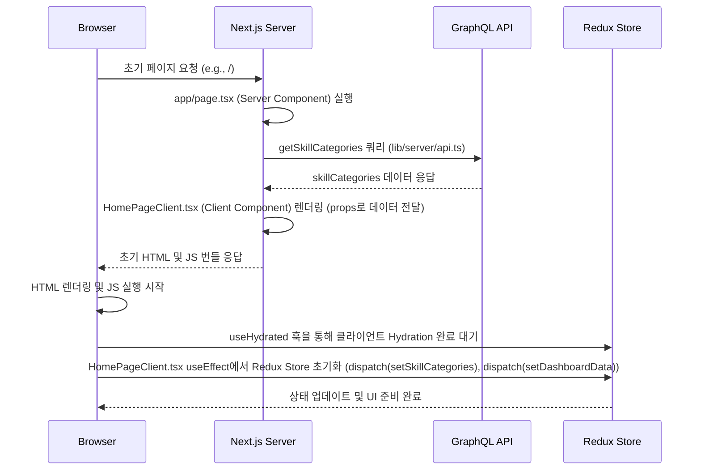
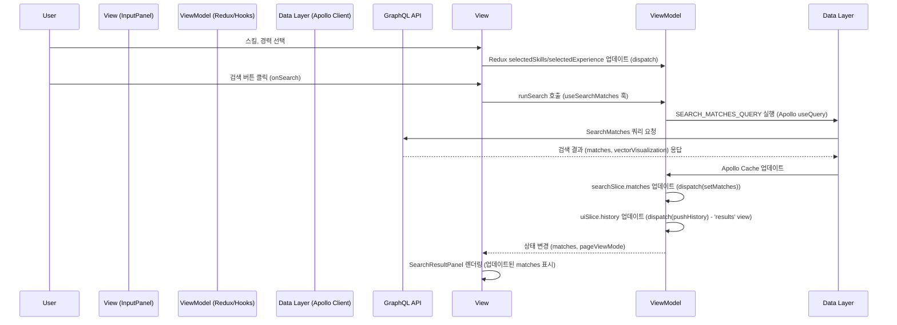

# 프론트 서버 구현 상세 (발표 자료)

## 1. 🧩 개요 (Overview)

본 문서는 Alpha-Match 프로젝트의 프론트엔드 서버 구현에 대한 상세한 내용을 다룹니다. Next.js의 Server/Client Components 아키텍처, MVVM 패턴 기반의 상태 관리, Apollo Client의 효율적인 캐싱 전략, 그리고 Redux-persist를 통한 상태 영속화 방안을 중심으로 설명합니다. 이는 발표용 슬라이드 제작을 위한 참고 자료로 활용될 수 있도록 구성되었습니다.

## 2. ⚙️ 구성 / 구조 (Architecture / Components)

### 2.1 Next.js App Router 기반의 Server/Client Components 아키텍처

Alpha-Match 프론트엔드는 Next.js 16의 App Router를 기반으로 Server Components와 Client Components의 역할을 명확히 분리하여 사용합니다.

*   **Server Components (SSG/SSR)**: 기본적으로 Server Components를 사용하여 초기 데이터 페칭, SEO 최적화, 번들 사이즈 감소를 달성합니다. `app/page.tsx`와 같은 최상위 페이지 컴포넌트에서 비동기 데이터 로딩을 수행합니다.
*   **Client Components (CSR)**: `'use client'` 지시어가 명시된 컴포넌트는 사용자 인터랙션, 브라우저 API 접근, 클라이언트 상태 관리 등 클라이언트 측 로직을 담당합니다. `app/_components/HomePage.client.tsx`가 대표적인 예시입니다.
*   **디렉토리 구조**:
    *   `src/app`: Next.js 라우팅 및 레이아웃 관리.
    *   `src/lib/server`: 서버 전용 유틸리티 및 API 호출 로직 (클라이언트 번들에서 제외).
    *   `src/lib/client`: 클라이언트 전용 유틸리티, 커스텀 훅, 서비스 로직.
*   **Hydration 처리**: 클라이언트 측에서 Server Components로부터 전달받은 DOM 트리를 재사용하기 위한 Hydration 과정은 Next.js가 기본적으로 제공합니다. 하지만 특정 UI 컴포넌트의 렌더링 순서나 브라우저 환경 의존성으로 인해 발생할 수 있는 Hydration 오류를 방지하기 위해 `src/lib/client/hooks/ui/useHydrated.ts`의 `useHydrated` 훅을 활용하여 클라이언트에서 안전하게 렌더링이 시작되었는지 여부를 추적합니다.

### 2.2 3-Layer 상태 관리: View - ViewModel - Data (MVVM 패턴)

프로젝트는 React 컴포넌트(View), Redux Toolkit (ViewModel), Apollo Client (Data Layer)의 3계층으로 구성된 MVVM 패턴을 따릅니다.

*   **View Layer (React Components)**: 사용자 인터페이스를 담당하며, ViewModel로부터 상태를 받아 렌더링하고 사용자 이벤트를 ViewModel에 전달합니다.
*   **ViewModel Layer (Redux Toolkit)**: UI 상태와 도메인별 검색 결과를 영구적으로 저장하고 관리합니다.
    *   `src/lib/client/services/state/features/search/searchSlice`: 검색 필터(`selectedSkills`, `selectedExperience`), **검색 결과(`matches`) 캐시**, 기술 스택 목록(`skillCategories`) 등을 도메인별(CANDIDATE/RECRUITER)로 분리하여 관리합니다. 이는 모드 전환 후에도 검색 결과를 유지하는 "Multiple Back Stacks" 패턴을 구현합니다.
    *   `src/lib/client/services/state/features/ui/uiSlice`: `pageViewMode`, `selectedMatchId`와 같은 UI 네비게이션 상태 및 탐색 히스토리 스택(`uiSlice.history`)을 관리합니다.
*   **Data Layer (Apollo Client)**: GraphQL API 통신을 전담하며, 네트워크 캐시(`InMemoryCache`) 및 전역 에러 처리(`Apollo Error Link`)를 담당합니다.

### 2.3 Apollo Client 캐싱 전략

Apollo Client의 `InMemoryCache`는 GraphQL 쿼리 결과를 정규화하여 캐시합니다. 이를 통해 복잡한 데이터 간의 일관성을 자동으로 유지하고 불필요한 네트워크 요청을 줄입니다.

*   **맞춤형 캐싱 (`typePolicies`)**:
    *   `searchMatches`: 무한 스크롤을 위해 `keyArgs`를 (`mode`, `skills`, `experience`)로 설정하고, `merge` 함수를 통해 기존 데이터와 새 데이터를 병합하여 검색 결과 목록을 관리합니다. `vectorVisualization`은 항상 최신 데이터로 덮어씌웁니다.
    *   `skillCategories`, `dashboardData`: `keyArgs`를 설정하고 `merge: false`로 설정하여 변경 불가능한(immutable) 정적 데이터 또는 `userMode`별 데이터를 별도로 캐시합니다.
    *   `getRecruit`, `getCandidate`: 상세 정보를 `id`별로 캐시하고 `toReference`를 사용하여 다른 쿼리에서 참조될 수 있도록 합니다.
*   **Fetch Policy**: `watchQuery`는 'cache-and-network', `query`는 'network-only'를 기본으로 설정하여 데이터 신뢰성과 성능을 균형 있게 관리합니다.

### 2.4 Redux-persist를 활용한 상태 저장

`redux-persist` 라이브러리를 사용하여 Redux 스토어의 특정 상태(`ui`, `search`)를 브라우저의 로컬 스토리지에 영구적으로 저장합니다. 이는 앱 재시작 시에도 사용자의 UI 설정, 검색 조건, 탐색 히스토리 등이 유지되어 일관된 사용자 경험을 제공하는 데 기여합니다.

## 3. 🧠 처리 흐름 (Flow / Sequence Diagram)

### 3.1 초기 데이터 로딩 및 하이드레이션 흐름

초기 페이지 로딩 시 Next.js Server Components의 강점을 활용하여 데이터를 가져오고, 클라이언트 측에서 Hydration을 수행합니다.

**요약**: Next.js 서버에서 초기 데이터를 비동기로 페칭한 후 Client Component에 전달하여 Hydration 시 Redux 스토어를 초기화하고, `useHydrated` 훅으로 클라이언트 렌더링의 안정성을 확보합니다.

### 3.2 검색 및 결과 조회 흐름 (MVVM)

사용자가 검색 조건을 입력하고 결과를 조회하는 과정은 MVVM 패턴에 따라 명확하게 분리됩니다.

**요약**: 사용자의 입력은 View를 통해 ViewModel로 전달되어 Redux 상태를 업데이트하고, ViewModel은 Data Layer를 통해 GraphQL API와 통신하여 결과를 가져옵니다. 가져온 결과는 다시 ViewModel을 통해 Redux에 저장되고 View를 업데이트하여 사용자에게 표시됩니다. `useAppNavigation` 훅은 이 과정에서 탐색 히스토리를 관리합니다.

## 4. 💡 예외 및 디버깅 (Edge Cases / Debugging)

### 4.1 Hydration 오류 처리

*   **문제**: Next.js 환경에서 Server Component와 Client Component 간의 렌더링 불일치(HTML 구조, 속성 등)로 인해 Hydration 과정에서 오류가 발생할 수 있습니다. 이는 특히 브라우저 환경에 따라 다르게 렌더링되는 요소(예: `<canvas>`, 날짜/시간 포맷)나 초기 클라이언트 상태에 따라 UI가 변경되는 경우 발생하기 쉽습니다.
*   **해결**: `src/lib/client/hooks/ui/useHydrated.ts`의 `useHydrated` 훅을 도입했습니다. 이 훅은 컴포넌트가 클라이언트에서 완전히 하이드레이션된 후에만 특정 클라이언트 전용 로직이나 UI 렌더링을 시작하도록 하여 렌더링 불일치로 인한 오류를 방지합니다.

### 4.2 ViewModel & Multiple Back Stacks

*   **문제**: Redux의 `useState` 훅으로 `matches`와 같은 주요 데이터를 관리할 경우, 컴포넌트 재렌더링 시 데이터가 손실되거나 모드(CANDIDATE/RECRUITER) 전환 시 이전 상태가 유지되지 않는 문제가 발생했습니다.
*   **해결**: `matches` 데이터를 Redux의 `searchSlice`에 저장하고, `dispatch(setMatches({ userMode, matches }))` 액션을 통해 명시적으로 관리하도록 했습니다. 또한, `uiSlice` 내부에 각 `userMode`별로 독립적인 탐색 히스토리 스택(`history`, `currentIndex`)을 구현하여 모드 전환 후에도 사용자의 이전 탐색 상태를 완벽하게 복원할 수 있도록 "Multiple Back Stacks" 패턴을 적용했습니다.

### 4.3 Apollo Error Link를 통한 전역 에러 처리

*   **문제**: GraphQL API 통신 중 발생하는 네트워크 에러, 서버 에러, GraphQL 유효성 검증 에러 등 다양한 유형의 에러를 일관성 있게 처리하고 사용자에게 피드백을 제공해야 했습니다.
*   **해결**: `src/lib/client/services/api/apollo-client.ts`에 `errorLink`를 구현하여 모든 Apollo Client 요청에서 발생하는 에러를 전역적으로 가로챕니다. 에러 유형에 따라 사용자 친화적인 메시지를 생성하고, 이를 Redux `notificationSlice`의 `showNotification` 액션을 통해 디스패치하여 화면에 토스트 알림으로 표시합니다.

## 5. 📊 성능 지표 (Performance Metrics)

현재 Alpha-Match 프론트엔드 서버는 구체적인 성능 측정 지표(LCP, FID, CLS 등 Core Web Vitals)를 문서화하지는 않았지만, 다음과 같은 아키텍처적 선택을 통해 고성능 및 최적화된 사용자 경험을 지향하고 있습니다.

*   **Next.js Server Components**: 초기 HTML을 서버에서 빠르게 생성하여 브라우저에 전송함으로써 FCP(First Contentful Paint)를 개선하고, JavaScript 번들 사이즈를 줄여 초기 로딩 속도를 최적화합니다. 이는 검색 엔진 최적화(SEO)에도 유리합니다.
*   **Apollo Client 캐싱**: GraphQL 쿼리 결과를 `InMemoryCache`에 저장하고 `typePolicies`를 통해 효율적으로 관리함으로써, 불필요한 API 호출을 최소화하고 데이터 재요청 시 즉각적인 UI 반응을 가능하게 합니다.
*   **코드 스플리팅 및 Lazy Loading**: Next.js의 내장 기능을 활용하여 필요한 시점에만 컴포넌트와 모듈을 로드함으로써 초기 번들 크기를 줄이고 애플리케이션의 전반적인 반응성을 향상시킵니다.
*   **Redux-persist**: `ui`, `search`와 같은 주요 클라이언트 상태를 로컬 스토리지에 저장하여, 앱 재방문 시 초기 데이터 로딩 시간을 단축하고 사용자가 이전에 작업했던 환경을 빠르게 복원할 수 있도록 돕습니다.

## 6. 🧱 참고 및 부록 (Reference / Appendix)

*   [Front-Server 아키텍처 설계 문서](ARCHITECTURE.md)
*   [캐싱 전략 가이드](CACHING_STRATEGY.md)
*   [Apollo Client 및 SSR 데이터 페칭 가이드](Apollo_Client_and_SSR_Fetching.md)
*   [트러블슈팅: ViewModel & Multiple Back Stacks](troubleshooting/ViewModel_Multiple_Back_Stacks.md)
*   [트러블슈팅: Hydration 오류 및 SSR](troubleshooting/Hydration_Error_and_SSR.md)
