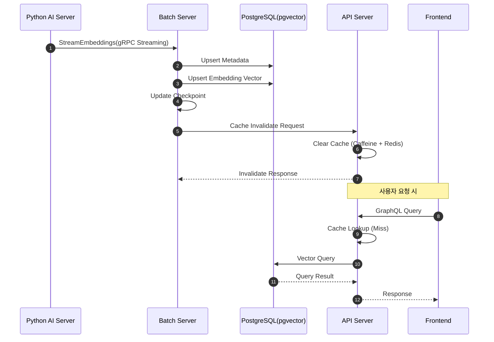
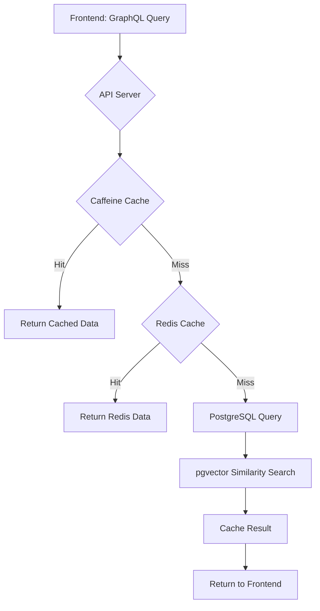
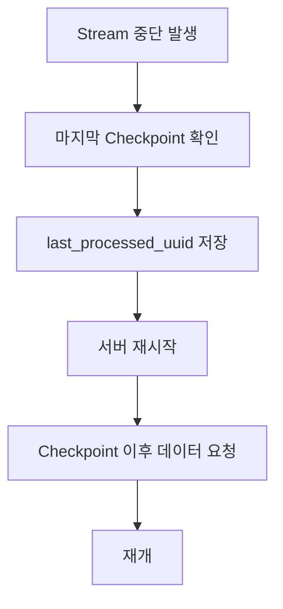
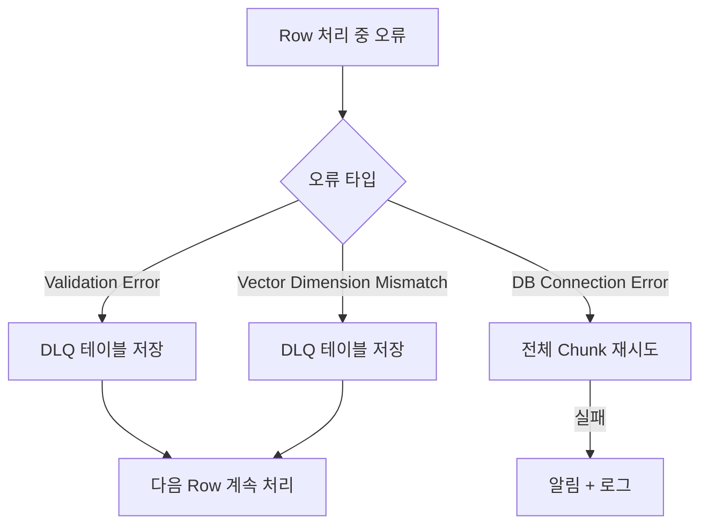
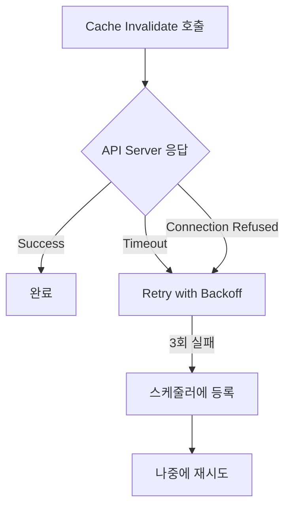

# 🔄 데이터 플로우

**작성일:** 2025-12-10
**업데이트:** 2025-12-10

---

## 1. Embedding 데이터 저장 플로우

### 전체 흐름



### 단계별 상세

#### Step 1: Python → Batch (gRPC Streaming)
```python
# Python 서버
for chunk in chunks:
    yield RowChunk(rows=chunk)  # 300 rows per chunk
```

#### Step 2: Batch → DB (Upsert)
```java
// Batch 서버
metadataRepository.upsertAll(metadataList);
embeddingRepository.upsertAll(embeddingList);
```

#### Step 3: Checkpoint 업데이트
```java
UUID lastId = chunk.getLastRowId();
checkpointRepository.updateLatestCheckpoint(lastId);
```

#### Step 4: 캐시 무효화
```java
cacheInvalidateClient.invalidateCache("recruit");
```

---

## 2. 검색/조회 플로우

### GraphQL 조회 흐름



### 캐싱 전략

#### L1 Cache: Caffeine (In-Memory)
- **TTL:** 10분
- **Max Size:** 10,000개
- **용도:** 자주 조회되는 데이터

#### L2 Cache: Redis (Distributed)
- **TTL:** 1시간
- **직렬화:** byte[] 기반
- **용도:** 서버 간 공유 캐시

#### DB Query
- **용도:** Cache Miss 시만 실행
- **최적화:** pgvector 인덱스 활용

---

## 3. Vector Similarity Search 플로우

### 유사도 검색 과정

```sql
-- pgvector L2 distance 검색
SELECT * FROM recruit_embedding
ORDER BY vector <-> CAST(:queryVector AS vector)
LIMIT :limit;
```

### 검색 최적화

#### IVFFlat 인덱스
```sql
CREATE INDEX recruit_embedding_ivfflat
ON recruit_embedding USING ivfflat (vector vector_l2_ops)
WITH (lists = 100);
```

#### 성능 튜닝
- **lists:** 클러스터 수 (100~1000)
- **probes:** 검색 시 확인할 클러스터 수
- **Trade-off:** 정확도 vs 속도

---

## 4. 예외 상황 처리 플로우

### 4.1 gRPC Stream 중단



### 4.2 Batch Upsert 실패



### 4.3 캐시 무효화 실패



---

## 5. 데이터 일관성 보장

### Checkpoint 기반 재시작
- **저장 시점:** 각 Chunk 처리 완료 후
- **저장 내용:** 마지막 처리된 UUID
- **활용:** 재시작 시 중복 처리 방지

### Upsert 전략
```sql
INSERT INTO recruit_metadata (...)
VALUES (...)
ON CONFLICT (id) DO UPDATE SET ...;
```
- **Idempotent:** 동일 요청 반복 실행 안전
- **장점:** 재처리 시에도 데이터 일관성 유지

### Race Condition 방지
```java
// 캐시 무효화 중복 방지
private final AtomicBoolean invalidating = new AtomicBoolean(false);

public void invalidateSafely() {
    if (invalidating.compareAndSet(false, true)) {
        try {
            // 무효화 로직
        } finally {
            invalidating.set(false);
        }
    }
}
```

---

## 관련 문서
- [시스템 아키텍처](./시스템_아키텍처.md)
- [Batch 설계서](../Backend/Batch-Server/docs/Batch설계서.md)
